# Introduction to Transformer Architecture

In the rapidly evolving world of artificial intelligence, few innovations have been as transformative as the **Transformer architecture**. Introduced in the seminal 2017 paper ["Attention is All You Need"](https://arxiv.org/abs/1706.03762) by Vaswani et al., Transformers have become the backbone of virtually all state-of-the-art language models, including GPT-4, ChatGPT, and Google's Bard.

But what exactly is a Transformer, and why has it revolutionized natural language processing? In this comprehensive guide, we'll break down the Transformer architecture from the ground up, using clear explanations and visual diagrams to help you understand how these powerful models work.

Whether you're a beginner just starting your AI journey or a practitioner looking to solidify your understanding, this guide will walk you through the core concepts that power today's most advanced language models.

## The Problem with the Past: RNNs and Feedforward Networks

Before Transformers, we had two main approaches for sequential data like text: **Recurrent Neural Networks (RNNs)** and simple **Feedforward Networks (FFNs)**. Let's understand why these approaches had limitations that needed to be addressed.

### Feedforward Networks (FFNs)

Feedforward Networks are the most basic type of neural network. Data flows in one direction, from input to output, with no loops. They can't remember past information, which makes them terrible for language, where context is everything.

Think about it: the meaning of a word often depends on the words that came before it. A basic FFN has no way to capture this.

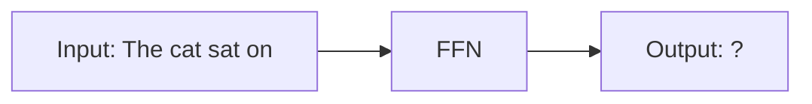

As you can see, a Feedforward Network processes the input and produces an output without any memory of previous inputs. This is problematic for language understanding.

### Recurrent Neural Networks (RNNs)

RNNs were designed to address the memory problem by having a "memory" or hidden state that allows them to process a sequence one element at a time, feeding the output of one step back into the input of the next. This lets them "remember" context.

However, RNNs have significant limitations:

1. **Sequential Processing**: They process data one step at a time, making them slow to train
2. **Vanishing Gradient Problem**: It becomes difficult to learn long-range dependencies
3. **Limited Parallelization**: Due to their sequential nature, they can't take full advantage of modern parallel computing hardware

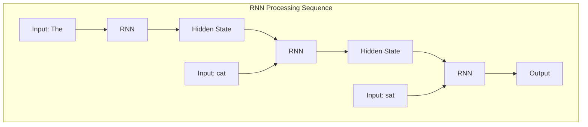

As shown above, RNNs process each word sequentially, with the hidden state carrying information from previous steps. While this provides some memory, it's still limited and inefficient.

### The Transformer Solution

The Transformer solves these problems by introducing two key innovations:

1. **Attention Mechanism**: Instead of processing sequences step-by-step, the model can look at all words simultaneously and determine which ones are most relevant to each other
2. **Parallel Processing**: Because words aren't processed sequentially, the entire sequence can be processed in parallel, dramatically speeding up training

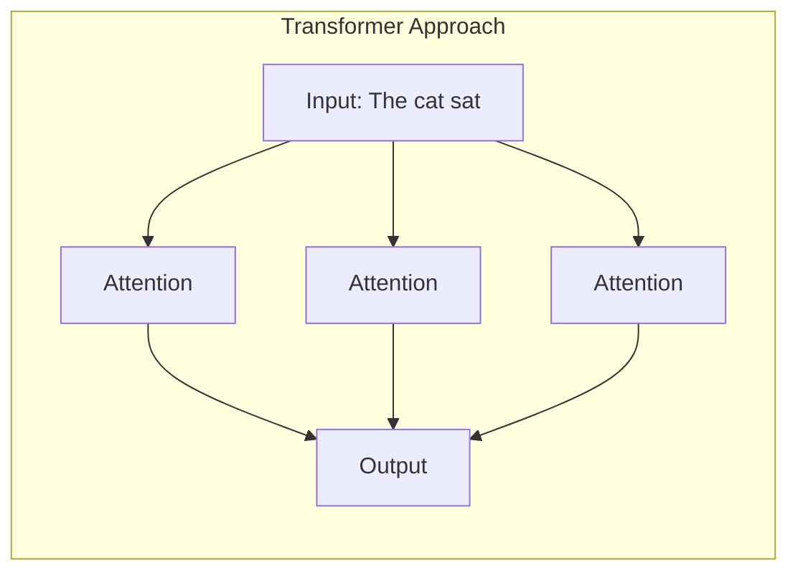

## Understanding the Transformer Architecture

The Transformer architecture, introduced in the 2017 paper "Attention is All You Need," completely changed the game. Instead of processing data sequentially, it processes the entire sequence at once, relying on a mechanism called self-attention to understand context.

The core idea is to let the model weigh the importance of all other words in a sentence when processing a single word. It can look at the entire sequence and decide which parts are most relevant to the word it's currently considering.

### The Original Transformer: Encoder-Decoder Architecture

The original Transformer model consists of two main parts:

1. **Encoder**: Processes the input sequence and creates representations of each word in context
2. **Decoder**: Uses the encoder's representations to generate the output sequence

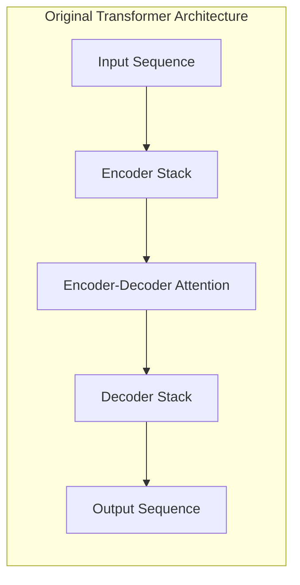

However, modern large language models (LLMs) like GPT-4 and GPT-5 use a **decoder-only architecture**, so we'll focus on that for the rest of this guide.

### Decoder-Only Architecture

In a decoder-only Transformer (like GPT models), the architecture consists of a stack of identical layers. Each layer contains three key components:

1. **Masked Multi-Head Attention**: The heart of the Transformer that allows the model to focus on relevant parts of the input
2. **Feed-Forward Network (FFN)**: A simple neural network that processes each word's representation independently
3. **Residual Connections and Layer Normalization**: Technical components that help with stable training

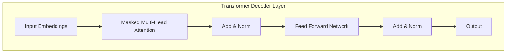

Multiple such layers are stacked together to form the complete model:

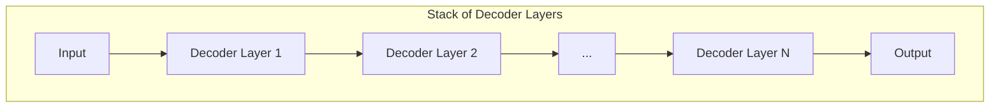

## Understanding Input Processing: Embeddings

Before we dive into the layers and attention mechanisms, let's understand how text is prepared for processing by the Transformer model.

> **2025 Update:**  
> Most state-of-the-art models now use **rotary positional embeddings** (RoPE) or dynamic position encodings, which better capture relative positions and scale to longer contexts than the original sinusoidal method.

### Token Embeddings

When you input text to a Transformer model, the first step is to convert each word (or subword) into a numerical representation called an **embedding**. Think of an embedding as a list of numbers that capture the meaning of a word.

For example, the word "cat" might be represented as a list like [0.2, -0.4, 0.7, ...] with hundreds or thousands of numbers. Words with similar meanings will have similar embedding values.

### Positional Embeddings

Since Transformers process all words simultaneously, they don't naturally understand the order of words in a sentence. To solve this, the model adds **positional embeddings** - special numbers that represent where each word appears in the sequence.

This way, the model can distinguish between "The cat chased the dog" and "The dog chased the cat" even though they contain the same words.

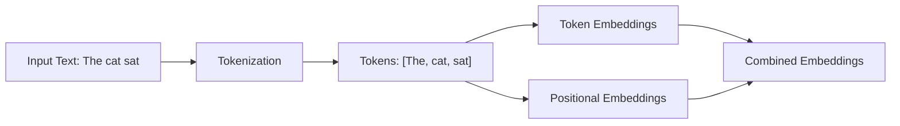

The combined embeddings (token + positional) are what gets fed into the first layer of the Transformer.

## Deep Dive into Attention Mechanism

The attention mechanism is the core innovation that makes Transformers so powerful. But what exactly is "attention" in the context of AI?

Think of attention like human focus. When you read a sentence, your brain doesn't process all words with equal importance. Instead, you naturally focus more on certain words that are relevant to understanding the meaning.

For example, in the sentence "The cat sat on the mat", when trying to understand what "sat" means, your brain pays more attention to "cat" (the one doing the action) than to "the" or "on". This is exactly what the attention mechanism does in Transformers.

### How Simple Attention Works

In a simple attention mechanism, each word can "attend to" or "look at" all other words in the sequence. The model calculates attention weights that determine how much focus to place on each word.

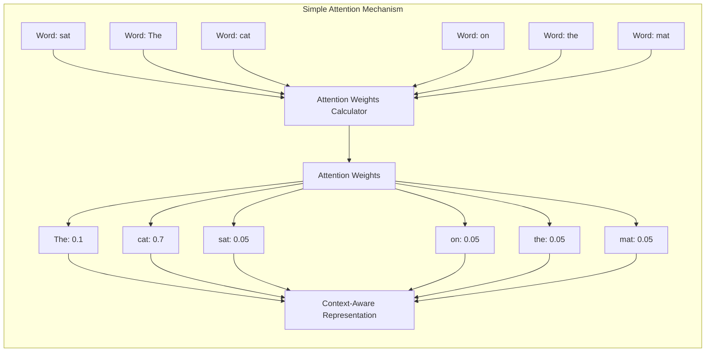

In this example, when processing the word "sat", the model assigns the highest attention weight (0.7) to "cat" because it's the subject performing the action. The word "The" gets a smaller weight (0.1) because it's less important for understanding the meaning.

### The Magic of Self-Attention

What makes Transformers special is "self-attention". This means each word can attend to all words in the sequence, including itself. This allows the model to build a rich understanding of context by considering relationships between all words simultaneously.

For instance, in the sentence "The chef cooked the books", self-attention helps the model understand that "books" likely refers to accounting records (because of "cooked") rather than literature, even though "books" usually means literature.

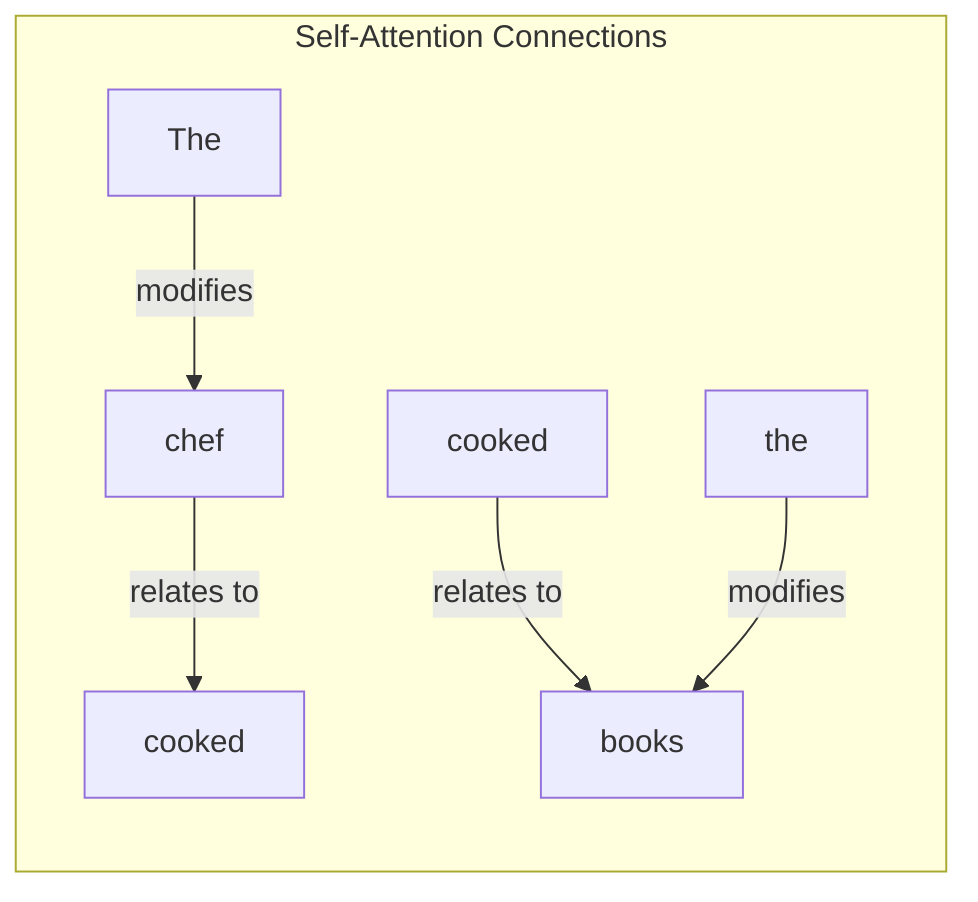

### Multi-Head Attention: Getting Multiple Perspectives

While simple attention is powerful, it only gives the model one way of looking at the relationships between words. Multi-head attention allows the model to look at these relationships from multiple perspectives simultaneously, just like how humans can interpret the same information in different ways.

Think of it like a team of experts analyzing a sentence:
- One expert might focus on grammatical relationships
- Another might focus on semantic meaning
- A third might look for emotional context

Each "head" in multi-head attention learns to focus on different types of relationships, and their insights are combined to create a more complete understanding.

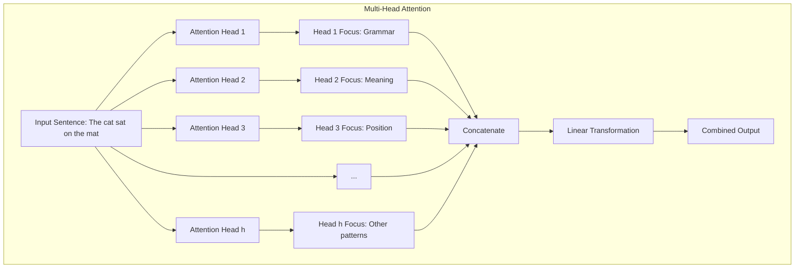

> **2025 Update:**  
> Some models now use **hybrid attention architectures** (e.g., combining attention with state space models) to further improve efficiency and context length.

In practice, models like GPT typically use 12 or more attention heads. Each head develops its own specialization through training, and together they provide a much richer understanding of the text than a single attention mechanism could.

### Why is it "Masked"?

This is the key difference for a generative model like GPT. During training, the model needs to learn to predict the next word. To prevent it from "cheating" and looking at the words that come after the current word, a mask is applied. This mask essentially hides future words in the sequence, ensuring that the model only uses the words it has already "seen" to make its prediction.

This is what makes GPT an autoregressive model—it generates text one word at a time, based on the words that came before.

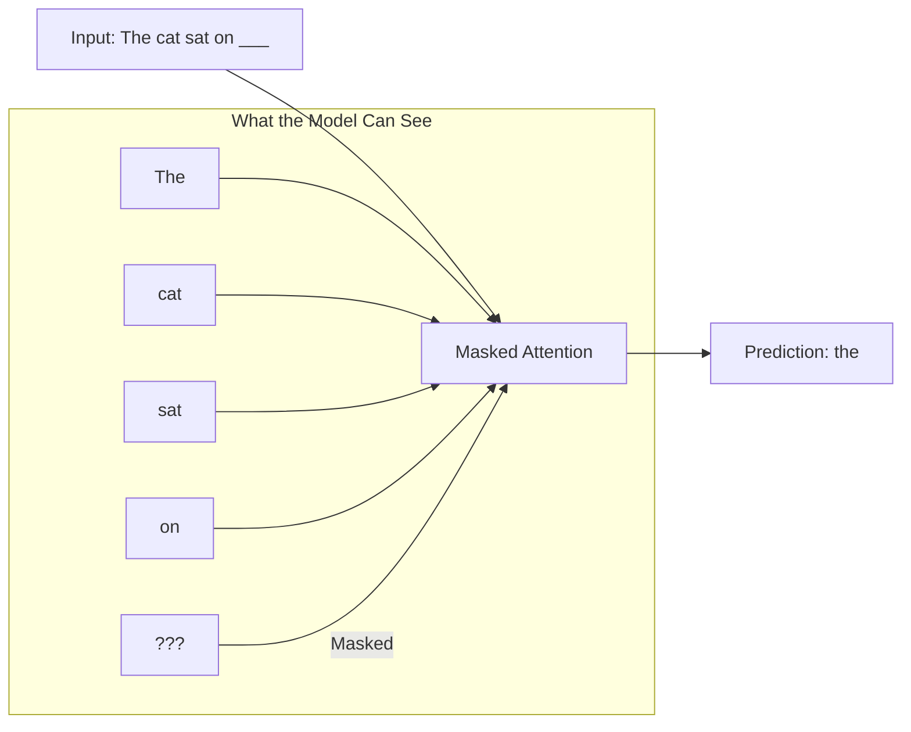

So, in a nutshell, masked multi-head attention allows the model to consider the entire past context in a sophisticated, parallel way, without peeking at the future.

## Understanding the Transformer Decoder Layer Components

Now that we understand attention, let's look at how it fits into a complete decoder layer. Each decoder layer has several components that work together:

### 1. Masked Multi-Head Attention

This is the first component in each decoder layer. It applies the masked multi-head attention mechanism we discussed earlier to the input embeddings. The "masking" ensures that when predicting a word, the model can only look at previous words, not future ones.

### 2. Add & Norm (Residual Connection and Layer Normalization)

After the attention mechanism produces an output, the model applies "Add & Norm" which consists of two operations:

- **Residual Connection (Add)**: The input to the attention layer is added to its output. This helps with gradient flow during training and prevents the vanishing gradient problem.
- **Layer Normalization (Norm)**: Normalizes the values to keep them in a reasonable range, which helps with training stability.

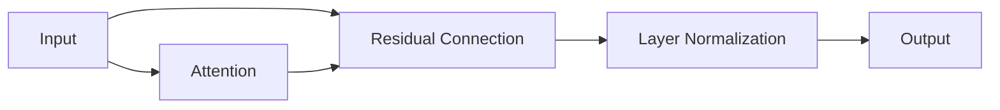

### 3. Feed-Forward Network (FFN)

After the attention mechanism, the output goes through a Feed-Forward Network. This is a simple neural network that processes each position (word) independently. It consists of two linear transformations with a ReLU activation in between:

1. First linear transformation (expands the dimension)
2. ReLU activation function
3. Second linear transformation (compresses back to original dimension)

The FFN helps the model process the attention output further and adds more representational power.

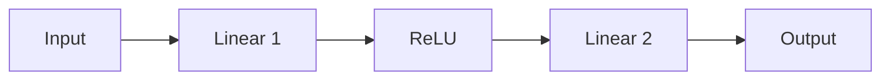

### 4. Another Add & Norm

After the FFN, there's another Add & Norm operation, similar to the one after attention. The input to the FFN is added to its output, and then layer normalization is applied.

### Complete Decoder Layer Flow

Here's how all components work together in a single decoder layer:

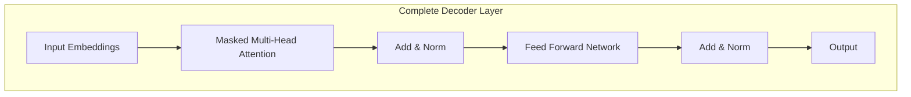

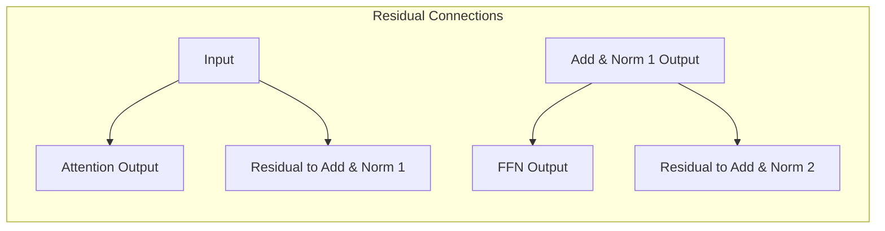

## How Layers Work Together in Decoder-Only Architecture

In a decoder-only model like GPT, multiple decoder layers are stacked on top of each other. The output of one layer becomes the input to the next layer. This allows the model to build increasingly complex representations of the text as it goes through more layers.

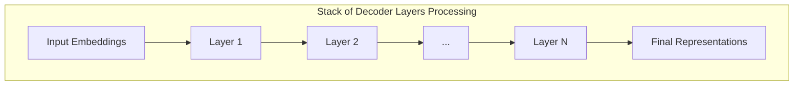

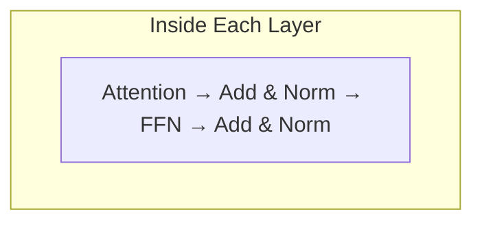

Each layer refines the representations from the previous layer:
- Early layers focus on basic syntax and word relationships
- Middle layers understand more complex sentence structure
- Later layers capture high-level meaning and context

This hierarchical processing is what allows Transformers to understand complex language patterns and generate coherent text.

## Transformer Data Flow Visualization

To better understand how information flows through a Transformer, let's look at a complete visualization of the data processing pipeline:

```mermaid
flowchart TB
    subgraph "Complete Transformer Data Flow"
        A[Input Text] --> B[Tokenization]
        B --> C[Token Embeddings]
        C --> D[Positional Encoding]
        D --> E[Embedding Layer]
        E --> F[Decoder Layer 1]
        F --> G[Decoder Layer 2]
        G --> H["..."]
        H --> I[Decoder Layer N]
        I --> J[Output Probabilities]
        J --> K[Next Token Prediction]
    end
    
    subgraph "Inside a Decoder Layer"
        L[Masked Attention]
        L --> M[Add & Norm]
        M --> N[FFN]
        N --> O[Add & Norm]
    end
```

## Anatomy of a Modern LLM: Parameter Calculation and Mixture of Experts (MoE)

A common misconception is that the self-attention mechanism holds the most parameters. In reality, the vast majority of parameters are in the **Feed-Forward Networks (FFNs)**. This insight is key to understanding one of the most important recent innovations in LLM architecture: the **Mixture of Experts (MoE)**.

> **2025 Update:**  
> MoE is now standard in most frontier models (GPT-4.5, DeepSeek-V2, Gemini Ultra, etc.), enabling efficient scaling to hundreds of billions of parameters without proportional increases in inference cost.

Let's demystify this with a concrete example inspired by a modern MoE model like **DeepSeek-V2**.

### How Many Layers? It Depends!

First, it's important to know that there's no single answer for the number of layers in an LLM. It's a key architectural choice that scales with the model's size. For example:
*   **Llama 3 8B** has **32 layers**.
*   **Llama 3 70B** has **80 layers**.
*   **DeepSeek-V2** has **60 layers**.

More layers allow the model to build up more complex and abstract representations of the data.

### Parameter Breakdown: A DeepSeek-V2-Inspired MoE Model

Let's design a hypothetical MoE model to see where the parameters are.

**Key Architectural Specs:**
*   **Total Layers (`n_layers`)**: 60
*   **Hidden Dimension (`d_model`)**: 4096 (the main vector size)
*   **Vocabulary Size (`vocab_size`)**: 100,000
*   **MoE Layers**: MoE is applied to the FFNs in **every other layer** (30 MoE layers in total).
*   **Number of Experts (`n_experts`)**: 64 per MoE layer.
*   **Active Experts (`n_routed_experts`)**: 6 (only 6 are used for any given token).

The model's parameters are split into two main categories: **Shared Parameters** (used by every token) and **Expert Parameters** (used selectively).

#### 1. Shared Parameters (The Backbone)

These are the parts of the model that are always active.

*   **Token Embeddings**: Converts input tokens to vectors.
    *   `vocab_size * d_model` = 100,000 * 4096 = **410 Million**
*   **Attention Blocks**: Every layer has a self-attention mechanism. We'll use Grouped-Query Attention (GQA) for realism, which has separate projections for Query (Q), Key (K), and Value (V).
    *   **How is "Attention parameters per layer ≈ 42 Million" calculated?**
        - In a standard multi-head attention, the parameter count is roughly `4 * d_model^2` (for Q, K, V, and output projections). For `d_model = 4096`, that's `4 * 4096^2 = 67M`.
        - However, modern models use optimizations like GQA, multi-query attention, shared projections, or reduced head sizes, which typically bring this down to about **42M per layer** or even lower in practice (sometimes <30M).
        - **Architect's note:** The exact number depends on implementation details (e.g., grouped-query, parameter sharing, or low-rank projections).
    *   Total for all 60 layers: `60 * 42M` = **2.5 Billion**

*   **Total Shared Parameters**: `0.41B (Embeddings) + 2.5B (Attention)` = **~2.9 Billion**

These ~3B parameters form the model's backbone, handling the sequence processing and context-gathering for every token.

#### 2. Expert Parameters (The Knowledge Store)

This is where the MoE architecture comes into play. Instead of one FFN per layer, we have many.

*   **FFN / Expert Size**: Each expert is a standard Feed-Forward Network.
    *   **How is "Parameters per expert ≈ 117 Million" calculated?**
        - Each FFN/expert has two weight matrices: input-to-hidden and hidden-to-output.
        - Formula: `2 * d_model * ffn_dim`. If `ffn_dim = 3.5 * d_model`, then `2 * 4096 * (3.5 * 4096) = 117M`.
        - If `ffn_dim = 4 * d_model`, the count would be `134M`—the actual multiplier is a design choice.
        - **Architect's note:** The FFN (expert) is the main parameter consumer in large LLMs.
*   **Experts per MoE Layer**: We have 64 of these experts.
    *   `64 experts * 117M params/expert` = **7.5 Billion** parameters in just one MoE layer's FFN block!
*   **Total Expert Parameters**: We have 30 MoE layers in our model.
    *   `30 layers * 7.5B params/layer` = **225 Billion**

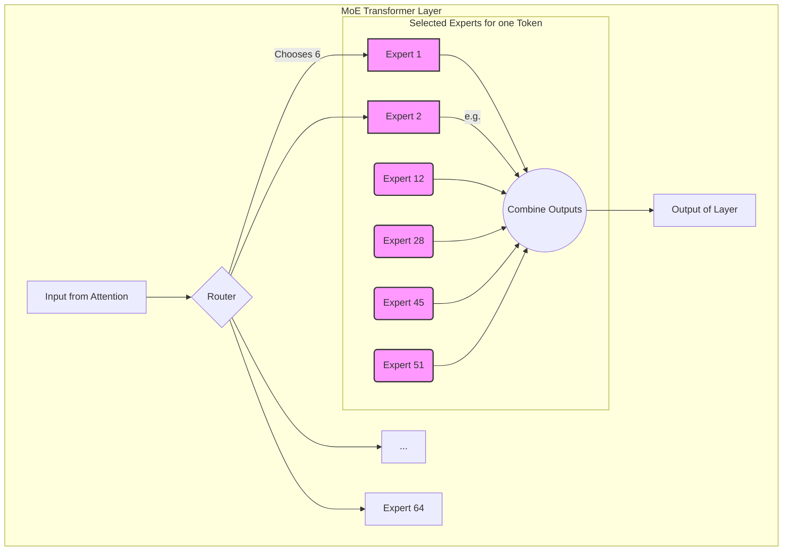

**Summary for architects:**  
- The majority of parameters in a modern LLM are in the FFN/experts, not attention.
- Attention parameter count per layer is implementation-dependent (67M naive, ~42M with optimizations, sometimes lower with MQA/GQA).
- FFN/expert parameter count is set by `2 * d_model * ffn_dim` (e.g., 117M for 3.5× width).
- Design choices (like GQA, expert width, and number of experts) have a direct, order-of-magnitude impact on model size and compute.
- **2025 Note:** Inference-time optimizations like speculative decoding, quantization, and efficient batching are now standard for production LLMs.

## Transformer Architecture Evolution

Since the original Transformer was introduced in 2017, there have been many improvements and variations:

> **2025 Update:**  
> Recent research explores **state space models** (SSMs), **hybrid attention/state space layers**, and **dynamic routing** for even longer context and better efficiency. Some models now mix attention and SSM blocks within the same architecture.

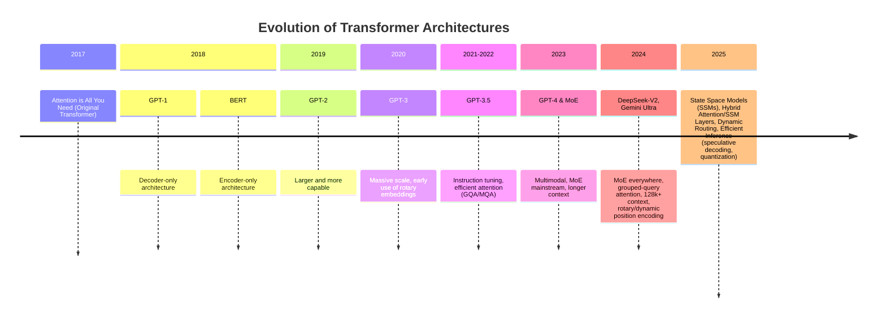

## Summary: The Big Picture

The Transformer architecture, with its reliance on the attention mechanism, has solved the key limitations of previous models by allowing for parallel processing and a superior ability to capture long-range dependencies.

### Transformer vs. RNN

| Aspect | RNN | Transformer |
|--------|-----|-------------|
| Processing | Sequential | Parallel |
| Speed | Slow | Fast |
| Long-range dependencies | Difficult | Easy |
| Training | Time-consuming | Efficient |

The Transformer's parallel processing makes it much faster and more efficient to train than the sequential RNN. The attention mechanism also helps it overcome the vanishing gradient problem, enabling it to handle much longer sequences of text effectively.

### Transformer vs. FFN

While both use feed-forward networks, the Transformer's self-attention layers provide the crucial context-awareness that FFNs completely lack.

```mermaid
flowchart LR
    subgraph "Comparison"
        A["FFN: No Context"] --> B[Simple Output]
        C["Transformer: Full Context"] --> D[Context-Aware Output]
    end
```

## Conclusion

Models like GPT-4 and the upcoming GPT-5 are simply massive, highly-tuned versions of this same basic architecture, proving that the Transformer is a truly scalable and powerful foundation for the future of AI.

> **2025 Perspective:**  
> The Transformer remains the backbone of LLMs, but the field is rapidly evolving. Expect to see more hybrid models, longer context windows, and smarter routing mechanisms in the next generation of AI systems.

The key innovations that make Transformers so powerful are:

1. **Self-Attention**: The ability to weigh the importance of different words in a sequence
2. **Multi-Head Attention**: Using multiple attention mechanisms to capture different types of relationships
3. **Parallel Processing**: Processing all words simultaneously rather than sequentially
4. **Masking**: Ensuring that generative models don't "cheat" by looking at future words
5. **Deep Stacked Architecture**: Building complex understanding through many layers
6. **Embeddings**: Converting text to numerical representations that capture meaning
7. **Feed-Forward Networks**: Processing each position independently to add representational power
8. **Add & Norm**: Ensuring stable training through residual connections and normalization

Understanding these concepts is crucial for anyone interested in modern AI and natural language processing. With this foundation, you can begin to explore more advanced topics like fine-tuning, prompt engineering, and even building your own Transformer models.

I hope this has provided a clear, accessible introduction to this fascinating topic!

For more detail on the masked multi-head attention mechanism and how it's used in models like GPT, you can watch this [video](https://www.youtube.com/watch?v=X6HWCoKdVo8).

## Further Reading & Resources

- [Attention is All You Need (original paper)](https://arxiv.org/abs/1706.03762)
- [The Illustrated Transformer (blog)](https://jalammar.github.io/illustrated-transformer/)
- [State Space Models for Sequence Modeling (overview)](https://arxiv.org/abs/2111.00396)
- [HuggingFace Transformers (library & tutorials)](https://huggingface.co/docs/transformers/index)
- [Open LLM Leaderboard](https://huggingface.co/spaces/HuggingFaceH4/open_llm_leaderboard)
- [DeepSeek LLM Playground](https://platform.deepseek.com/)
- [Llama 3 Model Card](https://ai.meta.com/llama/)
- [Mistral AI Models](https://mistral.ai/news/announcing-mistral-7b/)

**Hands-on suggestion:**  
Try running a small transformer model using HuggingFace Transformers, or experiment with open-source LLMs like Llama or Mistral in a notebook or playground.

**Glossary:**  
- **GQA/MQA**: Grouped/Multi-Query Attention, efficient attention variants.
- **MoE**: Mixture of Experts, a way to scale models efficiently.
- **Rotary Embeddings**: A positional encoding method for long context.
- **SSM**: State Space Model, an alternative or complement to attention.
- **Speculative Decoding**: An inference-time speedup technique.
