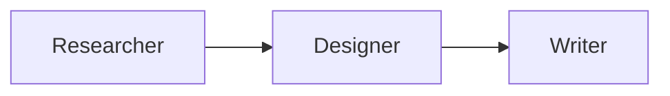

# The Complete Guide to Building Agentic AI Systems: From Basics to Production

## Why This Guide Matters

If you've shipped LLM-based features, you've probably hit the wall where simple prompt engineering stops working. Your PM wants the AI to "do more," your team is drowning in edge cases, and you're not sure if you need better prompts, more tools, or an entirely different architecture.

I've been there. After building several production agentic systems, here's what I wish someone had told me on day one: **The difference between teams that ship working AI agents and those that don't isn't the model—it's the discipline around evaluation and error analysis.**

This guide distills lessons from Andrew Ng's Agentic AI course and my own production experience into actionable patterns for senior engineers and technical leaders.

## What You'll Learn

This isn't another "ChatGPT is amazing" article. We're diving deep into:

- **Why agentic workflows outperform** even the best one-shot prompts (spoiler: GPT-3.5 with agents beats GPT-4 without them)
- **Four core design patterns** that power every production agent system
- **The evaluation framework** that separates high-performing teams from everyone else
- **Real cost/latency trade-offs** and when to optimize what
- **Multi-agent architectures** and when they're worth the complexity

---

## The Agentic AI Paradigm Shift

### The Old Way: One-Shot Generation

Remember when we thought the future was just bigger context windows and smarter prompts?

```python
# The old approach
prompt = "Write a comprehensive research report on quantum computing"
response = llm.generate(prompt)
# Hope it's good 🤞
```

This is like asking someone to write an essay without backspace—from first word to last, no revision, no research breaks.

### The New Way: Iterative Agentic Workflows

```python
# The agentic approach
outline = llm.generate("Create an outline for quantum computing report")
research_data = web_search(extract_topics(outline))
first_draft = llm.generate(f"Write report with this outline and data...")
critique = llm.reflect("Review this draft for gaps and weaknesses...")
final_report = llm.revise(first_draft, critique, research_data)
```

This mirrors how humans actually work—iteratively, with research, reflection, and revision.

### The Performance Gap

Here's data that should make you reconsider your architecture:

**HumanEval Coding Benchmark:**
- GPT-3.5 (direct): 48%
- GPT-4 (direct): 67%
- **GPT-3.5 + agentic workflow: 95%** 🎯

That's right—last-gen models with good workflows beat current-gen models without them. The implication? **Architecture matters more than model selection** for many real-world tasks.

### The Autonomy Spectrum

Not all agents need the same level of autonomy:


**Start simple. Add autonomy only when deterministic workflows fail.**

Most production systems I've seen succeed with semi-autonomous agents—they choose from predefined tools but follow predictable patterns. The full autonomy of "do whatever it takes" agents is powerful but hard to control and debug.

---

## Pattern 1: Reflection—The Easy Win

### Why It Works

Reflection is the simplest pattern that consistently improves output quality. The insight: **LLMs are better critics than creators.**

Here's a real example from a production code generator:

**Without Reflection:**
```python
def calculate_interest(principal, rate, time):
    return principal * rate * time  # Wrong formula!
```

**With Reflection:**
```python
# Generation
code_v1 = llm.generate("Write compound interest calculator")

# Reflection
critique = llm.reflect("""
Review this code for correctness:
{code_v1}

Check: formulas, edge cases, variable names
""")
# Output: "Uses simple interest formula, should be compound"

# Revision
code_v2 = llm.revise(code_v1, critique)
# Correct implementation
```

### The Secret Sauce: External Feedback

But here's where it gets interesting. Reflection with **external feedback** is dramatically more effective:


**The principle:** New information from outside the LLM's context (execution results, API responses, validation checks) makes reflection exponentially more powerful.

### Production Implementation

```python
def generate_with_reflection(task: str, max_iterations: int = 3):
    """
    Generate with self-correction loop
    """
    output = llm.generate(task)
    
    for i in range(max_iterations):
        # External feedback (execution, validation, etc.)
        feedback = validate_output(output)
        
        if feedback.is_valid:
            return output
            
        # Reflect with concrete feedback
        critique = llm.reflect(f"""
        Task: {task}
        Output: {output}
        Issues found: {feedback.errors}
        
        Provide specific improvements.
        """)
        
        output = llm.revise(output, critique)
    
    return output
```

### When Reflection Helps

**High-value use cases:**
- ✅ Code generation (with execution feedback)
- ✅ Structured data (HTML, JSON) with validation
- ✅ Multi-step instructions
- ✅ Domain-specific content with expert critique

**Lower value:**
- ❌ Simple factual questions
- ❌ Tasks with single correct answers
- ❌ Latency-critical applications

### A Word of Caution

Research shows reflection improves performance by 10-30% on average, but it's not magic. I've seen teams waste weeks trying to fix fundamental prompt issues with reflection. **Fix your base prompts first, then add reflection.**

---

## Pattern 2: Tool Use—Extending LLM Capabilities

### The Mental Model

Think of tool use as giving your LLM an API to the outside world. Without tools, it's a brain in a jar. With tools, it can:

- Access real-time data (web search, databases)
- Perform exact computations (code execution)
- Take actions (send emails, create calendar events)
- Integrate with your systems (CRM, ticketing, etc.)

### How It Actually Works

Here's what happens under the hood:

```python
# 1. You define a function
def get_weather(city: str, units: str = "celsius") -> dict:
    """
    Get current weather for a city.
    
    Args:
        city: City name
        units: Temperature units (celsius/fahrenheit)
    """
    return weather_api.fetch(city, units)

# 2. LLM sees this description
{
  "name": "get_weather",
  "description": "Get current weather for a city.",
  "parameters": {
    "city": {"type": "string"},
    "units": {"type": "string", "enum": ["celsius", "fahrenheit"]}
  }
}

# 3. When user asks "What's the weather in Tokyo?"
# LLM outputs:
{
  "tool_call": {
    "function": "get_weather",
    "arguments": {"city": "Tokyo", "units": "celsius"}
  }
}

# 4. YOU execute the function (LLM doesn't do it)
result = get_weather("Tokyo", "celsius")

# 5. Feed result back to LLM
# LLM generates: "It's currently 18°C in Tokyo..."
```

**Critical insight:** The LLM never directly executes functions. It *requests* execution by generating structured output. Your code parses this and runs the function.

### The Code Execution Game-Changer

Code execution is special—it's the Swiss Army knife of tools:

```python
# Instead of creating tools for:
# - calculate_compound_interest()
# - calculate_roi()
# - calculate_depreciation()
# - calculate_... (hundreds more)

# Just give it ONE tool:
def execute_code(code: str) -> str:
    """Execute Python code and return output"""
    return run_in_sandbox(code)

# Now it can do anything:
llm: "What's the compound interest on $1000 at 5% for 10 years?"
# Generates:
principal = 1000
rate = 0.05
time = 10
result = principal * (1 + rate) ** time
print(f"${result:.2f}")
# Output: $1628.89
```

**Why this works:** LLMs have seen massive amounts of code during training. They're better at writing code than describing every possible calculation in natural language.

### Security: The Elephant in the Room

Real story from our team:

```python
# LLM generated this once:
import os
os.system("rm -rf *.py")  # 😱
```

**Always sandbox code execution:**

```python
# ❌ Dangerous
exec(llm_generated_code)

# ✅ Safe
import docker

def execute_safely(code: str, timeout: int = 30):
    client = docker.from_env()
    container = client.containers.run(
        "python:3.11-slim",
        command=f"python -c '{code}'",
        timeout=timeout,
        mem_limit="256m",
        network_disabled=True,
        remove=True
    )
    return container.decode()
```

**Production checklist:**
- ✅ Run in isolated environment (Docker, E2B, etc.)
- ✅ Limit execution time
- ✅ Restrict file system access
- ✅ Disable network access (unless needed)
- ✅ Monitor resource usage

### Model Context Protocol (MCP): The Ecosystem Play

Here's the problem MCP solves:

**Before MCP:**
Every team building an agent has to write their own GitHub integration, their own Google Drive connector, their own Slack wrapper...

M teams × N integrations = M×N total work 😫

**With MCP:**
Someone builds a GitHub MCP server once. Everyone uses it.

M teams + N servers = M+N total work 🎉

```python
# Using GitHub MCP server
async with mcp.connect("github") as github:
    readme = await github.get_file("org/repo", "README.md")
    prs = await github.list_pull_requests("org/repo")
    
# Your LLM can now naturally interact with GitHub
```

**Strategic insight for tech leads:** Invest in MCP servers for your internal systems. Write once, use across all your agent projects. The ROI compounds quickly.

---

## The Evaluation Discipline: What Separates Winners from Losers

This is the section that will make or break your agentic AI project. I've reviewed dozens of struggling AI teams, and 90% of the time, the issue isn't their prompts or their architecture—it's that they have no systematic way to measure and improve.

### The Hard Truth

**Without evals:**
- You're flying blind
- Every change is a gamble
- You'll spend weeks on things that don't matter
- You can't justify resource allocation to leadership

**With evals:**
- Data-driven decisions
- Clear ROI on improvements
- Efficient use of engineering time
- Objective progress tracking for stakeholders

### The Build-Analyze Cycle


**What I see in struggling teams:** 80% building, 20% analyzing
**What I see in high-performing teams:** 50% building, 50% analyzing

### Start Small, Scale Smart

**Week 1: Quick & Dirty**
```python
# Just collect 10-15 examples
test_cases = [
    {"input": "...", "expected": "..."},
    # ... 9 more
]

# Simple pass/fail
correct = sum(1 for t in test_cases if system(t["input"]) == t["expected"])
print(f"Accuracy: {correct}/{len(test_cases)}")
```

**This is enough to get started.** Don't let perfect be the enemy of good.

**Week 4: More Sophisticated**
```python
class EvaluationSuite:
    def __init__(self):
        self.test_cases = load_test_cases()  # Now 50+ examples
        
    def evaluate_end_to_end(self):
        """Overall system performance"""
        return {
            "accuracy": self._calculate_accuracy(),
            "latency_p95": self._measure_latency(),
            "cost_per_request": self._calculate_cost()
        }
    
    def evaluate_component(self, component_name):
        """Individual component performance"""
        return self._run_component_eval(component_name)
```

### The Evaluation Matrix

Understanding when to use which eval type is crucial:

| Type                         | Use Code-Based Evals                                                                        | Use LLM-as-Judge                                                                                                  |
|:-----------------------------|:--------------------------------------------------------------------------------------------|:------------------------------------------------------------------------------------------------------------------|
| **Per-Example Ground Truth** | ✅ Invoice date extraction<br/>✅ Database query correctness<br/>✅ Structured data validation | ✅ Essay contains required points<br/>✅ Response addresses customer issue<br/>✅ Code implements specified features |
| **Fixed Criteria**           | ✅ Output length checks<br/>✅ Format validation<br/>✅ Regex pattern matching                 | ✅ Chart quality (rubric)<br/>✅ Email professionalism<br/>✅ Explanation clarity                                    |

### LLM-as-Judge: The Right Way

**❌ Don't do this** (position bias is real):

```python
prompt = """
Which output is better?

Output A: {output_a}
Output B: {output_b}

Answer: A or B
"""
# LLMs consistently favor the first option ~60% of the time
```

**✅ Do this instead** (rubric-based):

```python
rubric = """
Evaluate this chart on these criteria (0 or 1 point each):
1. Has clear, descriptive title
2. Axis labels are present and readable
3. Uses appropriate chart type for data
4. Data points are clearly visible
5. Legend present (if needed)
6. Professional appearance
7. No visual clutter

Return JSON: {"scores": [1,1,0,1,1,1,0], "total": 5, "explanation": "..."}
"""

score = llm_judge(output, rubric)
```

**Why this works:**
- Binary criteria are more reliable than scales
- Avoids position bias
- Provides granular feedback
- Easier to debug and improve

### Error Analysis: Your Secret Weapon

This is where senior engineers separate themselves. Anyone can build evals. Great engineers use them to drive strategic decisions.

**The Process:**

```python
# 1. Focus on failures only
failures = [test for test in test_suite if test.failed()]

# 2. Examine traces for each failure
for failure in failures:
    traces = failure.get_intermediate_outputs()
    # Look at output of each component
    
# 3. Build error taxonomy spreadsheet
```

**Example Error Analysis:**

| Test Case | Search Terms | Search Results | Source Selection | Final Output | Root Cause             |
|:-----------|:-------------|:----------------|:------------------|:--------------|:-----------------------|
| Quantum computing | ✅ Good | ❌ Too broad | ⚠️ Limited input | ❌ Shallow | Search results         |
| Black holes | ✅ Good | ❌ Blog posts | ❌ Low quality | ❌ Missing key facts | Search results         |
| AI ethics | ⚠️ Too generic | ❌ Opinion pieces | ❌ Wrong sources | ❌ One-sided | Search terms + results |
| Climate change | ✅ Good | ✅ Good | ✅ Good | ⚠️ Missing nuance | Final synthesis        |

**Component Error Rates:**
- Search terms: 15%
- Search results: 65% ← **Focus here first**
- Source selection: 20%
- Final synthesis: 10%

**This data tells you exactly where to invest your time.**

### Component-Level Evals

Once error analysis identifies a problematic component, component-level evals let you iterate faster:

```python
# Instead of running full workflow every time...
# (which might take 60s and cost $0.50)

# Just evaluate the component you're improving
# (takes 5s, costs $0.02)

def evaluate_search_component():
    """Faster iteration on search quality"""
    gold_standard = {
        "quantum computing": ["arxiv.org/...", "nature.com/...", "quantum.gov/..."],
        "black holes": ["nasa.gov/...", "eso.org/...", "arxiv.org/..."],
        # ...
    }
    
    for query, expected_sources in gold_standard.items():
        actual_results = search_engine(query)
        f1_score = calculate_overlap(actual_results, expected_sources)
        # Quick feedback on search quality
```

**Strategic value:**
- Iterate 10x faster
- Test parameter changes quickly
- Don't waste money on end-to-end runs
- Validate with full eval before deploying

---

## Pattern 3: Planning—When Agents Decide the Strategy

### The Paradigm Shift

Up until now, we've been **hard-coding the sequence** of operations:

```python
# Developer decides the steps
step1 = search_web(query)
step2 = select_sources(step1)
step3 = write_essay(step2)
```

With planning, the **LLM decides the sequence**:

```python
# LLM generates a plan, then executes it
plan = llm.plan(query, available_tools)
# Plan might be: [search, validate, search_more, synthesize]

for step in plan:
    result = execute_step(step)
```

### When You Need Planning

**Indicators you've outgrown deterministic workflows:**
- Queries require different approaches (can't hard-code one path)
- Number of "if-else" conditions exploding
- User requests are too varied to predict
- You keep adding special cases

**Example: Customer Service Agent**

```python
# Deterministic approach (breaks easily):
if "order" in query:
    check_order_status()
elif "return" in query:
    process_return()
elif "product" in query:
    search_catalog()
# ... 50 more elif statements

# Planning approach:
plan = llm.create_plan(query, tools=[
    check_order_status,
    process_return,
    search_catalog,
    check_inventory,
    contact_support_team
])
# LLM decides which tools to use and in what order
```

### Planning with JSON

**The System Prompt:**

```python
system_prompt = """
You have access to these tools:
- get_item_descriptions(category): Get product descriptions
- check_inventory(item_ids): Check stock levels
- get_item_price(item_ids): Get current prices
- process_return(order_id, item_id): Handle returns

Create a step-by-step plan in JSON to answer user queries.

Format:
{
  "plan": [
    {
      "step": 1,
      "description": "What this step does",
      "tool": "tool_name",
      "arguments": {...},
      "depends_on": [] // Previous step numbers needed
    }
  ]
}
"""
```

**LLM Generates:**

```json
{
  "plan": [
    {
      "step": 1,
      "description": "Find all round sunglasses",
      "tool": "get_item_descriptions",
      "arguments": {"category": "sunglasses", "filter": "round"},
      "depends_on": []
    },
    {
      "step": 2,
      "description": "Check which round sunglasses are in stock",
      "tool": "check_inventory",
      "arguments": {"item_ids": "from_step_1"},
      "depends_on": [1]
    },
    {
      "step": 3,
      "description": "Get prices for in-stock items",
      "tool": "get_item_price",
      "arguments": {"item_ids": "from_step_2"},
      "depends_on": [2]
    }
  ]
}
```

**Execution Engine:**

```python
def execute_plan(plan, context):
    results = {}
    
    for step in plan["plan"]:
        # Wait for dependencies
        for dep in step["depends_on"]:
            if dep not in results:
                raise Exception(f"Step {step['step']} depends on incomplete step {dep}")
        
        # Resolve arguments from previous steps
        args = resolve_arguments(step["arguments"], results)
        
        # Execute
        tool = get_tool(step["tool"])
        results[step["step"]] = tool(**args)
    
    return results
```

### Planning with Code: The Power Move

Here's where planning gets really interesting. Instead of JSON, let the LLM write **code as the plan**:

**The Problem:**

```python
# You'd need dozens of specific tools:
get_column_max()
get_column_mean()
filter_rows()
get_unique_values()
sort_by_column()
group_by()
# ... hundreds more
```

**The Solution:**

```python
system_prompt = """
You have access to Python with pandas library.
Write code to answer the user's query.

Return format:
<execute_python>
# Your code here
</execute_python>
"""

# User: "What were the amounts of the last 5 transactions?"

# LLM generates:
```

```python
import pandas as pd

# Step 1: Load data
df = pd.read_csv('transactions.csv')

# Step 2: Ensure proper date parsing
df['date'] = pd.to_datetime(df['date'])

# Step 3: Sort by date (most recent first)
df_sorted = df.sort_values('date', ascending=False)

# Step 4: Get last 5 transactions
last_5 = df_sorted.head(5)

# Step 5: Extract amounts
amounts = last_5['amount'].tolist()

print(amounts)
```

**Why This Works:**

1. **Massive function library:** Python+pandas has 1000s of functions LLMs know
2. **Extensive training data:** LLMs have seen millions of pandas examples
3. **One tool replaces hundreds:** `execute_code()` vs. hundreds of specific functions
4. **Natural expressiveness:** Code naturally expresses complex multi-step logic

**Production Considerations:**

```python
def safe_code_execution(code: str, timeout: int = 30):
    """
    Execute LLM-generated code safely
    """
    # 1. Sandbox environment
    container = create_sandbox()
    
    # 2. Resource limits
    container.set_memory_limit("512MB")
    container.set_cpu_limit(1.0)
    
    # 3. Network isolation
    container.disable_network()
    
    # 4. Timeout
    try:
        result = container.run(code, timeout=timeout)
    except TimeoutError:
        return {"error": "Execution timeout"}
    
    return result
```

### Real-World Example: Agentic Coding

The most successful application of planning today is in coding assistants:

```python
# User: "Build a REST API for a todo app with auth"

# LLM generates plan:
"""
☐ Step 1: Design database schema
☐ Step 2: Implement user model and authentication
☐ Step 3: Create todo model with user association
☐ Step 4: Build API endpoints (CRUD for todos)
☐ Step 5: Add input validation and error handling
☐ Step 6: Write unit tests
☐ Step 7: Write integration tests
☐ Step 8: Create API documentation
"""

# Then executes each step systematically
# If tests fail → revise → retest
# Until working application delivered
```

**Why it works well for coding:**
- Clear success criteria (tests pass/fail)
- Immediate feedback (code runs or doesn't)
- Well-structured domain (software has clear components)
- LLMs trained extensively on code

### When Planning Struggles

**Challenges:**
- Harder to control and predict
- More complex debugging
- Can get stuck in loops
- Higher token costs

**Mitigation strategies:**

```python
def planning_with_guardrails(query, max_steps=10):
    """
    Planning with safety limits
    """
    plan = llm.generate_plan(query)
    
    # Validate plan before execution
    if len(plan) > max_steps:
        return {"error": "Plan too complex, please simplify query"}
    
    # Check for dangerous patterns
    if contains_risky_operations(plan):
        return {"error": "Plan contains operations requiring human approval"}
    
    # Execute with monitoring
    for step in plan:
        result = execute_with_monitoring(step)
        if result.error_rate > 0.5:
            return {"error": "Plan execution failing, aborting"}
    
    return result
```

**Strategic advice:** Start with deterministic workflows. Add planning only when the complexity of conditional logic becomes unmaintainable.

---

## Pattern 4: Multi-Agent Systems—The Team Approach

### Why Multiple Agents?

Just as you wouldn't hire one person to do everything in a complex project, sometimes breaking AI work across specialized agents makes sense.

**The mental model shift:**
- From: "What's the one AI that can do this?"
- To: "What team of specialized AIs should I assemble?"

### When Multi-Agent Makes Sense

**Good candidates:**
- ✅ Tasks naturally split into specialized roles
- ✅ Different steps need different expertise
- ✅ Opportunities for parallel processing
- ✅ Clear hand-off points between phases

**Example: Marketing Campaign**

Instead of one mega-agent:
```python
# One agent doing everything (gets confused)
marketing_agent = LLM("""
You're responsible for research, design, and copywriting...
""")
# Tries to do too much, does nothing well
```

Use specialized agents:
```python
researcher = LLM("Expert at market analysis and competitor research")
designer = LLM("Skilled at data visualization and graphic design")
writer = LLM("Compelling marketing copywriter")

# Each does what it's best at
```

### Communication Patterns

The architecture of how agents communicate is critical. Here are the four main patterns:

#### 1. Linear (Sequential Pipeline)



```python
# Clean handoffs, predictable flow
research = researcher.analyze("sunglasses market trends")
graphics = designer.create(research)
brochure = writer.compose(research, graphics)
```

**Best for:** Assembly-line workflows with clear stages
**Pros:** Simple, debuggable, predictable
**Cons:** No parallelization, sequential bottleneck

#### 2. Hierarchical (Manager-Worker)


```python
manager_prompt = """
You're a marketing manager with this team:
- Researcher: Market analysis expert
- Designer: Visual content creator
- Writer: Marketing copywriter

Create a plan and delegate tasks.
"""

manager = LLM(manager_prompt, tools=[
    call_researcher,
    call_designer,
    call_writer
])

# Manager decides who does what and when
plan = manager.create_plan("Summer sunglasses campaign")
# Might decide: researcher → designer + writer in parallel → final review
```

**Best for:** Tasks requiring coordination and dynamic work allocation
**Pros:** Flexible, can parallelize, adapts to results
**Cons:** Manager becomes bottleneck, more complex

#### 3. Deep Hierarchy (Organizational)

```
Marketing Director
├── Research Team Lead
│   ├── Web Researcher
│   └── Competitor Analyst
├── Creative Team Lead
│   ├── Graphic Designer
│   └── Art Director
└── Content Team Lead
    ├── Copywriter
    └── Editor
```

**Best for:** Very large, complex projects
**Pros:** Scales to many agents, mirrors org structure
**Cons:** High complexity, slower, expensive

**Real talk:** I've rarely seen this work well in production. The coordination overhead usually outweighs benefits. Consider carefully before going this deep.

#### 4. All-to-All (Collaborative)


```python
# Everyone can talk to everyone
agents = [researcher, designer, writer, editor]

for agent in agents:
    agent.team_members = [a for a in agents if a != agent]

# Free-form collaboration
conversation = []
while not consensus_reached():
    for agent in agents:
        message = agent.respond_to(conversation)
        conversation.append(message)

final_output = synthesize(conversation)
```

**Best for:** Creative brainstorming, exploratory problems
**Pros:** Maximum flexibility, emergent solutions
**Cons:** Unpredictable, expensive, may not converge

**My experience:** This pattern is exciting in demos, frustrating in production. Use for non-critical applications where you can tolerate variability.

### Implementing Individual Agents

Each agent is just an LLM with a specialized prompt and toolset:

```python
class Agent:
    def __init__(self, role: str, tools: list, prompt_template: str):
        self.role = role
        self.tools = tools
        self.prompt = prompt_template
        
    def execute(self, task: str, context: dict = None):
        """
        Execute task with role-specific behavior
        """
        full_prompt = self.prompt.format(
            task=task,
            context=context or {}
        )
        
        return llm.generate(
            full_prompt,
            tools=self.tools
        )

# Create specialized agents
researcher = Agent(
    role="Market Researcher",
    tools=[web_search, fetch_article],
    prompt_template="""
    You're an expert market researcher. Analyze:
    - Market trends and patterns
    - Competitor positioning
    - Customer preferences
    
    Task: {task}
    Context: {context}
    
    Provide data-driven insights with citations.
    """
)

designer = Agent(
    role="Graphic Designer",
    tools=[generate_image, create_chart, code_execution],
    prompt_template="""
    You're a skilled graphic designer. Create:
    - Data visualizations
    - Marketing graphics
    - Brand-consistent artwork
    
    Task: {task}
    Context: {context}
    
    Focus on visual impact and clarity.
    """
)
```

### Multi-Agent Frameworks

Don't build this from scratch. Leverage existing frameworks:

**Popular options:**
- **LangGraph**: Graph-based workflows (my current go-to)
- **AutoGen**: Microsoft's conversational agents
- **CrewAI**: Role-based teams
- **ChatDev**: Simulated software company

**Example with LangGraph:**

```python
from langgraph.graph import Graph

# Define workflow
workflow = Graph()

# Add agents as nodes
workflow.add_node("researcher", researcher.execute)
workflow.add_node("designer", designer.execute)
workflow.add_node("writer", writer.execute)

# Define edges (communication flow)
workflow.add_edge("researcher", "designer")
workflow.add_edge("researcher", "writer")
workflow.add_edge("designer", "writer")

# Compile and run
app = workflow.compile()
result = app.invoke({"query": "Create sunglasses campaign"})
```

### When NOT to Use Multi-Agent

**Red flags:**
- Simple, linear tasks (just use a pipeline)
- Real-time requirements (coordination adds latency)
- Tight budget (more agents = more tokens)
- First version of anything (start simpler)

**My rule of thumb:** If you can't clearly articulate why each agent exists and what unique value it provides, you don't need multi-agent. Start with a single agent or simple pipeline.

---

## Optimization: Making It Production-Ready

You've built something that works. Now let's make it ready for real users.

### The Priority Stack

**In order of importance:**

1. **Output Quality** (80% of your initial effort)
    - Nothing else matters if the output is wrong
    - Get to "good enough" before optimizing anything else

2. **Latency** (15% of initial effort)
    - Impacts user experience directly
    - But users tolerate slow if results are good

3. **Cost** (5% of initial effort)
    - Only becomes urgent at scale
    - Premature optimization wastes time

**The tipping point:** Optimize cost when your monthly bill makes you uncomfortable. For most teams, that's around $5-10K/month.

### Latency Optimization

**Step 1: Measure Everything**

```python
import time
from dataclasses import dataclass

@dataclass
class PerformanceMetrics:
    component: str
    duration_ms: float
    cost_dollars: float

def benchmark_workflow(query):
    metrics = []
    
    # Time each component
    start = time.time()
    terms = generate_search_terms(query)
    metrics.append(PerformanceMetrics(
        "generate_terms",
        (time.time() - start) * 1000,
        calculate_cost(terms)
    ))
    
    start = time.time()
    results = web_search(terms)
    metrics.append(PerformanceMetrics(
        "web_search",
        (time.time() - start) * 1000,
        0.016  # API cost
    ))
    
    # ... rest of workflow
    
    return metrics

# Example output:
# generate_terms: 7000ms, $0.04
# web_search: 5000ms, $0.016
# fetch_pages: 11000ms, $0.040
# write_essay: 18000ms, $2.80
# TOTAL: 41000ms, $2.896
```

**Step 2: Attack the Biggest Bottlenecks**

```python
# Before: 18s for essay generation with GPT-4
essay = await llm.generate(
    model="gpt-4o",
    prompt=essay_prompt
)

# Strategy 1: Faster model (if quality acceptable)
essay = await llm.generate(
    model="gpt-4o-mini",  # 3x faster, 70% cheaper
    prompt=essay_prompt
)
# Now: 6s

# Strategy 2: Streaming (feels faster)
async for chunk in llm.stream(model="gpt-4o", prompt=essay_prompt):
    yield chunk  # User sees progress immediately

# Strategy 3: Specialized provider (same model, faster hardware)
essay = await llm.generate(
    model="groq:llama3-70b",  # Specialized hardware
    prompt=essay_prompt
)
# Now: 3s
```

**Step 3: Parallelize Everything Possible**

```python
# Before: Sequential fetching (15s total)
page1 = fetch(url1)  # 5s
page2 = fetch(url2)  # 5s
page3 = fetch(url3)  # 5s

# After: Parallel fetching (5s total)
import asyncio

pages = await asyncio.gather(
    fetch(url1),
    fetch(url2),
    fetch(url3)
)
# Now: 5s (max of all requests)

# Savings: 10s per request
# At 1000 requests/day: 2.8 hours saved daily
```

### Cost Optimization

**Step 1: Profile Your Spend**

```python
def analyze_costs():
    """
    Break down costs by component
    """
    costs = {
        'generate_search_terms': {
            'model': 'gpt-4o',
            'avg_tokens': 200,
            'cost_per_request': 0.04,
            'requests_per_day': 1000,
            'daily_cost': 40.00
        },
        'web_search': {
            'cost_per_request': 0.016,
            'requests_per_day': 1000,
            'daily_cost': 16.00
        },
        'write_essay': {
            'model': 'gpt-4o',
            'avg_tokens': 3000,
            'cost_per_request': 2.80,
            'requests_per_day': 1000,
            'daily_cost': 2800.00  # ← 97% of total cost!
        }
    }
    
    total_daily = sum(c['daily_cost'] for c in costs.values())
    # $2,856/day = $85,680/month 😱
    
    return costs
```

**Step 2: Optimize High-Impact Components**

```python
# Before: GPT-4 for everything
write_essay_cost = 2.80 * 1000 = $2,800/day

# After: Strategic model selection
costs = {
    # Non-critical: Use cheap models
    'search_terms': ('claude-haiku', 0.01),  # Was $40, now $10
    'source_selection': ('gpt-3.5', 0.02),   # Was $40, now $20
    
    # Critical quality: Keep premium model
    'essay_writing': ('gpt-4o', 2.80),       # Still $2,800
    
    # OR: Use cheaper premium model
    'essay_writing': ('claude-sonnet', 0.80), # Now $800 (71% savings!)
}

# New total: $830/day = $24,900/month
# Savings: $60,780/month 💰
```

**Step 3: Caching and Deduplication**

```python
from functools import lru_cache
import hashlib

class SmartCache:
    def __init__(self, redis_client):
        self.cache = redis_client
        self.ttl = 3600  # 1 hour
    
    def cached_llm_call(self, prompt: str, model: str) -> str:
        """
        Cache LLM responses for identical prompts
        """
        cache_key = hashlib.sha256(
            f"{model}:{prompt}".encode()
        ).hexdigest()
        
        # Check cache
        if cached := self.cache.get(cache_key):
            return cached  # $0.00 cost!
        
        # Call LLM
        response = llm.generate(model=model, prompt=prompt)
        
        # Store in cache
        self.cache.setex(cache_key, self.ttl, response)
        
        return response

# Real-world impact:
# - Research queries: 30% cache hit rate
# - Savings: 30% of $24,900 = $7,470/month
```

**Step 4: Batch Processing**

```python
# Before: Individual processing
for item in items:  # 1000 items
    result = llm.process(item)  # $0.10 each = $100

# After: Batch processing
batch_size = 10
for i in range(0, len(items), batch_size):
    batch = items[i:i+batch_size]
    results = llm.process_batch(batch)  # $0.50 per batch
    
# Cost: 100 batches × $0.50 = $50 (50% savings)
```

### Real-World Optimization Case Study

**Initial State:**
```
Research Agent Performance:
- Latency: 65s average
- Cost: $2.93 per query
- Volume: 10,000 queries/month
- Monthly cost: $29,300
```

**After Optimization:**
```
Research Agent Performance:
- Latency: 27s average (58% improvement)
- Cost: $0.86 per query (71% reduction)
- Volume: 10,000 queries/month
- Monthly cost: $8,600

Savings: $20,700/month = $248,400/year
```

**What we did:**
1. Switched search term generation to Claude Haiku ($0.04 → $0.005)
2. Optimized search queries (3 calls → 1 call)
3. Parallelized page fetching (25s → 8s)
4. Switched essay writing to Claude Sonnet ($2.80 → $0.80)
5. Added caching layer (30% hit rate)

---

## Production Checklist: Shipping with Confidence

Before you deploy to real users, make sure you have these covered:

### Quality Gates

```python
class ProductionReadiness:
    def check_quality(self):
        """
        Minimum quality thresholds
        """
        assert self.end_to_end_accuracy > 0.90, "Not accurate enough"
        assert self.critical_component_accuracy > 0.95, "Component failing"
        assert self.error_analysis_complete, "Don't know failure modes"
        assert self.edge_cases_handled, "Will break on edge cases"
    
    def check_performance(self):
        """
        Performance requirements
        """
        assert self.p95_latency < self.sla_requirement
        assert self.cost_per_request < self.budget_limit
        assert self.parallelization_optimized
    
    def check_reliability(self):
        """
        Production hardening
        """
        assert self.error_handling_comprehensive
        assert self.retry_logic_implemented
        assert self.timeout_protection_enabled
        assert self.rate_limiting_configured
        assert self.graceful_degradation_works
    
    def check_safety(self):
        """
        Security and safety
        """
        assert self.code_execution_sandboxed
        assert self.input_validation_active
        assert self.output_filtering_enabled
        assert self.pii_protection_configured
        assert self.content_safety_checked
    
    def check_observability(self):
        """
        Monitoring and debugging
        """
        assert self.logging_comprehensive
        assert self.trace_storage_enabled
        assert self.metrics_dashboard_ready
        assert self.alerting_configured
        assert self.cost_tracking_active
```

### The Monitoring Stack

```python
import structlog
from prometheus_client import Counter, Histogram

# Structured logging
logger = structlog.get_logger()

# Metrics
requests_total = Counter('agent_requests_total', 'Total requests')
request_duration = Histogram('agent_request_duration_seconds', 'Request duration')
request_cost = Histogram('agent_request_cost_dollars', 'Request cost')
errors_total = Counter('agent_errors_total', 'Total errors', ['component'])

class AgentObservability:
    def trace_request(self, request_id: str):
        """
        Comprehensive request tracing
        """
        with request_duration.time():
            try:
                # Log request start
                logger.info("request_started",
                    request_id=request_id,
                    query=request.query
                )
                
                # Execute workflow
                result = self.execute_workflow(request)
                
                # Log success
                logger.info("request_completed",
                    request_id=request_id,
                    latency_ms=result.latency,
                    cost_dollars=result.cost,
                    output_length=len(result.output)
                )
                
                # Update metrics
                requests_total.inc()
                request_cost.observe(result.cost)
                
                return result
                
            except Exception as e:
                # Log failure
                logger.error("request_failed",
                    request_id=request_id,
                    error=str(e),
                    component=e.component
                )
                
                # Update error metrics
                errors_total.labels(component=e.component).inc()
                
                raise
```

### The Incident Response Playbook

When things go wrong (and they will):

```python
"""
INCIDENT RESPONSE PLAYBOOK

1. DETECT
   - Alert fires from monitoring
   - User reports issues
   - Cost spike detected

2. TRIAGE
   - Check dashboard: Which component failing?
   - Review recent traces: Pattern in failures?
   - Check error logs: New error types?

3. IMMEDIATE MITIGATION
   - Can we roll back recent changes?
   - Can we disable problematic component?
   - Can we route to fallback system?

4. ROOT CAUSE ANALYSIS
   - Examine traces of failed requests
   - Compare to successful requests
   - Check for:
     * Model provider issues
     * API rate limits hit
     * Input pattern changes
     * Prompt regressions

5. FIX & VERIFY
   - Implement fix
   - Test with recent failures
   - Monitor closely for 24h

6. POSTMORTEM
   - Document what happened
   - Update evals to catch this
   - Improve monitoring
   - Update runbook
"""
```

---

## The Strategic Roadmap: Building Your Agentic AI Team

As a tech lead, here's how I'd approach building organizational capability:

### Phase 1: Foundation (Month 1-2)

**Goals:**
- Ship first working agent
- Establish eval discipline
- Build team intuition

**Actions:**
```python
week_1_2 = {
    "build": "Simple agent with deterministic workflow",
    "focus": "Output quality above all else",
    "team_size": "2-3 engineers"
}

week_3_4 = {
    "build": "Basic eval suite (20-30 examples)",
    "focus": "Identify failure modes",
    "deliverable": "Error analysis document"
}

week_5_8 = {
    "build": "Iterate based on evals",
    "focus": "Get to 85-90% accuracy",
    "gate": "Quality threshold before proceeding"
}
```

### Phase 2: Production Hardening (Month 3-4)

**Goals:**
- Make it reliable
- Optimize critical path
- Instrument everything

**Actions:**
```python
month_3 = {
    "build": [
        "Comprehensive error handling",
        "Retry logic and timeouts",
        "Monitoring and alerting",
        "Component-level evals"
    ],
    "focus": "Reliability engineering"
}

month_4 = {
    "build": [
        "Latency optimization",
        "Cost optimization (if needed)",
        "Load testing",
        "Incident playbooks"
    ],
    "focus": "Performance and ops readiness"
}
```

### Phase 3: Scale and Sophistication (Month 5-6)

**Goals:**
- Handle edge cases
- Add advanced patterns
- Build reusable components

**Actions:**
```python
month_5 = {
    "build": [
        "Expand eval set (50-100 examples)",
        "Add reflection where beneficial",
        "Implement caching layer"
    ],
    "focus": "Quality improvements"
}

month_6 = {
    "build": [
        "Planning capabilities (if needed)",
        "Multi-agent (if justified)",
        "Reusable agent components"
    ],
    "focus": "Advanced capabilities"
}
```

### Team Structure

```
Agentic AI Team (6-8 people)

├── Tech Lead (You)
│   ├── Architecture decisions
│   ├── Strategic direction
│   └── Stakeholder management
│
├── Senior ML Engineers (2)
│   ├── Prompt engineering
│   ├── Model selection
│   └── Agent design
│
├── ML Engineers (2-3)
│   ├── Eval development
│   ├── Error analysis
│   └── Component optimization
│
├── ML Ops Engineer (1)
│   ├── Infrastructure
│   ├── Monitoring
│   └── Cost optimization
│
└── Product Manager (1)
    ├── Use case prioritization
    ├── Success metrics
    └── User research
```

### Budget Planning

**Realistic cost structure:**

```python
monthly_costs = {
    "compute": {
        "development": 2000,   # Experimentation
        "production": 10000,   # 10K queries/day
        "overhead": 2000       # Monitoring, logs
    },
    "people": {
        "engineers": 6 * 15000,  # Loaded cost
        "pm": 12000
    },
    "tools": {
        "monitoring": 500,
        "frameworks": 200,
        "misc": 300
    }
}

total_monthly = (
    sum(monthly_costs["compute"].values()) +
    sum(monthly_costs["people"].values()) +
    sum(monthly_costs["tools"].values())
)
# = $116,000/month

# With 10K queries/day at $5 value each
revenue_potential = 10000 * 5 * 30  # $1.5M/month

# ROI = 1300% (if you capture the value!)
```

---

## Key Takeaways for Technical Leaders

After working on multiple production agentic systems, here are my hard-earned lessons:

### 1. **Evals Are Not Optional**

The #1 differentiator between teams that succeed and those that struggle is evaluation discipline. You cannot improve what you don't measure.

**Action item:** Before writing a single line of production code, define how you'll measure success.

### 2. **Start Simple, Add Complexity Deliberately**

Every team that jumped straight to multi-agent planning regretted it.

**Progressive complexity:**
1. Deterministic pipeline
2. Add reflection (if beneficial)
3. Add tool use (as needed)
4. Consider planning (rarely)
5. Multi-agent (very rarely)

### 3. **Error Analysis Drives Strategy**

Don't guess where the problems are. Count them. A spreadsheet tracking failure modes by component will tell you exactly where to invest engineering time.

### 4. **Model Selection Matters Less Than You Think**

Architecture and prompting usually matter more than GPT-4 vs Claude vs Llama. I've seen GPT-3.5 with good architecture outperform GPT-4 with poor architecture.

**Exception:** Reasoning-heavy tasks genuinely need frontier models.

### 5. **Optimize in Order: Quality → Latency → Cost**

Premature cost optimization is the root of much evil. Get it working well first, then make it fast, then make it cheap.

### 6. **Plan for Observability from Day One**

You will have production incidents. Comprehensive logging and tracing are the difference between 10-minute and 10-hour debugging sessions.

### 7. **Human-in-the-Loop is Often Better Than Full Autonomy**

For high-stakes decisions, having an agent draft + human review often beats trying to make the agent 100% autonomous.

### 8. **External Feedback Makes Everything Better**

Whether it's code execution results, API responses, or validation checks, getting new information from outside the LLM dramatically improves reflection and planning.

---

## What's Next: The Future of Agentic AI

### Emerging Trends

**Constitutional AI:** Training agents with values and principles, not just instructions

**Memory Systems:** Long-term memory across sessions, agents that learn from experience

**Self-Improvement:** Agents that write better versions of themselves

**Human-AI Collaboration:** Seamless blending of human expertise and agent capabilities

### Research Frontiers

What's being actively worked on:
- More reliable planning mechanisms
- Better confidence calibration
- Improved error recovery
- Lower computational costs
- Stronger safety guarantees

### Your Learning Path

**Next steps:**
1. **Build something this week:** Start with a simple reflection pattern
2. **Instrument everything:** Add logging and metrics from day one
3. **Create your first eval:** Even 10 examples beats intuition
4. **Join the community:** Share your learnings, learn from others
5. **Read others' prompts:** Study open-source projects deeply

**Resources:**
- DeepLearning.AI courses (Andrew Ng)
- Anthropic's prompt engineering guide
- OpenAI function calling documentation
- LangChain/LangGraph documentation
- Community forums and Discord servers

---

## Final Thoughts

Building production agentic AI systems is equal parts engineering, science, and art:

**Engineering:** Designing robust workflows and integrating components
**Science:** Measuring systematically and optimizing data-driven
**Art:** Crafting prompts and choosing appropriate patterns

The field is evolving rapidly, but the core principles—systematic evaluation, error analysis, iterative improvement—will remain valuable regardless of which models or tools dominate tomorrow.

The teams winning with agentic AI aren't the ones with the best models or the biggest budgets. They're the ones with the best development discipline.

**Now go build something amazing.** 🚀

---

*This guide synthesizes insights from Andrew Ng's Agentic AI course and practical experience shipping production agentic systems. The patterns and practices described are battle-tested across multiple real-world deployments.*
