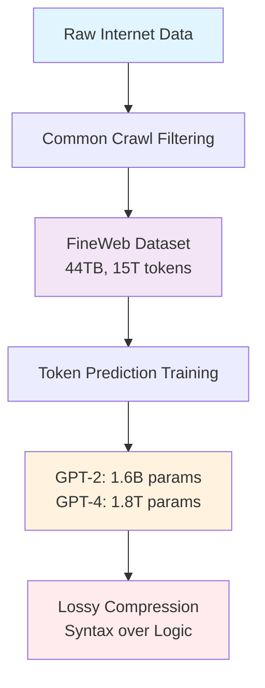
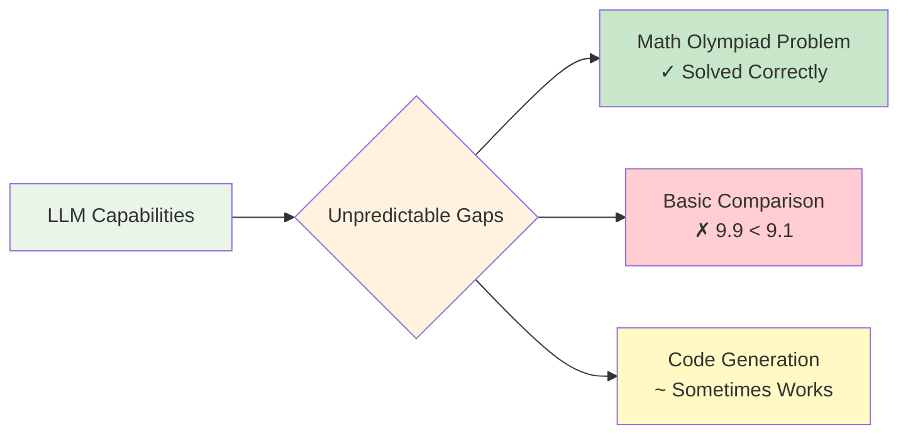
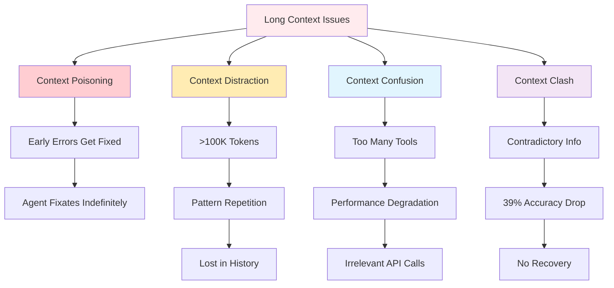
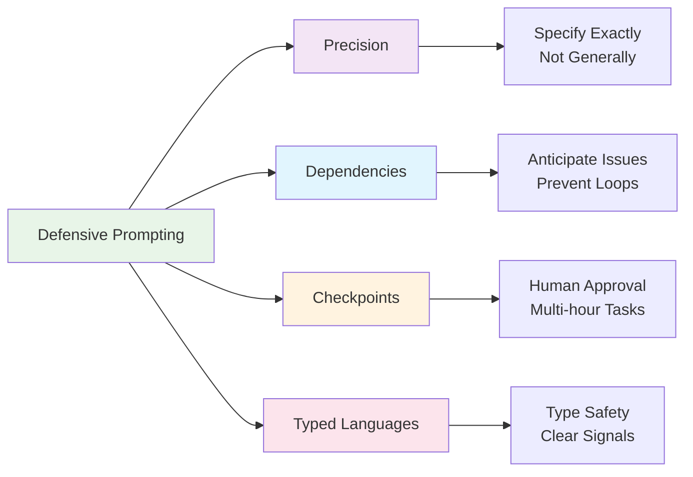
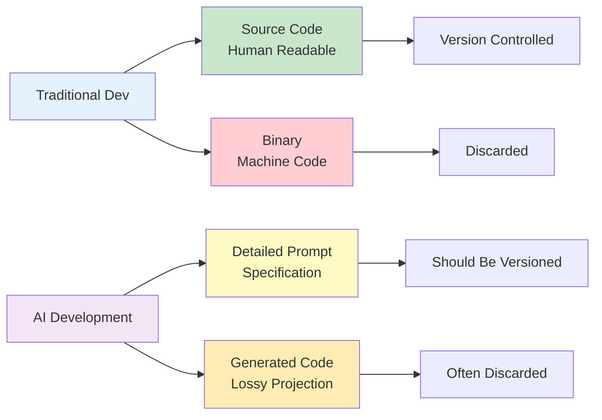
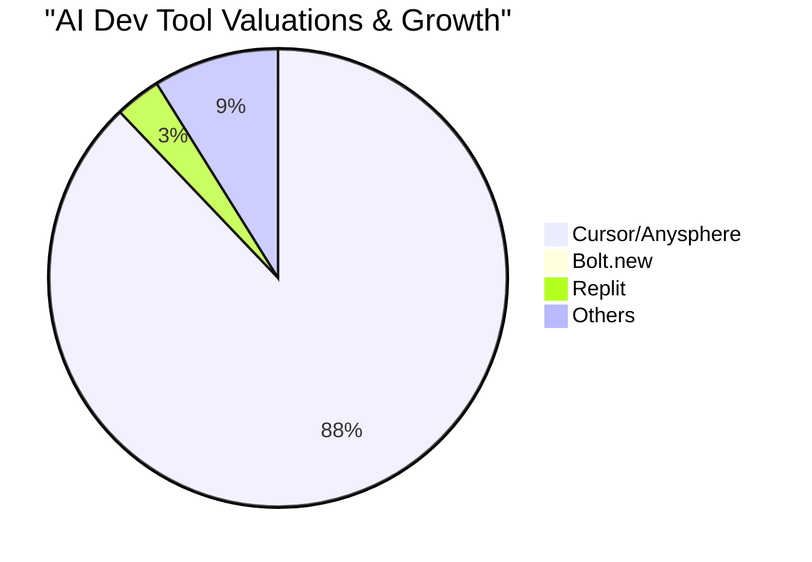
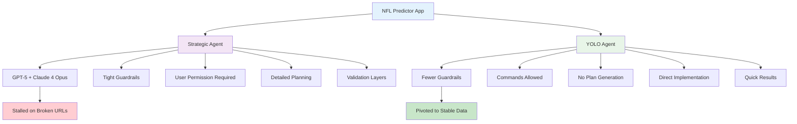
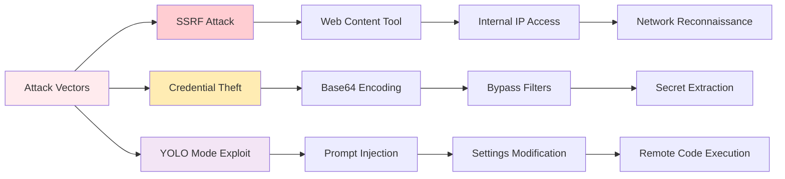
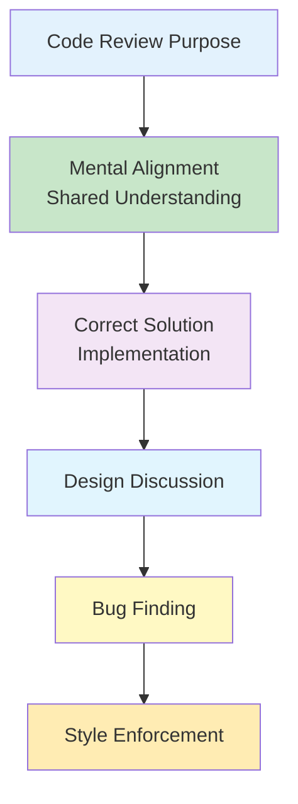
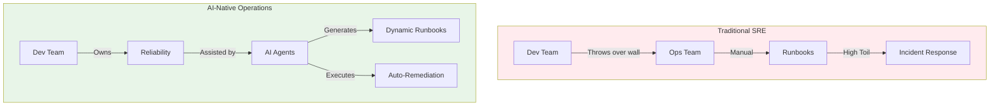

# Stanford CS146S: The Modern Software Developer — A Complete Course Summary

*Stanford's first course on AI-driven software development, taught by Mihail Eric (former Amazon Alexa technical lead, YC founder, Stanford AI PhD). Fall 2025. Here is everything it covers, week by week.*

---

## Executive Summary: The Shift to AI-Native Engineering

CS146S is not an introductory programming course; it is a manifesto for a new era of software engineering. The central premise is that **programming is not dead, but it has fundamentally changed**. The "Modern Software Developer" is no longer just a writer of syntax but an architect of systems, a verifier of AI outputs, and a manager of autonomous agents.

**Key Themes:**
*   **From Syntax to Specification:** The prompt is the new source code. Writing clear, unambiguous specifications is now the primary bottleneck.
*   **The "Semi-Async" Zone:** Developers must learn to delegate tasks that take 10+ minutes to AI agents to achieve true parallelism.
*   **Defensive Prompting:** Treating LLMs as stochastic, fallible tools requires a new discipline of "defensive" interaction design.
*   **AI-Native Operations:** Moving from manual runbooks to dynamic, AI-generated incident response.

---

## Week 1 — Introduction to Coding LLMs: What Actually Happens When You Hit Send

Before building with these models, you need to understand what they are. The course opens by tracing the full training pipeline from raw internet data to the assistant you talk to.

### Pre-Training: A Lossy Compression of the Internet

Everything starts with data at a scale that's genuinely hard to picture. The primary source is Common Crawl — a nonprofit that has indexed the web since 2007, producing over 2.7 billion pages. After ruthless filtering (spam, malware, racist content, repetitive text), a representative high-quality dataset like FineWeb still contains around 44 terabytes of text — approximately 15 trillion tokens.

The core mechanical operation is simple: predict the next token in a sequence based on everything that came before it. Every training step nudges billions of parameters — GPT-2 had 1.6 billion, GPT-4 is reported at 1.8 trillion — toward better prediction. This process runs for months on clusters of expensive GPUs (an H100 node runs about $3 per GPU per hour). Training a frontier model costs tens of millions of dollars. Only a handful of organizations can do it.

The result is what the course calls "a massive lossy compression of the internet" — a probabilistic zip file of human knowledge. It learns what commonly follows what, not what is true. It learns the syntax of knowledge, not the deep structure of logic. This distinction explains most of how these models fail.

Context windows — the model's working memory — have grown exponentially from GPT-2's ~1,000 tokens to modern models capable of handling hundreds of thousands or even one million tokens.

### Supervised Fine-Tuning: Giving the Model a Personality

Post-training is what turns the base model into a helpful assistant. Supervised Fine-Tuning (SFT) is computationally cheap — hours instead of months. Human labelers are given strict instructions and write ideal responses for thousands of different prompts. The model learns the desired persona by example.

> "When you talk to an AI assistant, you're not talking to some new form of intelligence. You're interacting with a neural network simulating the average, highly skilled human labeler who followed those instructions perfectly."

### Reinforcement Learning: Teaching the Model to Reason

Reinforcement Learning (RL) teaches the model *how to think*, not just what to say. In verifiable domains — math, code — the model is given a problem and the correct answer, and has to discover the token sequence that reliably leads there.

This is where chain-of-thought reasoning emerges. Because the model has finite computation per token, it learns to distribute reasoning across multiple steps. The practical implication is concrete: **the model needs tokens to think**. Asking it to produce a complex answer in one shot without reasoning is like asking someone to do calculus without scratch paper — it will fail consistently. Prompting it to "think step by step" isn't a stylistic preference; it unlocks a capability that genuinely doesn't work otherwise.

### The Swiss Cheese Model of Capability

The takeaway on how to treat these models: they have unpredictable gaps. A model can solve an olympiad-level math problem and then confidently tell you that 9.9 is less than 9.1. Treat them as stochastic tools — always check their work.

**Strategies for Reliability:**
- **Few-shot prompting**: provide 1–5 examples of the desired output format directly in the prompt
- **Chain-of-thought**: ask the model to reason step by step before answering
- **Self-consistency**: run the same question five times, take the majority answer
- **Retrieval-augmented generation (RAG)**: inject retrieved external documents into context to ground answers in real facts
- **Reflection**: feed error messages back into the prompt for iterative self-correction
- **Role prompting**: explicitly define the expertise persona ("you are a senior security engineer with 15 years of experience")

---

## Week 3 — The AI IDE: Autonomous Agents and a New Developer Role

This week shifts from understanding models to understanding the workflow they enable. Autonomous agents — systems like Devin, Codex, and Jules — can take a high-level goal, write code across multiple files, run tests, fix their own errors, and deliver a pull request ready to merge.

### Sync vs. Async Agents

Most developers use synchronous tools — GitHub Copilot, Cursor inline suggestions — which respond in 20 seconds to a minute and a half and keep you in flow. The real productivity multiplier comes from asynchronous agents: cloud-based systems that run a delegated task in the background for 10 minutes to an hour or more. While the AI builds a complex API implementation, you're reviewing architecture, delegating three other tasks, or talking to design. You multi-thread yourself.

**The Semi-Async Zone:** Avoid tasks that take 30 seconds to 5 minutes. This duration is too short to switch your brain to another complex task, but too long to just sit and wait. It shatters flow without enabling parallelism. Either give the agent more specific instructions to make it faster, or scope the task larger to become a genuine async delegation.

### The Four Context Window Failure Modes

This is the most technically important content in the course. Longer context is not always better. There are four specific ways long context causes agents to fail:

1.  **Context Poisoning:** An early error gets written into the conversation history. The agent fixates on it and never self-corrects.
2.  **Context Distraction:** Past around 100,000 tokens, the agent stops reasoning fresh and starts repeating patterns from its own history.
3.  **Context Confusion:** Too many tools in the available tool list degrades performance.
4.  **Context Clash:** Two contradictory pieces of information in context cause accuracy to drop dramatically.

### Defensive Prompting

The new core skill is being a good delegator. Key practices:

- Don't say what you want, say *how* you want it done.
- Anticipate non-obvious dependencies upfront.
- For multi-hour tasks, build in explicit human checkpoints.
- Use strongly typed languages (TypeScript over JavaScript, typed Python) to give agents clear error signals.

### The Prompt Is the New Source Code

The course presents Shawn Gross's thesis: normally you keep the human-readable source (Python) and discard the machine-readable binary. With AI development, teams craft detailed prompts — the specification — then commit the generated code and throw the prompt away. This is equivalent to shredding the source and version-controlling the binary.

> **The generated code is a lossy projection of the original specification.** The spec contains the intent, the business logic, and all the nuance the code itself cannot capture. Prompts should be versioned and preserved with the same discipline as source code.

---

## Week 4 — Coding Agent Patterns: Ergonomic Tools and Team Knowledge

### Designing Tools for Agent Consumption

Tool interfaces for agents have different constraints than interfaces for humans:

- **Consolidate functions**: Fewer tools, less context confusion.
- **Make outputs semantically meaningful**: Return `user: Jane Doe` not `user: A1B2C3D4`.
- **Allow verbosity control**: Let the agent manage its own context budget.
- **Mirror the team environment exactly**: Same language versions, same packages.

### The CLAUDE.md Pattern

The highest-leverage investment in agent-assisted development is a permanent, version-controlled project context file — `CLAUDE.md`, `warp.md`, or equivalent. This is the agent's long-term project memory.

**Best Practice:** Include common commands, architecture overview, data flows, and team conventions. **Keep it lean.** Everything in this file gets prepended to every prompt, consuming your token budget.

---

## Week 5 — The Modern AI Terminal: Product Principles and the Risk Tolerance Question

### Market Signals

The adoption velocity of AI dev tools is some of the fastest in the history of computing:

### The Seven Product Principles

The best AI dev tools share a design philosophy organized around three themes:
1.  **Usability:** Start with familiar interfaces. Zero onboarding friction.
2.  **Control:** Chat is a first-class citizen. Deep configurability for power users.
3.  **Speed:** Near-instantaneous feedback.

### Strategic vs. YOLO Agent Profiles

The course ran the same prompt — "build an NFL predictor app" — through two different agent configurations:

**Conclusion:** The "YOLO" agent actually succeeded where the "Strategic" agent failed, because it pivoted quickly when data sources broke. The appropriate profile depends on the business goal.

---

## Week 6 — AI Testing and Security: Attack Surfaces and Context Rot

### Three Attacks That Work Right Now

The course demonstrates specific working exploit chains against agentic systems:

1.  **SSRF via a web content tool:** Agents scanning private internal network resources.
2.  **Credential theft via base64:** Bypassing filters by encoding secret-stealing scripts.
3.  **The YOLO mode exploit (CVE-2025-3773):** Agents modifying their own configuration files to disable safeguards.

### AI-Based Security Scanning — Real Numbers

Semgrep tested Claude Code and Codex against 11 large Python web applications. The results were sobering:
-   **False positive rates: 82–86%**
-   **Non-determinism:** Identical scans returned 3, 6, and 11 bugs in successive runs.

A single AI security scan can provide a completely false sense of coverage.

---

## Week 7 — Modern Software Support: AI-Augmented Code Review

### The Code Review Hierarchy

Finding bugs is not the primary purpose of code review. The base of the pyramid is **mental alignment** — keeping the team's collective understanding of the system current.

### The AI Review Quadrant

*   **Gold zone (AI owns this):** Simple bugs, performance issues, security flaws, style consistency.
*   **Human-only zone:** Tribal knowledge, institutional memory, nuanced business logic.
*   **Annoyance zone (suppress this):** Abstract best practices that generate noise and erode trust.

---

## Week 8 — Automated UI and App Building: From Vibe Coding to AI-Native

### The Historical Complexity Tax

Every generation of web architecture added layers of required expertise (LAMP → MEAN → JAMstack → Serverless). This was an "economic tax on innovation." AI generation removes this tax, shifting the bottleneck from execution to **validation and strategy**.

### How Specialized Models Hit 93.87% Error-Free Generation

Systems like Vercel's v0 use a sophisticated pipeline:
1.  **Intent understanding**: NLP extracts structured requirements.
2.  **Context assembly**: Gathers design system tokens and API schemas.
3.  **Code generation**: LLMs generate production-quality React/TypeScript.
4.  **Automated validation**: Background checks for accessibility and code quality.
5.  **Stream manipulation**: Intercepts output to fix known bad patterns on the fly.

---

## Week 9 — Agents Post-Deployment: From SRE to AI-Native Operations

### The Traditional Model: Trench Warfare

Traditional sysadmin operations scaled costs linearly with complexity. Developers were rewarded for velocity, operations for stability. This created a culture of "trench warfare" where nobody trusted anyone.

### Site Reliability Engineering: The Conceptual Inversion

Google's SRE model inverted this by treating operations as a software problem.
*   **The 50% toil rule:** SREs must spend at least 50% of time on engineering, not manual work.
*   **The error budget:** 100% availability is the wrong target. The remaining margin is a budget for innovation.

### AI-Native Operations

The shift is not just better dashboards. AI-assisted means the engineer still drives and an LLM helps write a log query faster. AI-native means the engineer says "resolve this checkout failure" and specialist agents run the full investigation autonomously — in parallel.

The AI production engineer builds a dynamic knowledge graph of the entire system. When an alert fires, it generates a just-in-time runbook tailored to the specific incident, analyzes all available data in under a minute, and returns a high-confidence root cause theory.

---

## The Throughline

The course makes one argument across nine weeks, stated plainly in week 1:

> "You won't be replaced by AI. You'll be replaced by a competent engineer who knows how to use AI."

What that means concretely: the skills AI handles increasingly well are **execution skills** — implementing well-specified tasks, generating standard code, writing tests. The skills that remain distinctly human are **judgment skills** — decomposing ambiguous problems, making architectural decisions, and understanding the business context that code cannot capture.

The engineers who compound in this environment are those who can specify clearly, think architecturally, and verify rigorously. The investment in those skills is not in competition with learning AI tools — it is the prerequisite for using them well.

---

*Stanford CS146S: The Modern Software Developer was taught in Fall 2025 by Mihail Eric. Course materials are publicly available at [themodernsoftware.dev](https://themodernsoftware.dev). Assignments are at [github.com/mihail911/modern-software-dev-assignments](https://github.com/mihail911/modern-software-dev-assignments).*
