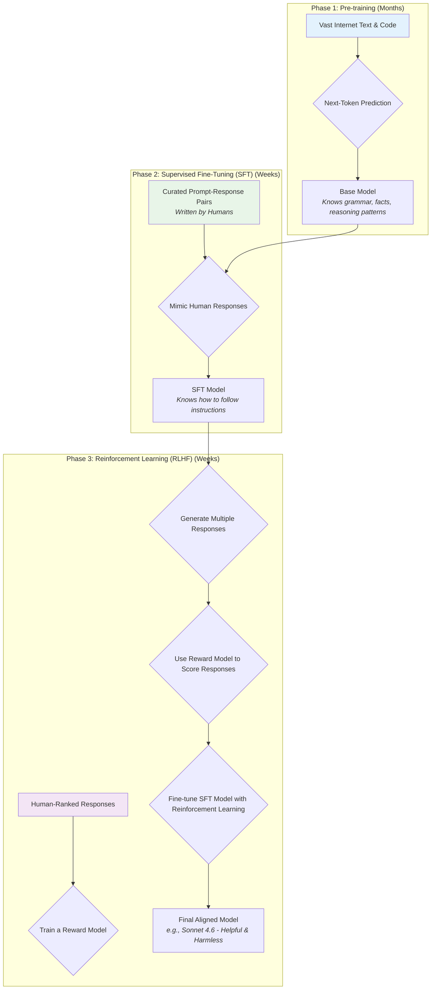
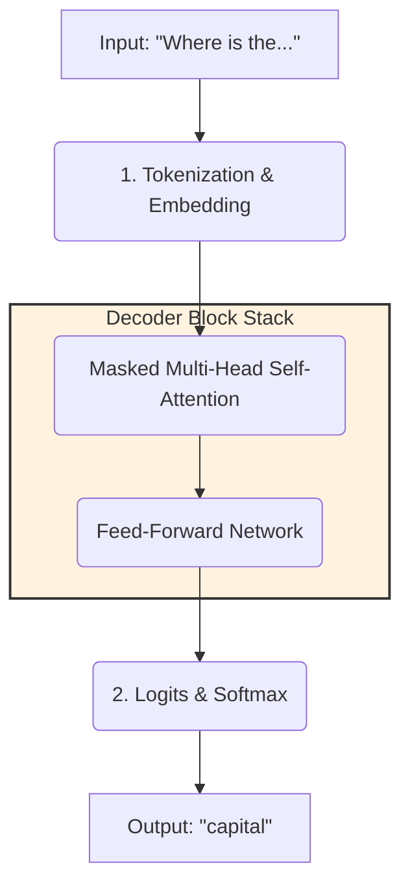
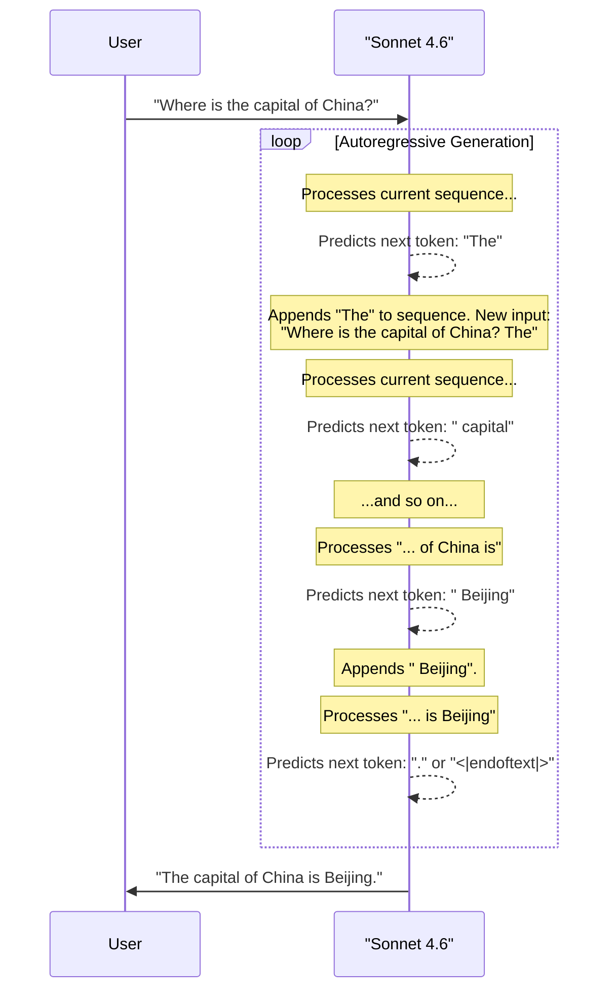

## Introduction: From Raw Data to Reasoning

Large Language Models (LLMs) like Sonnet 4.6, GPT-4, and Llama 3 appear to "understand" and "reason" about our prompts. But how do they actually work? How does a model go from a simple user query like **"Where is the capital of China?"** to generating the correct answer, "Beijing"?

This guide will walk you through the entire end-to-end process, from the three-stage training that creates the model to the intricate mechanics of the decoder-only transformer architecture that generates the answer, token by token.

## The Three-Stage Training Process: Building and Aligning the Model

An LLM isn't built in a single step. It undergoes a rigorous, multi-stage training process to acquire knowledge and learn to interact with humans.

### Phase 1: Pre-training (Building the Foundation)

The goal of pre-training is to build a **base model** that understands the fundamental patterns of human language and knowledge.

*   **What it is:** The model is trained on a massive, diverse dataset comprising a significant portion of the public internet—text, books, code, and more. This huge dataset is broken down into smaller, manageable **batches** that are fed to the model iteratively.
*   **The Task:** The training objective is deceptively simple: **next-token prediction**. The model is given a sequence of text and asked to predict the very next word (or sub-word, called a token). For example, given "The quick brown fox jumps over the lazy...", it must learn to predict "dog".
*   **The Outcome:** By doing this billions of times, the model develops a deep, implicit understanding of grammar, syntax, facts about the world (like the capital of China), and even reasoning abilities. However, at this stage, it's not a helpful assistant. It's a powerful text completion engine.

### Phase 2: Supervised Fine-Tuning (SFT) (Teaching the "Chat" Format)

The base model knows a lot, but it doesn't know how to be a chatbot. SFT teaches it to follow instructions and respond in a conversational format.

*   **What it is:** Human labelers create a high-quality dataset of thousands of prompt-and-response pairs.
*   **The Task:** The base model is trained on this dataset to mimic the ideal responses.
*   **The Outcome:** The model learns the instruction-following and conversational format we expect from an assistant.

### Phase 3: Reinforcement Learning from Human Feedback (RLHF) (Aligning with Human Preferences)

The SFT model is helpful, but its responses might be verbose or unnatural. RLHF fine-tunes the model to better align with what humans find valuable.

*   **The Process:** A separate "reward model" is trained to predict human preferences. The SFT model is then "rewarded" for generating answers that the reward model scores highly.
*   **The Outcome:** This process makes the final model more helpful, harmless, and honest. This is the model, like **Sonnet 4.6**, that you interact with.

---

## Next-Token Prediction: The Dual Role of a Single Task

A crucial point to understand is that **"next-token prediction" is the core task used in *both* pre-training and inference, but for very different purposes.** The core mechanism is the same, but the application and data flow are completely different.

| Feature | 🏋️ Pre-training Stage (Learning) | 🤖 Inference Stage (Generating) |
| :--- | :--- | :--- |
| **Goal** | **To Learn & Adjust Weights.** | **To Generate an Answer.** The model's weights are **frozen**. |
| **Input** | A chunk of text from the massive dataset (e.g., a paragraph from Wikipedia). | A user's prompt (e.g., "Where is the capital of..."). |
| **What happens after prediction?** | **Compare to Ground Truth & Learn.** The model checks the *actual* next token in the text. It calculates a **loss** (error signal) and uses **backpropagation** to adjust its weights. | **Select & Append.** There is no "ground truth." The model **selects** a token and **appends it to the input sequence** to generate the next token in a loop. |
| **Final Output** | The "output" is not text. The output is **updated model weights**. | The output is a **sequence of generated tokens** that form a complete answer. |

### Analogy: The Student and the Exam

Think of the LLM as a student.

*   **Pre-training is Studying:** The student reads thousands of textbooks (the huge dataset). For each sentence, they try to guess the next word (**prediction**). They then look at the actual next word in the book (**ground truth**). If they were wrong, they mentally correct themselves and adjust their understanding (**learning/weight update**). They are not writing a new book; they are just learning from existing ones.

*   **Inference is Taking an Exam:** The professor gives them the start of a question ("The capital of France is..."). The student uses all their learned knowledge to write down the answer (**generation**). They write "Paris," then a period. They are not learning from the exam question; they are demonstrating what they already know.

---

## Core Architecture: The Decoder-Only Transformer

Now, let's dive into the inference process. When you send the prompt "Where is the capital of China?" to Sonnet 4.6, what happens inside the model's architecture?

LLMs like Sonnet 4.6 are based on a **decoder-only transformer architecture**. This architecture is designed specifically for next-token prediction.

### Step 1: Tokenization and Embedding

The model doesn't see words; it sees numbers.

1.  **Tokenization:** The input string is broken down into **tokens** based on the model's built-in vocabulary.
    *   `"Where is the capital of China?"` -> `["Where", " is", " the", " capital", " of", " China", "?"]`
2.  **Embedding:** Each token is converted into a dense vector of numbers, called an **embedding**.
3.  **Positional Encoding:** A **positional encoding** vector is added to each token's embedding to give the model information about word order.

### Step 2: The Decoder Block (The Thinking Engine)

The sequence of embedded vectors is now processed through a stack of identical decoder blocks. Each block has two main components:

#### A. Masked Multi-Head Self-Attention

This is the heart of the transformer, where the model understands context.

*   **Self-Attention:** For each token, it calculates "attention scores" to determine how much importance it should pay to every *other* token in the sequence. For the token "capital", it will learn to pay high attention to "China".
*   **Multi-Head:** The attention mechanism is run multiple times in parallel (e.g., 12+ "heads"), allowing the model to capture different types of relationships simultaneously.

#### B. Feed-Forward Network (FFN)

This is a simpler neural network that processes each token's vector independently, acting as the "thinking" step to synthesize the contextual information from the attention layer.

### Step 3: The Final Prediction (Logits and Softmax)

After passing through the decoder stack, the final output vector is fed into two final layers:

1.  **Logit Head:** A linear layer that produces a raw score (a **logit**) for every single token in the model's vocabulary.
2.  **Softmax Function:** Converts the logits into probabilities that sum to 1. The token with the highest probability is selected as the output.

---

## Putting It All Together: An End-to-End Example

Let's trace the generation of the answer for **"Where is the capital of China?"** by Sonnet 4.6. This is an **autoregressive** process, meaning the model's output is fed back into its input in a loop.

1.  **Initial Prompt:** The model takes the tokenized embeddings for `"Where is the capital of China?"`.
2.  **First Prediction:** It processes this sequence. The self-attention mechanism identifies the strong link between "capital" and "China". The model outputs a probability distribution, and the token **"The"** has the highest probability.
3.  **Second Prediction:** The model now takes the original prompt *plus* the newly generated token as its new input: `"Where is the capital of China? The"`. It runs the entire process again. This time, the most likely next token is **"capital"**.
4.  **Continuing the Loop:** This autoregressive loop continues, generating one token at a time until it predicts a special **end-of-sequence** token.

## Conclusion

The journey from a simple prompt to a coherent answer is a remarkable interplay between massive-scale pattern recognition and careful human alignment.

*   **Pre-training** gives the model a vast library of world knowledge by using next-token prediction as a **learning objective**.
*   **Fine-tuning (SFT & RLHF)** teaches it to access that knowledge in a helpful, conversational, and safe manner.
*   The **decoder-only transformer architecture** uses next-token prediction as a **generation mechanism** to autoregressively build an answer, one token at a time.

So, when you ask Sonnet 4.6 a question, you are initiating a sophisticated, high-speed sequence of predictions, where each new word is chosen based on the rich contextual understanding the model has built from processing trillions of words before.