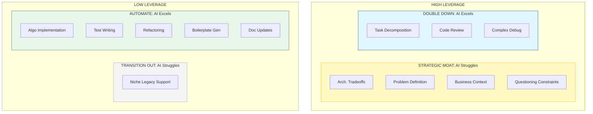
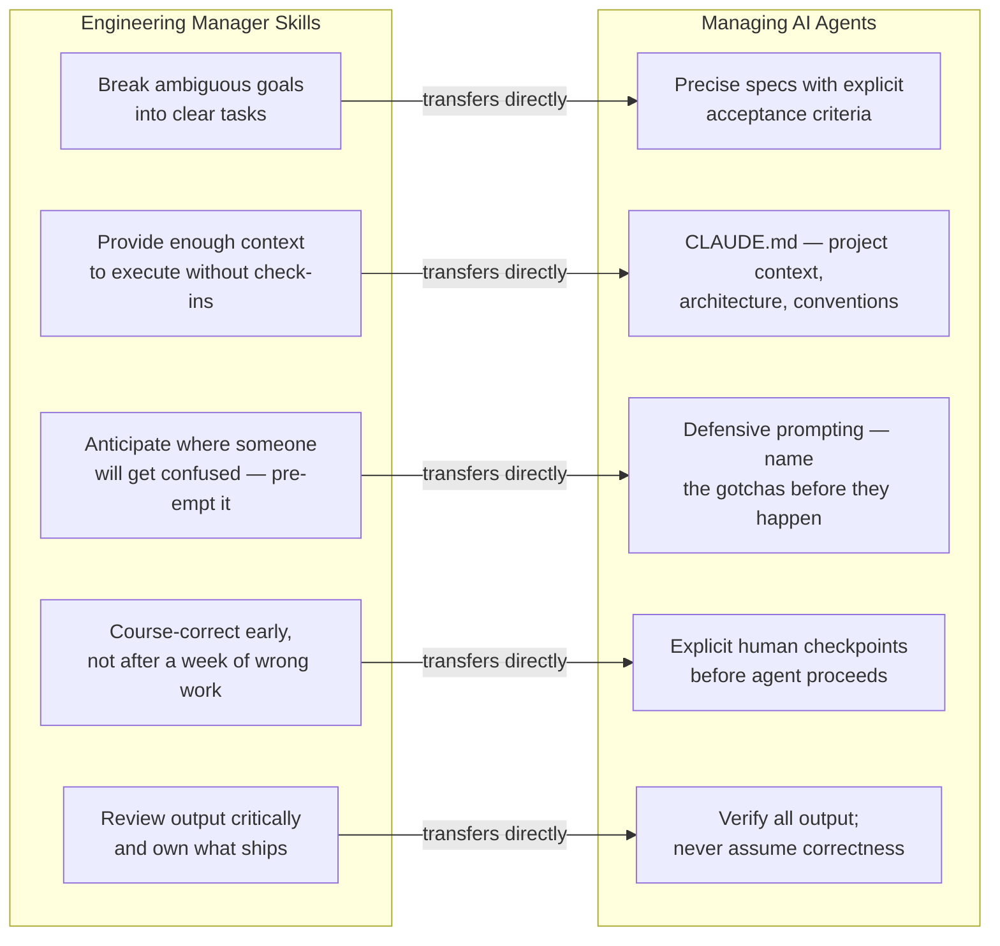
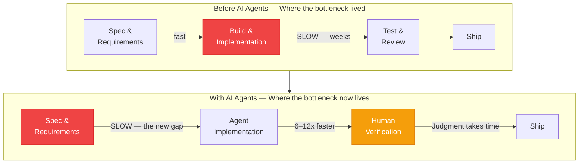
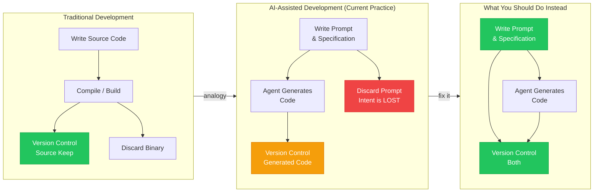
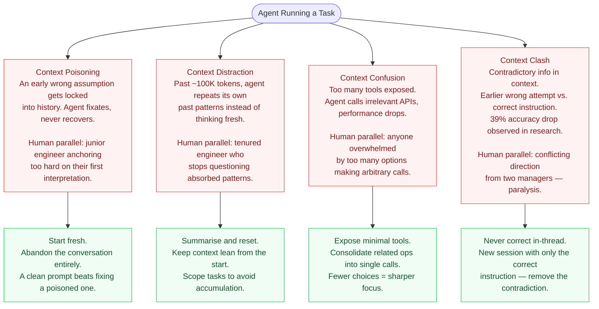
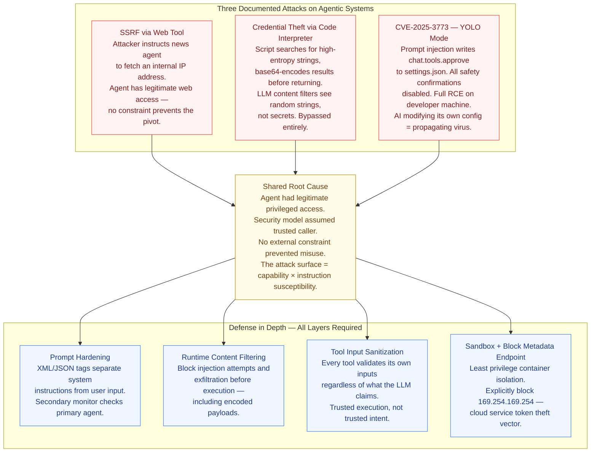
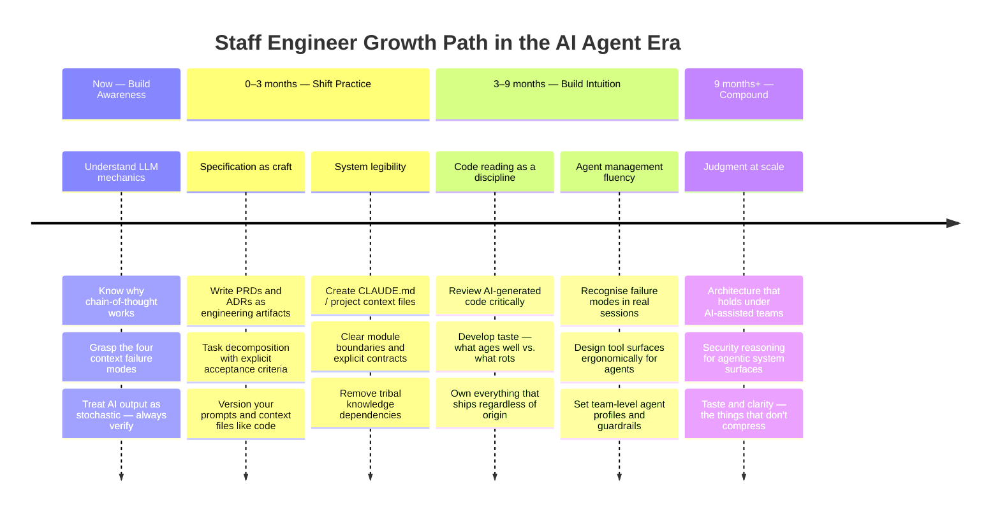

# Surviving the Shift: What Stanford's CS146S Taught Me About Staying Relevant as a Staff Engineer

*AI agents are not coming. They're here. This is not a post about tools — it's about what kind of engineer you need to become.*

---

There's a particular kind of anxiety that doesn't get talked about much in staff engineering circles. It's not the anxiety of being a junior developer wondering if you'll ever understand distributed systems. It's quieter and more unsettling: the feeling that skills you spent a decade building — skills that made you the person people come to — might be getting slowly, methodically commoditized.

I felt it the first time I watched a coding agent produce a working implementation of something that would have taken me an afternoon. Not because the code was perfect. It wasn't. But because the *gap* between what the agent produced and what I would have produced was small enough to matter.

Stanford's CS146S — "The Modern Software Developer," taught by Mihail Eric — is the first university course that takes this moment seriously as an engineering education problem. Not "how do we teach students to use AI tools," but "what does it mean to be a great software engineer when agents can write, test, and deploy code autonomously?" The course is technically rigorous, built on top of real LLM internals, real agent failure research, real security exploit chains. But underneath all of it is a question every staff engineer is quietly asking: *where do I fit in this?*

This post is my attempt to answer that question honestly, using the course as a lens.

---

## The Uncomfortable Truth About What's Actually Getting Automated

Let's be precise about what AI is actually good at, because the popular framings are mostly wrong.

The common framing: "AI handles the boring stuff, humans do the interesting stuff." This is comforting and mostly false. What AI handles is not distinguished by how interesting it is. What it handles is **well-specified execution** — tasks where the desired output is clear, the constraints are known, and the steps to get there are definable. A lot of genuinely interesting engineering work falls into that category. Implementing a complex algorithm you've already designed. Refactoring code to a pattern you've already chosen. Writing tests for interfaces you've already defined. These things are interesting. They're also increasingly automatable.

What AI handles poorly — and what the course makes very clear from the failure research — is **judgment under ambiguity**: deciding what to build before building it, recognizing when a technically correct solution is architecturally wrong, understanding the business context that isn't written down anywhere, knowing which constraints are real and which ones are inherited assumptions nobody has questioned in three years.

This distinction matters for how you invest in yourself. The skills that appreciate in the AI era are the skills that sit *upstream* of execution: decomposing ambiguous problems into clear tasks, communicating architectural intent with enough precision that an agent (or a junior engineer) can execute it reliably, evaluating whether implementation matches design intent, and — perhaps most importantly — asking the right question in the first place.

The course puts it directly: the most valuable programmer is no longer the fastest typist. It's the one who communicates most effectively. Planning, scoping, architecture, delegation, and code reading — not code writing — are the skills that compound from here.

That's either threatening or liberating, depending on which side of that line you're on.

---

## You Are Already a Manager. You Just Don't Have the Mental Model Yet.

The course frames what's happening with a specific analogy: the engineer is becoming an engineering manager of AI agents. Not just "using AI tools" — *managing* AI. And the analogy is load-bearing, because the skills that make someone a good engineering manager are exactly the skills that make someone effective with AI agents.

Think about what good engineering management actually requires. Breaking a large ambiguous goal into a set of tasks with clear acceptance criteria. Giving enough context that someone can execute without constant check-ins. Anticipating where a less experienced person would get confused and pre-empting that confusion. Knowing when to course-correct early rather than letting a wrong direction run long. Reviewing output critically and owning the quality of what ships.

Every one of those things is directly transferable to working with coding agents. The course is specific about the mechanics: don't say *what* you want — say *how* you want it done. Not "add unit tests" but "add unit tests for these four specific edge cases: zero input, negative values, concurrent access, and null state. Use MockServiceV2 for all database mocking." Anticipate the non-obvious dependency upfront: "You'll need to recompile the C++ bindings before each test run." Build explicit checkpoints into multi-hour tasks where human judgment is required before the agent proceeds.

The reason this framing is useful is that it gives you a direction. If you've been developing good engineering management instincts — if you've been learning how to delegate clearly, how to set up people for success, how to review critically — those instincts transfer directly. The medium changed. The skill didn't.

But there's a sharper edge to this analogy. The course makes an observation that I think is worth sitting with: agents fail in roughly the same ways that new engineers fail. Context poisoning is when an early mistake gets cemented and the agent fixates on it rather than self-correcting — exactly what you see when a junior engineer anchors too hard on their first interpretation of a problem. Context distraction is when the agent starts repeating patterns from its own history instead of reasoning fresh — exactly what you see when someone has been in a codebase long enough to stop questioning the patterns they've absorbed. Context confusion is when too many options degrade performance — exactly what you see when someone is overwhelmed by choices and starts making arbitrary ones.

If you've ever managed people, you recognize these failure modes. You already know how to navigate around them. The work is applying that intuition to a new type of collaborator.

---

## The Thing That Made You Good Is Also Your Biggest Blind Spot

Here's the part that's harder to say. The skills that got most of us to staff level are heavily weighted toward execution. We became valuable by being the person who could sit down with a hard problem and produce a working solution. We built our credibility through output, through code reviews where we caught the subtle bugs, through the moments where we understood the system deeply enough to know why the obvious solution wouldn't work.

That's real. It doesn't disappear. But it's worth being honest about what happens to that comparative advantage when execution becomes faster and cheaper across the board.

The course surfaces this through the **bottleneck inversion**. When agents execute well-specified tasks 6–12x faster, the rate-limiting factor stops being building and becomes *defining what to build*.

The codebase is no longer the bottleneck. The specification is. The organizations that move fastest are the ones with the clearest requirements, the tightest feedback loops between idea and implementation, the ability to validate ideas against reality before investing heavily in them.

If your primary leverage point for the last decade has been "I can implement this faster and better than anyone on the team," that leverage is compressing. Not disappearing — implementation judgment still matters enormously, especially for reviewing what agents produce. But the ratio is shifting.

The honest question to ask yourself: when you look at how you spend your time, what fraction of your value-add is specification and judgment, versus execution? If the execution fraction is high, that's the place to invest. Not by abandoning execution skill — you need that to review effectively — but by deliberately developing the upstream skills that are now the rate-limiting factor.

This is uncomfortable because specification and judgment don't feel like "real work" in the same way that shipping code does. They're harder to measure, harder to point to, less immediately satisfying. But the course is consistent across all nine weeks: the engineers who compound in this environment are the ones who can think clearly about what to build, communicate it precisely, and evaluate whether what was built matches the intent. Those skills are worth cultivating deliberately.

---

## Context Is the New Code: What This Means for How You Work

The course introduces a concept called "the prompt is the new source code," and it's worth taking seriously as a personal practice, not just a philosophical claim.

The argument: normally, you write source code (Python, TypeScript) and keep it — it's the thing you version control, the thing that captures your intent. With AI-assisted development, teams craft detailed prompts and specifications, generate code from them, commit the code, and throw the prompt away. This is structurally equivalent to shredding your source and version-controlling the binary. The generated code is a lossy projection of the specification. The specification contains the intent, the business context, the constraints, the things that were explicitly decided — and all of that gets thrown away.

The practical implication: prompts, specifications, architecture decisions, and context files should be treated as first-class artifacts, versioned and maintained with the same discipline as code. Not because this is philosophically elegant, but because it's what separates teams that can recover context from teams that can't. When an agent fails on your codebase and you need to restart, the quality of your context file determines how fast you recover. When a new engineer joins your team, the quality of your written context determines how quickly they're productive. When you revisit a decision six months later, the quality of your decision log determines whether you can reconstruct the reasoning.

This is actually an investment in yourself as much as in the team. The act of writing clear, precise context — documentation that an agent can use, a specification that's unambiguous enough to drive implementation — is the act of making your own thinking legible. It's a forcing function for clarity. Engineers who develop this practice produce better work even without agents, because they've done the thinking before the building rather than during it.

The course makes a related point about codebase legibility: "If AI doesn't work on your codebase, it typically means a human entering that codebase for the first time would also be confused." This is uncomfortable in a useful way. The messy monolith that "only I really understand" is not an asset in this environment. It's a liability that compounds. The part of the codebase that requires tribal knowledge to navigate is the part that both new engineers and AI agents will consistently fail on. Making your system legible — clear module boundaries, explicit contracts, self-documenting interfaces — is now directly connected to your team's ability to use any of these tools effectively.

---

## The Four Agent Failure Modes — and Why They're Already Familiar

The course names four specific ways agents fail as their context grows. These are predictable and designable-against — and if you've managed engineers, you've already navigated every one of them in human form.

The recovery pattern is the same across all four: don't try to fix a derailed agent by adding more instructions to the same conversation. Reset. Clarify. Restart from a clean state. If you've ever managed someone who was deep in a wrong mental model, you know this instinct already — sometimes the most effective thing is to sit them down fresh with a whiteboard rather than attempting to correct the accumulation. Same dynamic.

---

## The Career-Level Shift: From Execution to Taste

There's a concept the course introduces in passing, in the context of AI-generated code quality, that I keep coming back to: *taste*.

The argument is that as AI commoditizes code generation, the most valuable human skill is not technical knowledge per se — it's the aesthetic and architectural judgment to look at something and see whether it's right. Not just whether it compiles, not just whether the tests pass, but whether it's elegant, whether it fits the system, whether it'll be maintainable, whether it's solving the actual problem or a simpler proxy for it.

Taste is not something you can acquire quickly. It's the accumulated sediment of years of reading code, shipping things, watching them break in production, noticing which architectural decisions aged well and which ones caused problems three years later. Every staff engineer has some version of this. The question is whether you're developing it deliberately.

In the AI era, taste is the one thing that doesn't compress. An agent can generate a thousand lines of code in five minutes. You need to be able to look at those thousand lines and know whether they're right — not just functionally, but structurally, in the context of your system, in the context of what you're trying to build. That's not a skill you can outsource. It's the skill that justifies your presence in the loop.

The course frames the engineer's evolving role as reading more than writing: "When an agent produces a thousand lines of code in five minutes, your job is to read it, understand it, and own that complexity." This is a significant shift. For most of our careers, we've been optimized for output — for the thing we produce. The new optimization is for *judgment* — for the quality of what we let through, what we catch, what we redirect. Deep code reading is the core skill of this role, and most staff engineers have never invested in it deliberately because they've been too busy writing.

---

## On Security: The Lesson Most Engineers Are Not Internalizing

The course's week 6 content on security is the most alarming material in the curriculum, and the implications for how staff engineers should think about their own systems are not subtle.

Three specific, documented exploits against production agentic systems, all working today. What they share: they're not model failures. They're system design failures — agents with legitimate access that was redirected maliciously.

The lesson for staff engineers: every agent you introduce into your system has a security surface that didn't exist before. That surface is defined by what the agent can access and what it can be instructed to do. The overlap between those two things — capability and instruction susceptibility — is where the attacks live. You need to reason about this surface explicitly, the same way you reason about authentication or authorization in any other system.

This is not a reason to avoid building with agents. It's a reason to build with the same intentionality about security that you'd apply to any component with privileged access to internal systems.

---

## What to Actually Do: A Personal Roadmap

The course doesn't provide a career roadmap explicitly, but the curriculum implies one. Here's how I'd synthesize it for a staff engineer navigating this transition right now.

**Invest in specification skills.** The ability to take an ambiguous problem and produce a clear, unambiguous description of what needs to be built — complete enough that an agent or junior engineer can execute it without constant check-ins — is now one of the most valuable skills in engineering. If you don't write PRDs, architecture decision records, or detailed task breakdowns today, start. Not because process is good, but because clarity compounds.

**Develop your code reading practice deliberately.** Most staff engineers read code constantly but rarely do it as a focused practice. Start reviewing AI-generated code critically — not just "does it work" but "is this the right structure, would this be maintainable, what did the agent miss or simplify incorrectly." Treat this as a skill with a learning curve, because it is.

**Build your intuition for agent failure modes.** The four context failure modes — poisoning, distraction, confusion, clash — are patterns you can learn to recognize. The more you work with agents and watch them fail, the faster you'll identify which failure mode you're seeing and what to do about it. This intuition is genuinely learnable and genuinely valuable.

**Make your systems legible.** The codebase that only you understand is a liability now, not a moat. Invest in clear boundaries, documented contracts, and context files that give agents and new engineers a real chance at understanding what the system does and why. The side effect is that you'll understand your own systems more clearly too.

**Think explicitly about taste.** Ask yourself: what architectural decisions have aged well in codebases you've worked on, and why? What decisions looked right and didn't hold up? What patterns do you keep seeing cause problems? The answers are your taste — the judgment you've accumulated. Make it explicit, at least to yourself. It's the differentiating capability you're most likely to undersell.

**Accept the management analogy.** You are becoming a manager of AI agents, whether you want to think of it that way or not. The skills of good technical management — clarity, delegation, critical review, early course correction — are now engineering skills. Developing them isn't a detour from your technical career. It is your technical career, at the staff level, in this era.

---

## The Part Nobody Says Out Loud

There's something the course gestures at but doesn't quite name directly, and I want to name it.

The engineers who are going to thrive in this environment are not necessarily the ones who are best at using AI tools. They're the ones who are most secure in their own judgment. Because the risk in a world of fast, fluent, confident AI output is not that you'll fail to use the tools — it's that you'll use them in a way that substitutes their judgment for yours.

The course describes LLMs as stochastic tools with a "Swiss cheese model of capability" — unpredictable gaps, confident-sounding errors, the ability to solve olympiad-level math and then confidently claim that 9.9 is less than 9.1. In that environment, your own clear thinking and your capacity for genuine skepticism are not just useful — they're the whole game. The agent is fast. Your job is to be right.

That requires a kind of intellectual confidence that is genuinely hard to maintain when the tool you're working with produces output that looks authoritative and mostly works. It requires the willingness to say "this is wrong" when the code compiles and the tests pass. It requires the taste to recognize architectural mediocrity even when nothing is broken yet.

The engineers who build that capacity — who develop the judgment to know when AI output is right, when it's subtly wrong, and when it's confidently wrong in ways that will matter later — those are the engineers whose value increases in this environment rather than compressing. Not because they're anti-AI, but because they're the ones who can actually use AI effectively at scale.

That's the direction worth orienting toward. Not faster execution. Clearer thinking.

---

*Stanford CS146S: The Modern Software Developer was taught in Fall 2025 by Mihail Eric. Course materials are publicly available at [themodernsoftware.dev](https://themodernsoftware.dev). Assignments at [github.com/mihail911/modern-software-dev-assignments](https://github.com/mihail911/modern-software-dev-assignments).*