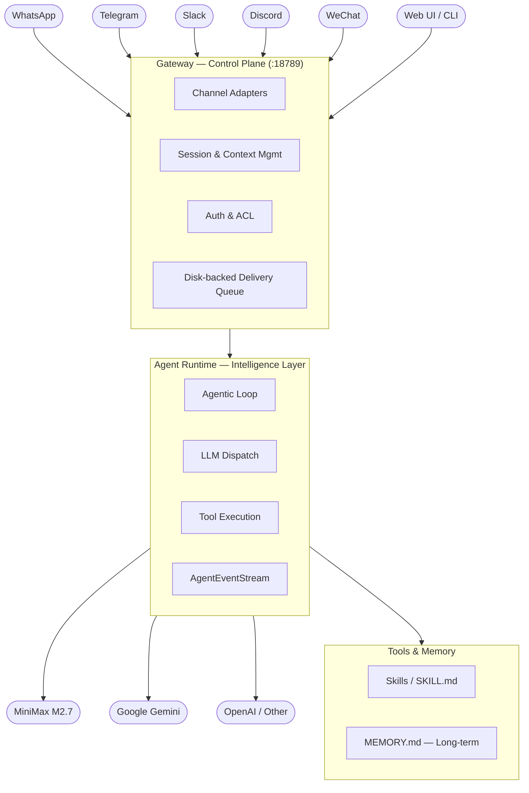
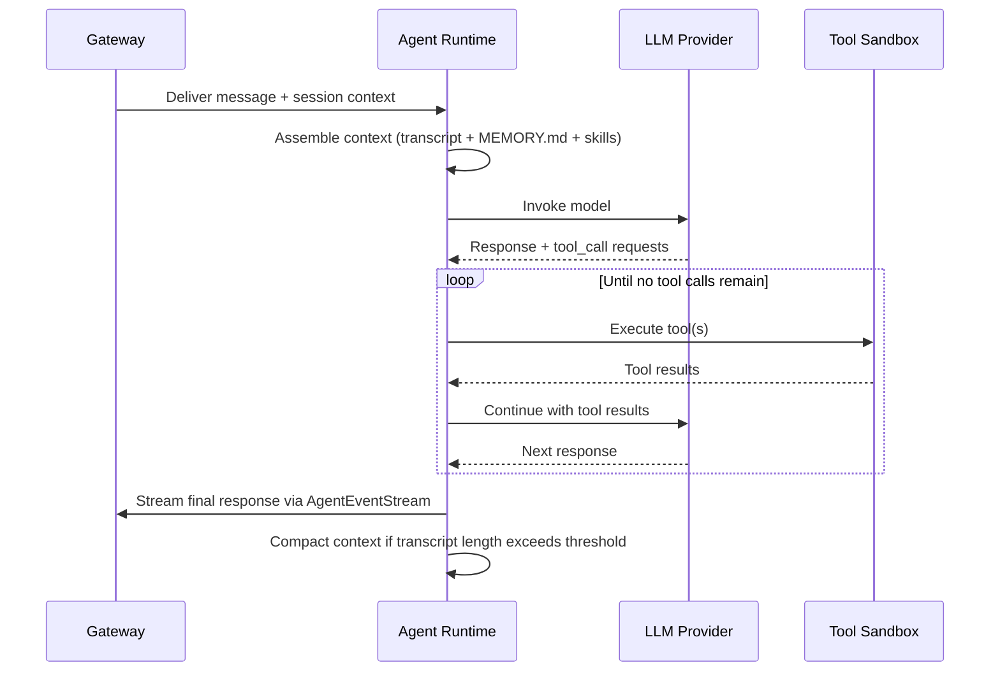
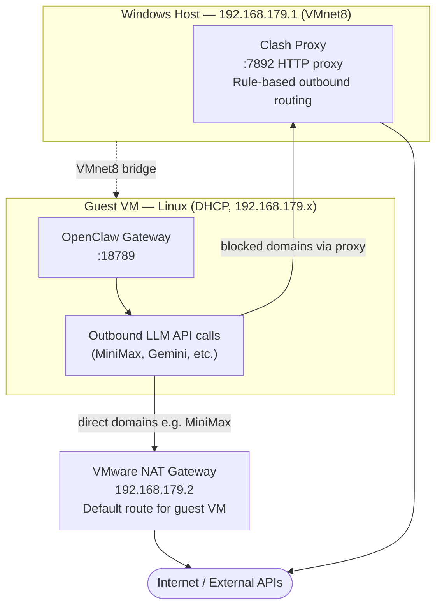

# Self-Hosting Agentic AI: A Deep Dive into the OpenClaw Architecture

## What Is OpenClaw?

**OpenClaw** is a self-hosted, open-source AI agent runtime built in TypeScript. It is not a chatbot wrapper. It is an **operating system for AI agents** — a persistent, long-running service that treats AI as infrastructure: session management, long-term memory, tool sandboxing, access control, multi-channel delivery, and orchestration are all first-class architectural concerns.

The project was started by Peter Steinberger (founder of PSPDFKit) in late 2025 as a small weekend experiment called "Warelay" — a WhatsApp relay that forwarded messages to an LLM and returned the response. It went viral in January 2026, generating successive waves of tech press coverage (and two forced rebrands in four days due to trademark conflicts). It is MIT-licensed and the codebase is publicly available on GitHub.

What makes OpenClaw distinctly different from managed AI services is its operational model: the agent runs as a background system service on hardware you own, connects to whichever LLM provider you configure (cloud or local), and is accessible through whichever messaging platform your team already uses — Feishu, WeChat, Telegram, WhatsApp, Slack, Discord, or a web UI. Nothing leaves your machine unless you explicitly route it out.

## The Problem It Solves

Corporate environments create a fundamental tension for engineers who want to leverage AI. Sending proprietary source code, internal documents, or customer data to a third-party cloud API is legally and contractually fraught — often prohibited. Waiting for IT to procure and approve an enterprise AI SaaS agreement takes months. And even where external AI is permitted, the tooling rarely integrates with internal workflows.

OpenClaw sidesteps this entirely. You run it on hardware you already have — a developer workstation, a home server, a lab VM. You point it at an LLM that is either already approved for your environment, or one that runs entirely locally. The agent sits persistently in the background, available from your existing messaging channels, operating proactively without requiring you to open a new tool or prompt manually.

This is the architectural insight that separates OpenClaw from a chatbot: **persistence and proactivity**. It can check your email every 30 minutes, monitor a CI pipeline, alert you to drift in a monitored system — all without a human-initiated prompt. That is AI as infrastructure, not AI as a chat window.

## Architecture: Hub-and-Spoke Around a Gateway

OpenClaw follows a hub-and-spoke architecture. All external channels — messaging platforms, web UI, CLI — converge on a single control plane process called the **Gateway**. The Gateway routes everything to a single **Agent Runtime**, which executes the agentic loop and calls out to LLM providers and tools.



This separation between the **interface layer** (where messages originate) and the **intelligence layer** (where execution and LLM calls happen) is the central design decision in OpenClaw. It means you get one persistent assistant, with unified session state and tool access, reachable through any channel you configure — all managed centrally on your own hardware.

### The Gateway: Deep Dive

The Gateway is the most architecturally significant component. It is a WebSocket server that runs as a system service — a `LaunchDaemon` on macOS, a `systemd` unit on Linux — and it is the single ingress point for all agent interactions.

**Responsibilities of the Gateway:**

| Responsibility | Detail |
|---|---|
| Channel adapters | Normalizes input from WhatsApp (Baileys library), Telegram (grammY), Slack, Discord, Feishu (WebSocket), iMessage, web UI, and CLI into a unified message envelope |
| Session management | Maintains conversation state, context windows, and participant identity across channels |
| Access control | `allowFrom`, `dmPolicy`, `groupPolicy`, and `requireMention` settings per channel |
| Outbound delivery queue | Disk-backed queue to buffer outbound messages during transient failures |
| Control UI | Serves a web-based interface at the same port (`:18789`) for browser-based interaction |
| RPC interface | Exposes a local CLI surface for `openclaw status`, `openclaw chat`, and other operational commands |

**Bind configuration** is operationally important. The default is `bind: "0.0.0.0"`, which exposes the API on all network interfaces — a misconfiguration risk on shared machines or corporate networks. In any environment you don't fully control, the correct default is `loopback`:

```json
{
  "gateway": {
    "bind": "loopback",
    "port": 18789
  }
}
```

Remote access from another machine then goes through an SSH tunnel or Tailscale Serve — both of which are cryptographically authenticated and do not expose the port to the broader network.

The Gateway's port is also significant in a VMware-hosted setup. When OpenClaw runs inside a guest VM, the Gateway binds to the guest's IP (e.g., `192.168.179.x`), and any host-side tooling that wants to talk to it — or any agent that needs to talk to an API on the host — must traverse the VM's NAT boundary. This has concrete consequences for proxy and LLM provider configuration, covered in the Lessons Learned section.

### The Agent Runtime

The Agent Runtime owns the core agentic loop. Each iteration is deterministic: assemble context, invoke the model, execute whatever tools it requests, and repeat until the model signals it is done.



Context compaction runs automatically as the transcript grows, summarizing older turns to keep the context window within the model's limit without losing conversational continuity.

### The Skills System

Skills are the extensibility mechanism. Each skill is a directory at `~/.openclaw/workspace/skills/<skill-name>/` containing:

- **`SKILL.md`** — a Markdown file injected verbatim into the agent's system prompt; this is how you define what the agent knows and how it behaves
- **Optional scripts** — executable files the agent can call as tools
- **Optional assets and references** — additional files the agent can read from memory

OpenClaw ships built-in skills (GitHub, Notion, Tavily search, etc.) and supports community skills via ClawHub. Writing your own skill is straightforward: define what the agent should know, what tools it should use, and what behaviors it should exhibit — then place the `SKILL.md` file in the appropriate directory.

### Memory Architecture

OpenClaw maintains a persistent memory model anchored around two layers:

- **Long-term memory** (`MEMORY.md`) — a curated summary that the agent maintains itself, distilling what it has learned about the user, preferences, and recurring contexts across sessions
- **Workspace identity files** — `AGENTS.md` (agent persona and capabilities), `SOUL.md` (communication values and style), `USER.md` (persistent facts about the user the agent should always remember)

The design puts the agent in charge of its own retention decisions. Rather than logging every turn and retrieving at query time, the agent periodically reviews what it knows and condenses it into `MEMORY.md`. This keeps memory inspectable and portable — you can read, audit, or edit it directly — at the cost of not supporting semantic search or high-volume knowledge retrieval.

## Setup: MiniMax Integration

### Installation

```bash
npm install -g openclaw
openclaw gateway start
openclaw status
```

Node.js 22+ is required. On macOS, the install process registers a LaunchDaemon. On Linux, service management is via `systemd`.

### Connecting to MiniMax M2.7

The primary model is **MiniMax M2.7**, a reasoning-capable model with a 204,800 token context window and a 131,072 token max output. MiniMax exposes an Anthropic-compatible messages API, which OpenClaw supports natively via the `anthropic-messages` adapter.

The model configuration defines both the provider endpoint and the full agent model chain — primary plus a ranked fallback list:

```json
{
  "models": {
    "providers": {
      "minimax": {
        "baseUrl": "https://api.minimaxi.com/anthropic",
        "api": "anthropic-messages",
        "authHeader": true,
        "models": [
          {
            "id": "MiniMax-M2.7",
            "name": "MiniMax M2.7",
            "reasoning": true,
            "input": ["text", "image"],
            "contextWindow": 204800,
            "maxTokens": 131072
          }
        ]
      }
    }
  },
  "agents": {
    "defaults": {
      "model": {
        "primary": "minimax/MiniMax-M2.7",
        "fallbacks": [
          "minimax/MiniMax-M2.5-highspeed",
          "gemini/gemini-2.5-flash-preview",
          "nvidia/z-ai/glm-5.1"
        ]
      },
      "imageModel": { "primary": "minimax/image-01" },
      "musicGenerationModel": { "primary": "minimax/music-2.6" }
    }
  }
}
```

Several design decisions here are worth calling out:

- **`authHeader: true`** instructs OpenClaw to pass the API key as an `Authorization: Bearer` header, which MiniMax requires for its Anthropic-compatible endpoint
- **`reasoning: true`** enables chain-of-thought mode on M2.7, which affects both response quality and token consumption; understand the cost trade-off before enabling it for all sessions
- **The fallback chain spans providers** — M2.5-highspeed (MiniMax, lower latency), Gemini 2.5 Flash (Google, via Clash proxy), and GLM-5.1 (NVIDIA NIM / Zhipu AI). OpenClaw tries each in order on provider failure or timeout, providing genuine multi-provider resilience without application-layer retry logic

### MiniMax Pricing Model

MiniMax offers two consumption models: a **Token Plan** (subscription-based, bundles monthly request allocations) and **pay-per-token** (on-demand, priced per million input/output tokens). Pricing evolves frequently — always check the [MiniMax pricing page](https://www.minimaxi.com/en/pricing) for current rates before making a commitment.

The Token Plan is worth evaluating if you are running heavy coding workloads, particularly where you're also using MiniMax-compatible IDE integrations such as Claude Code, Cline, or Roo Code, and those workloads share the same monthly allocation. For lighter or intermittent use, pay-per-token avoids a fixed monthly commitment.

### TTS, Image, and Music Generation

OpenClaw supports multimodal output via MiniMax's extended model suite:

```json
{
  "messages": {
    "tts": {
      "provider": "minimax",
      "providers": {
        "minimax": {
          "model": "speech-2.8-hd",
          "voiceId": "English_expressive_narrator"
        }
      }
    }
  },
  "agents": {
    "defaults": {
      "imageModel": { "primary": "minimax/image-01" },
      "musicGenerationModel": { "primary": "minimax/music-2.6" }
    }
  }
}
```

All three modalities are dispatched through the standard tool interface — the agent handles routing to the correct model based on the request type.

### WeChat Integration

WeChat is the channel I run in production. OpenClaw connects to WeChat via [openclaw-wechat](https://github.com/openclaw/openclaw-wechat), a community-maintained plugin that bridges the OpenClaw Gateway with WeChat's personal account interface using a local WebSocket relay.

The channel configuration in `openclaw.json`:

```json
{
  "channels": {
    "wechat": {
      "enabled": true,
      "dmPolicy": "open",
      "groupPolicy": "disabled",
      "requireMention": false
    }
  }
}
```

A few operational notes:

- **`groupPolicy: "disabled"`** keeps the agent out of group chats; it only responds in direct messages, which is the right default for a personal assistant
- **`requireMention: false`** works here because DM context is unambiguous — every message in a DM is addressed to the agent
- WeChat's personal account API is unofficial; the relay depends on maintaining a logged-in WeChat session on the host machine. Treat this as a best-effort integration, not a production-grade channel with stability guarantees
- **Add WeChat's domains to `NO_PROXY`** if you have a proxy configured — routing WeChat traffic through a proxy can cause session disruption, particularly for the local relay WebSocket connection

## Lessons Learned: Network Topology Matters

### Understanding the VMware Environment

My OpenClaw instance runs inside a VMware guest VM. Understanding the network topology is essential for diagnosing connectivity issues — and it is different from what you'd encounter on a bare-metal machine or a cloud VM.

The VMware NAT network in my environment is configured as follows:



Key addresses:
- **`192.168.179.1`** — the Windows host, reachable from inside the VM; this is where the Clash proxy runs
- **`192.168.179.2`** — the VMware NAT gateway, the VM's default route for internet traffic
- **`192.168.179.x`** — the guest VM's own IP (DHCP-assigned within the VMnet8 subnet)

Traffic from the guest VM to the internet flows through the NAT gateway (`192.168.179.2`), which translates it to the host's external IP. The guest VM cannot reach external internet directly — it always goes through the host.

### The Gemini Connectivity Problem

When I attempted to add Google Gemini as a fallback model, connectivity tests immediately failed:

```bash
curl -v https://generativelanguage.googleapis.com/
# exit code 56: Failure in receiving network data
```

Exit code 56 from curl indicates that TCP established but data transfer failed — a pattern consistent with a transparent proxy or firewall dropping traffic after connection. The domain `generativelanguage.googleapis.com` was unreachable from the VM's network path.

This is not an OpenClaw issue. It is a network-level block — common in environments where Google API domains are filtered at the ISP or enterprise perimeter level.

### The Proxy Solution: Routing Through Clash

The host machine runs **Clash**, a rule-based proxy client, which provides outbound internet routing including routing to Google APIs. Since the host is reachable from the guest VM at `192.168.179.1`, the correct solution is to route the guest's traffic through the Clash proxy on the host.

**OpenClaw proxy configuration** (in `~/.openclaw/.env`):

```bash
HTTP_PROXY=http://192.168.179.1:7892
HTTPS_PROXY=http://192.168.179.1:7892
NO_PROXY=api.minimaxi.com,api.minimax.chat,localhost,127.0.0.1
```

Port `7892` is the configured HTTP proxy port in this environment. Setting `NO_PROXY` for MiniMax's domains ensures that traffic already accessible without the proxy does not get unnecessarily routed through it — important both for latency and to avoid Clash routing rules interfering with providers that don't need them.

**But there are three critical constraints to understand:**

1. **Clash must have "Allow LAN" enabled.** By default, many proxy clients only listen on `127.0.0.1`. For the guest VM to reach the proxy on the host (`192.168.179.1`), the proxy must be configured to accept connections from the local network. Without this, the VM's connection attempts will be met with "Connection Refused."

2. **Clash must have a rule for the target domain.** If Clash's routing rules don't cover `generativelanguage.googleapis.com` (i.e., no policy routes it through a working upstream), the proxy will fail or produce a different error. Verify in Clash's UI or logs that Google API traffic is being forwarded through an upstream that can reach it.

3. **Proxy settings in OpenClaw are global.** OpenClaw does not yet support per-provider proxy configuration. All outbound traffic goes through the same proxy. This creates potential collateral damage: channels like WeChat or Feishu that connect to Chinese-operated services may be inadvertently routed through the proxy, causing unexpected failures. Add all provider domains that do not need proxying to `NO_PROXY`.

### Operational Lessons

**1. Diagnose at the transport layer first.**  
Before assuming an application misconfiguration, verify connectivity with `curl`. Exit code 6 (couldn't resolve host) is DNS. Exit code 7 (connection refused) is a firewall blocking the port. Exit code 56 (recv failure) after a TCP connection means something upstream is intercepting and dropping the stream — almost always a transparent proxy or DPI appliance.

**2. Map your network topology and verify listener permissions.**  
In a VMware NAT environment, the default gateway (`192.168.179.2`) is not the proxy — it is the NAT device. The proxy lives on the host (`192.168.179.1`). Ensure the proxy has **"Allow LAN"** enabled to accept traffic from the VM's subnet. Confusing these two addresses or omitting the LAN permission are common sources of proxy misconfigurations that result in "Connection Refused" errors.

**3. `NO_PROXY` is not optional.**  
If you route all traffic through a proxy, providers that are already accessible directly will now have their traffic routed through your proxy's upstream — which may have different routing, higher latency, or different TLS behavior. Define `NO_PROXY` explicitly for every provider domain you don't want proxied.

**4. Proxy configuration is a system-wide change.**  
When you set `HTTP_PROXY` in OpenClaw's environment, every outbound HTTP/HTTPS request from the OpenClaw process is affected — including all channel connections (Feishu, WeChat, Telegram) and all LLM provider calls. Changes here have wide blast radius. Test each channel explicitly after making proxy changes.

**5. Validate Clash's upstream routing.**  
A proxy that cannot reach its target is worse than no proxy — it introduces a delay (connect timeout to the proxy, then proxy connection to upstream) before failing. Use Clash's dashboard or logs to confirm that traffic for your target domain is being handled by a working upstream rule, not a fallback that routes it to a dead endpoint.

### Current Working State

| Component | Status | Notes |
|:-----------|:--------|:-------|
| MiniMax M2.7 | ✅ Working | Primary model; direct access, no proxy needed |
| MiniMax M2.5-highspeed | ✅ Working | First fallback; lower latency, lower cost |
| Google Gemini 3 Flash | ✅ Working (via Clash) | Second fallback; routes through `192.168.179.1:7892` |
| NVIDIA / GLM-5.1 | ✅ Working | Third fallback; accessed via NVIDIA NIM endpoint |
| WeChat | ✅ Working | Added to `NO_PROXY`; direct DM channel in production |
| Tailscale | ⚪ Off | Not needed for current use case |

## Security Considerations

### Gateway Bind Surface

The default `bind: "0.0.0.0"` exposes the Gateway on all network interfaces. On a developer workstation, this means the agent is reachable from any machine on the same network segment. On a corporate network, this is a real exposure: any machine on the VLAN can interact with your agent.

**Always set `gateway.bind: "loopback"` in any environment you don't fully control:**

```json
{
  "gateway": {
    "bind": "loopback",
    "port": 18789
  }
}
```

Remote access should go through SSH tunnel or Tailscale Serve — both provide authenticated, encrypted transport without exposing the port to the broader network. This is not optional hardening; it is the baseline configuration for any non-isolated deployment.

### Credential Storage

OpenClaw splits credentials across two files with distinct roles:

- **`~/.openclaw/.env`** — stores actual secret values (API keys, tokens, channel secrets) as environment variables, e.g. `MINIMAX_API_KEY=...`, `WECHAT_TOKEN=...`
- **`~/.openclaw/openclaw.json`** — references those variables by name (e.g. `"apiKey": "$MINIMAX_API_KEY"`), keeping the config file free of raw secrets and safe to inspect or version-control

This separation is a sensible operational pattern: `.env` is the secrets store, `openclaw.json` is the configuration surface. The practical security posture is still plaintext-on-disk, however — there is no native keychain integration or secrets manager backing either file. Apply filesystem permissions (`chmod 600 ~/.openclaw/.env`, `chmod 700 ~/.openclaw`) and treat both files with the same care you'd give an SSH private key.

### Audit Logging

OpenClaw maintains a config change audit log at `~/.openclaw/logs/config-audit.jsonl`. Review this file periodically — particularly after system updates or when debugging unexpected behavior — to track configuration drift.

## What You Can Build With It

OpenClaw's value comes from combining persistence with proactivity. Below is a mix of verified integrations and high-value patterns currently in the design phase.

### News Digest Auto-Push to WeChat ✅ Integration Verified

This workflow represents the \"hello world\" of autonomous agents: scheduled retrieval, synthesis, and delivery.

The agent executes on a 7:00 AM weekday schedule. It leverages the Tavily search skill to aggregate top stories from curated technical sources—engineering blogs, Hacker News, and AI research repositories. It then distills these into a structured digest, providing a high-signal, one-line summary for each item. Finally, it pushes the payload to a designated WeChat account via the `openclaw-wechat` channel.

The result is a high-bandwidth, low-noise briefing delivered to the primary messaging app I use, running entirely on local infrastructure. This ensures that personal reading interests and high-value source lists remain private.

Operationally, the latency is negligible—typically under 30 seconds from trigger to delivery. The implementation requires only a single `SKILL.md` definition and a standard cron-style heartbeat configuration; no custom code was written to achieve this.

### Emerging Patterns (Proof-of-Concept)

The following scenarios leverage the same architectural primitives and are currently in the design or prototyping phase:

**Automated Incident Response with RCA Drafts.** A heartbeat skill monitors service health. Upon failure, the agent assembles context from runbooks and recent GitHub deployment history to draft a root-cause hypothesis. This is delivered to an engineering group before the primary on-call alert even fires, significantly reducing Mean Time to Repair (MTTR).

**Context-Aware Mobile Code Review.** By querying the agent via WeChat for a specific branch diff, you can receive a structured review based on organizational engineering standards while away from your workstation. This effectively turns your mobile device into a secure bridge to your development environment.

**Release Note Automation.** Triggered by a new Git tag, the agent summarizes the delta between releases, categorizing features and fixes into a formatted changelog for Confluence or internal documentation hubs.

### The Common Pattern

Every workflow here — whether verified or planned — shares the same structural pattern: a **trigger** (schedule, message, or event), a **context assembly** step (skills + memory), an **LLM reasoning** step, and a **delivery** step to a channel. Once you internalize that pattern, the set of automatable workflows becomes obvious.

## Architectural Observations

Deploying OpenClaw in a production-adjacent environment surfaces several design decisions that warrant closer scrutiny from an infrastructure perspective.

**The Gateway as a normalized control plane is an elegant abstraction.** By decoupling channel-specific transport protocols — whether the Baileys library for WhatsApp, grammY for Telegram, or the community-driven WeChat relay — from the agentic runtime, OpenClaw maintains a strict separation of concerns. This is a classic implementation of the adapter pattern at the infrastructure layer, allowing the core intelligence to remain platform-agnostic while supporting an expansive range of egress points.

**Disk-backed delivery queues provide a necessary reliability primitive.** Messaging platforms are notoriously prone to transient failures, rate limiting, and session expirations. By persisting outbound messages to disk before delivery, OpenClaw ensures that agent responses are not lost during network volatility. This decoupling of message generation from delivery is a hallmark of resilient distributed systems design.

**The Markdown-centric memory model is a high-utility trade-off.** While the absence of a vector database might seem like a limitation, the use of curated, human-readable Markdown files (`MEMORY.md`) prioritizes auditability and portability. For personal or small-team context, this provides a low-friction \"long-term memory\" that can be version-controlled and manually corrected—capabilities often lost in opaque embedding-based systems.

**Prompt-injected skills introduce powerful, yet silent, composition challenges.** The `SKILL.md` mechanism allows for rapid behavior modification by injecting instructions directly into the system prompt. However, as the skill library expands, the risk of \"prompt collision\"—where instructions from disparate skills contradict or degrade one another—increases. Managing this composition will likely become a primary operational concern as the ecosystem matures.

## Practical Takeaways

For engineers evaluating OpenClaw for internal or professional deployment:

1. **Model selection is the primary architectural driver.** Your choice of provider (and its API compatibility layer) dictates your network topology, latency profile, and cost structure. Always validate the provider's `anthropic-messages` or `openai-compatible` compliance before finalizing your `openclaw.json`.
2. **Network topology precedes configuration.** In complex environments (e.g., VMware NAT or firewalled corporate subnets), map your traffic flow before troubleshooting application errors. Understanding the relationship between your runtime, your proxy, and your upstream gateway is non-negotiable.
3. **Enforce `loopback` binding by default.** Exposing the Gateway on `0.0.0.0` is an unnecessary security risk in shared environments. Rely on authenticated transport layers—SSH tunnels or Tailscale—for remote management.
4. **Shift from \"Chat\" to \"Workflow\" thinking.** The true utility of a persistent agent lies in proactive, event-driven automation. Design your skills around scheduled heartbeats, webhook triggers, and automated synthesis rather than reactive conversational turns.
5. **Establish a per-channel testing baseline.** Given the wide blast radius of global proxy settings, verify every active channel (WeChat, CLI, Web UI) independently after any environment variable modification.

## Observed Gaps

These are gaps I encountered directly during setup and operation — not speculative concerns.

- **No per-provider proxy configuration.** All outbound traffic in OpenClaw goes through a single proxy setting. There is no way to route traffic for provider A through a proxy while sending provider B direct. The `NO_PROXY` workaround covers the immediate need but requires ongoing maintenance as providers change.

- **Credential storage is plaintext.** Despite the `.env` / `openclaw.json` split — which is a clean operational pattern — both files store secrets as readable text on disk. There is no integration with system keychains or external secrets managers. File permission discipline (`chmod 600 ~/.openclaw/.env`) is the only available mitigation.

- **Documentation lags the codebase.** The project moves fast. Several configuration options I encountered during setup were undocumented or documented incorrectly. The Discord community and the TypeScript source were more reliable than the official docs for resolving ambiguities.

---

*OpenClaw is MIT-licensed and available on GitHub. It is built in TypeScript on Node.js and the codebase is a well-structured reference for how to build agentic systems with tool use, session management, and multi-channel delivery. The project moves fast — watch the changelog.*
