## Why Read Source Code?

Most writing about AI agents describes patterns in the abstract. Clean Mermaid diagrams, idealised loops, production-sounding words. None of it tells you how the system behaves when the LLM hallucinates a field name, or what happens when a Bash command runs for 20 seconds, or how you prevent a child agent from bankrupting your token budget.

I read the source code of Anthropic's **Claude Code** — a production CLI agent shipped to real engineers daily — and traced every architectural decision back to its implementation. What follows are the patterns worth understanding before you design your next agentic system.

This is not a tutorial. This is a design review.

---

## The Fundamental Inversion: LLM as Control Flow

The first mental model shift: **stop thinking of the LLM as a library call**. In a conventional system, your code controls the sequence — you call `readFile()`, branch on the result, write output. You own the graph.

In an agentic system, the LLM owns the graph. Your job is to build a safe, observable **harness** that lets the LLM drive execution within bounded constraints.

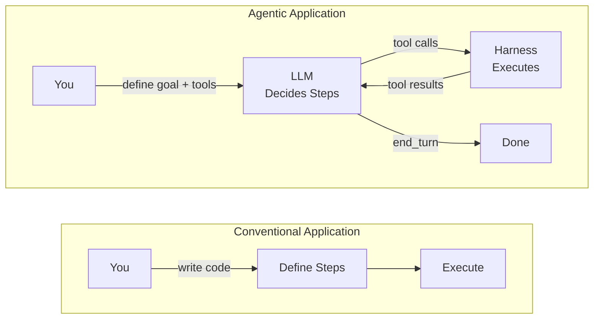

The harness does four things:

1. Serialises available tools as JSON schemas for the LLM
2. Provides a security boundary between LLM intent and OS execution
3. Feeds LLM decisions to the OS and OS results back to the LLM
4. Loops until the LLM emits `end_turn` — or a circuit breaker fires

The key insight is that **the harness is richer than most frameworks admit**. It includes tool registration, runtime input validation, permission verification, concurrency control, context management, and budget accounting. Everything between the LLM's intent and your machine's reality flows through it.

### The Architectural Actors

| Actor | Responsibility | Implementation |
|:---|:---|:---|
| **The Brain** | Reasoning, planning, tool selection | External LLM (Claude API) |
| **The Engine** | Run loop, state machine, turn management | `src/query.ts` |
| **The Harness** | Tool registry, execution, security boundary | `src/tools/`, `src/Tool.ts` |
| **The Trust Boundary** | Per-invocation permission verification | `bashPermissions.ts`, `bashSecurity.ts` |
| **The Context** | Session state, file caches, abort signals | `ToolUseContext` |

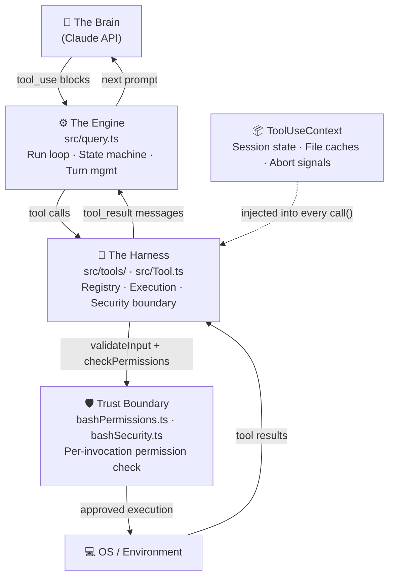

## The Tool Contract: One Interface, Mandatory Compliance

`src/Tool.ts` is the architectural keystone. Every tool — built-in, MCP-bridged, or sub-agent — implements the same interface:

```typescript
export type Tool<Input extends ZodType, Output, P extends ToolPermissions> = {
  readonly name: string
  readonly description: string
  readonly inputSchema: Input                          // Zod schema
  call(
    args: z.infer<Input>,
    context: ToolUseContext,
    canUseTool: CanUseToolFn,
    parentMessage: AssistantMessage
  ): Promise<ToolResult<Output>>
  checkPermissions(input: z.infer<Input>, context: ToolUseContext): Promise<PermissionResult>
  validateInput?(input: z.infer<Input>, context: ToolUseContext): Promise<ValidationResult>
  isReadOnly(input: z.infer<Input>): boolean
  isConcurrencySafe(input: z.infer<Input>): boolean
}
```

Two design decisions here are worth discussing individually.

### Zod: Schema as Both Validation and Documentation

In most systems, validation logic and API documentation are separate artifacts that drift apart. The `inputSchema` field eliminates that drift by doing double duty:

1. **Runtime validation** — Zod validates the LLM's JSON before any business logic runs
2. **LLM documentation** — Zod schemas are serialised to JSON Schema and sent in the system prompt as the tool's "instruction manual"

The `.describe()` strings on individual fields are not comments for humans. They are **prompts for the LLM**. When you write:

```typescript
const BashInput = z.strictObject({
  command: z.string()
    .describe('The bash command to execute. Avoid interactive commands.'),
  timeout: z.number().optional()
    .describe(`Timeout in milliseconds. Max: ${getMaxTimeoutMs()}. Default: 30000.`),
  description: z.string()
    .describe('One-sentence explanation of what this command does, shown to the user.'),
})
```

...the LLM reads those descriptions when deciding how to call the tool. `z.strictObject()` rejects any extra field the LLM hallucinates — so if the LLM sends `{ command: "ls", workdir: "/tmp" }`, validation fails before any permission check or execution attempt.

**Practical implication:** When building tools, treat `.describe()` as a micro-prompt. Be precise about types, ranges, and failure modes. Ambiguous descriptions produce ambiguous LLM calls.

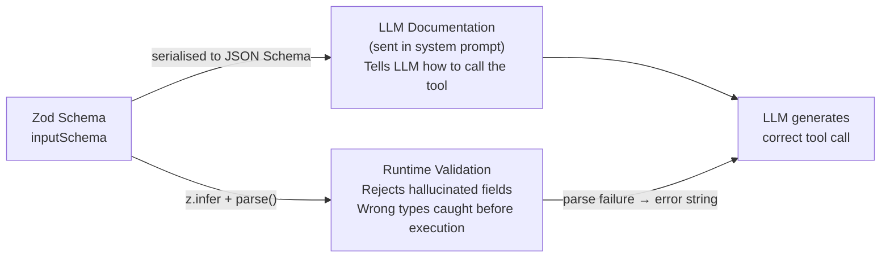

### Fail-Closed Defaults via `buildTool()`

`buildTool()` is a factory function that enforces safe defaults:

```typescript
const TOOL_DEFAULTS = {
  isConcurrencySafe: () => false,  // Assume NOT parallelisable — conservative
  isReadOnly:        () => false,  // Assume writes data — triggers stricter perms
  isDestructive:     () => false,
  checkPermissions:  (input) => Promise.resolve({ behavior: 'allow', updatedInput: input }),
}
```

`isReadOnly` defaults to `false`. If a developer writes a tool that's actually read-only but forgets to set this, the system treats it as a write operation and may prompt the user for confirmation. The failure mode is **friction, not a security hole**. Design your permission systems with the same asymmetry: the cost of a false positive (unnecessary prompt) is always lower than the cost of a false negative (unintended destructive action).

---

## Dependency Injection Without a Framework

No DI container. Instead, a single `ToolUseContext` object is threaded through every `call()` invocation:

```typescript
export type ToolUseContext = {
  options: {
    tools: Tools
    mcpClients: MCPServerConnection[]
    mainLoopModel: string
    thinkingConfig: ThinkingConfig
  }
  abortController: AbortController
  getAppState(): AppState
  setAppState(f: (prev: AppState) => AppState): void
  readFileState: FileStateCache
  messages: Message[]
  agentId: AgentId | null
}
```

When a child agent is spawned, `runAgent.ts` creates a new context with:

- An **isolated `AbortController`** — aborting the child doesn't propagate to the parent
- A **cloned `readFileState`** — the child's file-read cache is independent
- A **no-op `setAppState`** — the child cannot mutate the parent's global UI state
- An **empty `messages` array** — fresh history, no inherited conversation

This achieves process-level isolation semantics without actually forking a process. When evaluating agent frameworks, ask: "How does this framework isolate child agent state?" The answer tells you a lot about how the system will behave under failures.

---

## The Run Loop: Self-Healing by Design

`src/query.ts` (~1,700 lines) contains the core `while(true)` loop. Each iteration follows this sequence:

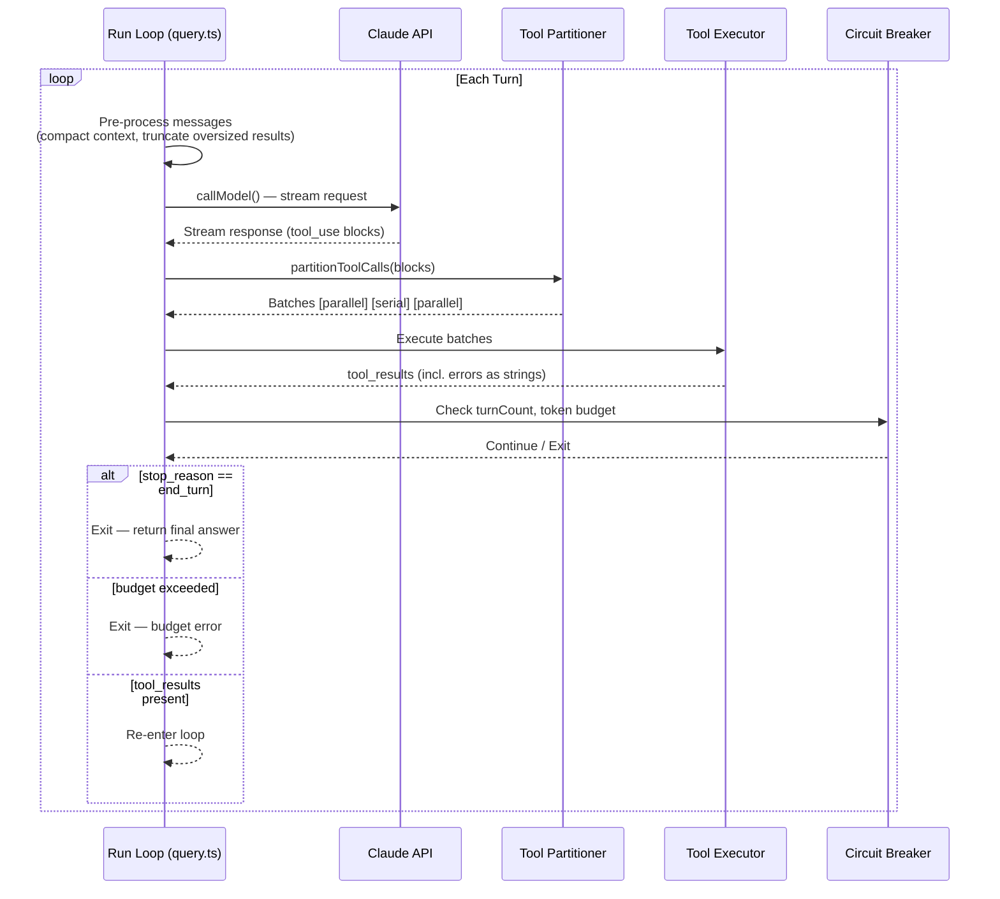

### The Critical Pattern: Errors as LLM Input

In a conventional application, exceptions propagate up the call stack to a global error handler. In an agent loop, this is wrong. If `FileReadTool` throws because the path doesn't exist, catching the exception and returning HTTP 500 terminates the agent's ability to recover.

The correct model: **catch every tool error and return it as a string in the `tool_result`**. The LLM reads the error and decides its next action — try a different path, ask the user, or give up gracefully.

```typescript
// Wrong: exception terminates the loop
async call(args, context): Promise<ToolResult> {
  const content = await fs.readFile(args.path)  // throws if not found → agent dies
  return { data: content }
}

// Right: error becomes LLM input
async call(args, context): Promise<ToolResult> {
  try {
    const content = await fs.readFile(args.path)
    return { data: content }
  } catch (err) {
    return {
      data: `Error reading file: ${err.message}. Check that the path exists and is accessible.`
    }
  }
}
```

The loop then sees a `tool_result` with error content, and the LLM's next turn can self-correct. This is what "self-healing" actually means in practice — not magic, just structured error feedback.

### Failure Recovery Patterns

| Failure Mode | Detection | Recovery Strategy |
|:---|:---|:---|
| **Prompt too long** | Token count exceeds model limit | Emergency context compaction — summarise oldest messages |
| **Max output tokens** | `stop_reason === "max_tokens"` | Retry up to 3× with extended `max_tokens` budget |
| **Streaming failure** | Mid-stream network error | Tombstone orphaned partial response, reset state, retry with fallback model |
| **Tool validation error** | Zod parse failure | Return validation error string — LLM fixes its call format |
| **Permission denied** | `checkPermissions` returns deny | Return denial reason string — LLM adapts strategy |
| **Tool timeout** | Command exceeds wall time | Auto-background, return background job ID to LLM |

### Circuit Breakers

`turnCount` is incremented on every loop iteration. When `turnCount >= maxTurns`, the loop exits with a budget-exceeded error. Token cost is tracked cumulatively; when projected cost exceeds the session budget, the loop exits. These are non-negotiable termination conditions — **no agent should run to infinity**.

When designing your own agent, set `maxTurns` conservatively in development and raise it only after observing real completion distributions. An agent that reliably completes in 15 turns doesn't need a 200-turn budget — and an unbounded budget is an unbounded cost exposure.

---

## Tool Orchestration: Concurrency as a Per-Invocation Property

When the LLM returns multiple `tool_use` blocks in a single response, `partitionToolCalls()` splits them into execution batches. The critical insight: **concurrency safety is a property of a specific invocation, not of a tool type**.

`BashTool.isConcurrencySafe(input)` receives the actual arguments and analyses the shell command. `ls /tmp` is concurrent-safe. `rm -rf /tmp/build` is not. The same `BashTool` instance produces different answers depending on what command it's been asked to run.

```
LLM response:  [FileRead("a.ts"), FileRead("b.ts"), Bash("mkdir dist"), FileRead("c.ts")]

Partition result:
  Batch 1 (parallel):  FileRead("a.ts"), FileRead("b.ts")   → isConcurrencySafe = true
  Batch 2 (serial):    Bash("mkdir dist")                    → isConcurrencySafe = false
  Batch 3 (parallel):  FileRead("c.ts")                      → isConcurrencySafe = true
```

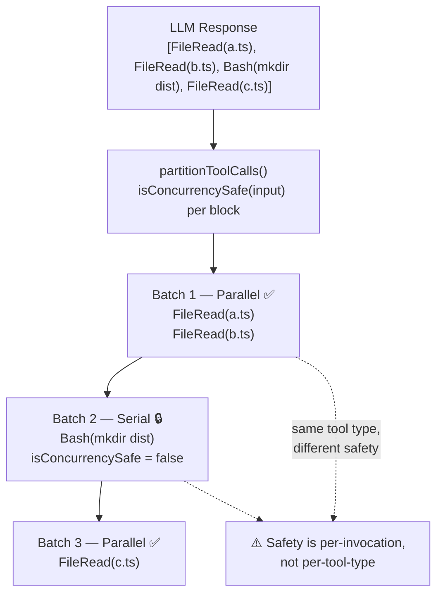

This means your tool interface must accept `input` as a parameter to `isConcurrencySafe()`. A simple `isReadOnly: boolean` field on the tool definition is insufficient — it loses the information needed to make correct concurrency decisions.

### StreamingToolExecutor: Latency Hiding

A more sophisticated executor starts tool execution **while the LLM is still streaming**. When the LLM emits a complete `tool_use` block early in its stream, the file read or API call begins immediately. By the time the stream ends and subsequent tool blocks are decoded, earlier results are often already available.

```mermaid
gantt
    title StreamingToolExecutor — Latency Hiding
    dateFormat  s
    axisFormat %Ss

    section LLM Stream
    Stream tool_use block 1   :stream1, 0, 1s
    Stream tool_use block 2   :stream2, after stream1, 1s
    Stream tool_use block 3   :stream3, after stream2, 1s
    Stream end_turn           :done, after stream3, 0.5s

    section Tool Execution
    FileRead(a.ts) — starts on decode  :crit, exec1, 0, 1.5s
    FileRead(b.ts) — starts on decode  :exec2, 1, 1.5s
    Bash(mkdir dist) — starts after stream ends :exec3, after done, 1s
```

When a Bash tool errors during parallel execution, the executor **cancels all sibling Bash tools**. Shell commands frequently have implicit dependencies (`mkdir dir && cd dir`). If `mkdir` fails, sibling commands that assumed the directory exists should not proceed. Other tool types (FileRead, FileWrite) are not cancelled — their failures are isolated.

---

## BashTool: 1,100 Lines of Defensive Engineering

`BashTool` is the most complex built-in tool in the codebase. The complexity is not accidental — shell execution is the highest-risk surface in the system.

### Why Regex Validation Fails

Naive implementations validate shell commands with regular expressions: block if the string contains `rm -rf`, allow otherwise. This fails against trivial obfuscation:

```bash
r\m -rf /          # Backslash in command name
"rm" -rf /         # Quoted command name
$(echo rm) -rf /   # Command substitution
eval $(echo "rm -rf /")  # eval bypass
```

Claude Code uses **Tree-sitter** (`tree-sitter-bash`) to parse commands into a full AST. The security engine then:

1. Walks the AST to identify `CommandSubstitution` and `ProcessSubstitution` nodes (dynamic execution)
2. Strips wrapper commands (`timeout`, `nice`, `nohup`, `env`) to reveal the underlying command
3. Decomposes compound commands (`cmd1 && cmd2 | cmd3`) into individually-validated leaf nodes
4. Validates each leaf independently against the allow/deny policy

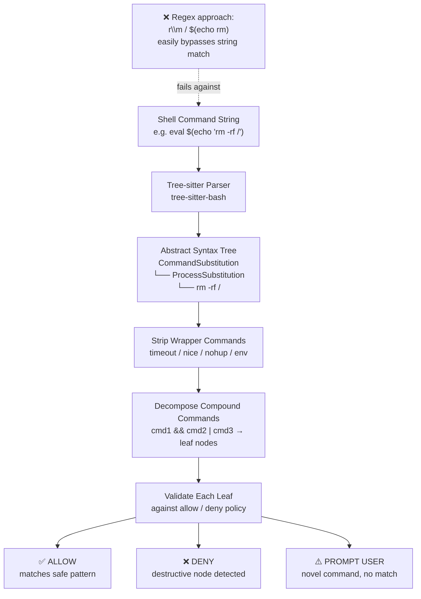

**Design lesson:** Any security control built on regex pattern matching for shell commands will eventually be bypassed. AST-level analysis is the correct abstraction for this problem. If you're building an agent that executes shell commands, Tree-sitter integration is not optional.

### Output Truncation with Graceful Degradation

A command that emits 2MB of output would fill the LLM's context window and make the token budget unusable. `BashTool` enforces `maxResultSizeChars` (30,000 characters). When output exceeds this limit:

1. Output is truncated at the limit
2. The full output is persisted to `/tool-results/{uuid}.txt`
3. The LLM receives the truncated output plus: *"Output truncated. Full output saved to /tool-results/{uuid}.txt. Use grep or head to inspect specific sections."*

This design is worth noting: the LLM is not simply told "output was truncated." It's given a recoverable path — the full file path and a suggested approach. The agent can continue working without losing access to the complete output.

### Auto-Backgrounding Long-Running Commands

Commands that block for more than 15 seconds are automatically detached to prevent UI freeze. The LLM receives:

> *"Command exceeded the blocking budget (15s) and was moved to the background. Background job ID: bg-{uuid}. Use `bg_result(bg-{uuid})` to retrieve output when ready."*

The LLM can then either poll for the result or continue with other tasks. This is essentially cooperative async scheduling imposed on a synchronous command execution model.

---

## The Permission System: Trust Boundaries That Compose

Every tool invocation passes through two distinct phases before execution:

**Phase 1 — `validateInput()`**: Logical validation. Is the path syntactically valid? Is the timeout within range? Does the target directory exist? Returns a string error the LLM can correct.

**Phase 2 — `checkPermissions()`**: Trust validation. Has the user consented to this action? Does this command match an allow-list rule? Is this a destructive operation in a protected path? Returns allow/deny with a reason string.

These phases are deliberately separate. A validation error means the LLM made a formatting mistake it can fix. A permission denial means the user hasn't consented to this class of action — the LLM needs a different strategy, not a reformatted call.

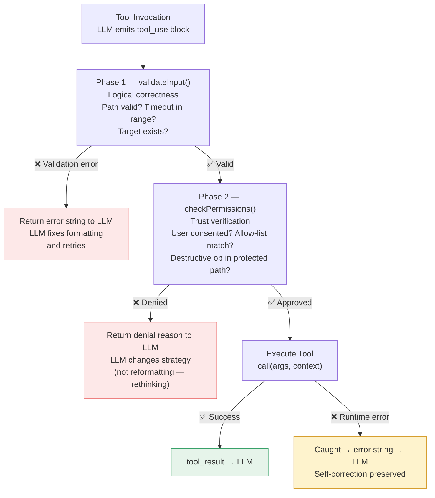

### The Hybrid Permission Model

Naive permission systems use exact-match allow/deny lists. This creates two failure modes: overly restrictive (every new command prompts the user) or overly permissive (allow-all with a few denies). Claude Code uses a three-tier hybrid:

1. **Fast path — explicit allow/deny lists**: Known-safe commands (e.g., `git:status`, `npm:install`) are auto-allowed. Known-dangerous patterns are auto-denied. This handles ~70% of commands with no latency.

2. **Heuristic classifier**: For commands that don't match explicit rules, the AST is normalised and checked against learned patterns. This handles common-but-not-whitelisted commands without prompting the user.

3. **User prompt**: Only for genuinely novel commands that don't match any heuristic. The user sees the parsed intent, not the raw command string.

Without tier 2, every unfamiliar command would reach tier 3 — and **permission fatigue is a real security risk**. Users who are prompted too frequently begin approving requests without reading them.

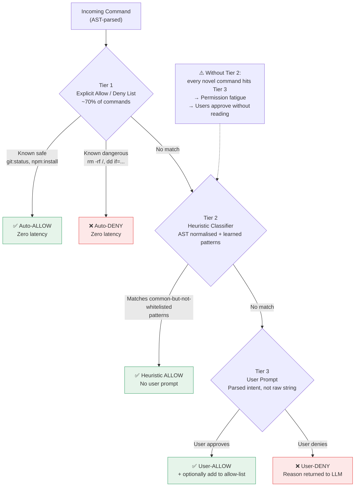

### Environment Variable Safety

`PATH` and `LD_PRELOAD` are excluded from the safe environment variable allowlist. The reasoning: if `PATH` were injectable, an LLM could run `PATH=/attacker/bin npm install` and match an `npm:*` allow-rule while executing a malicious binary named `npm`. The exclusion is not accidental — it's the result of thinking through the full attack surface of the permission model.

When building permission systems, don't just think about what the operation does. Think about what environment the operation runs in, and which environmental parameters an adversarial actor (or a confused LLM) could manipulate.

---

## MCP: Runtime Tool Extensibility Without Recompilation

The Model Context Protocol answers a critical architectural question: **how do you add capabilities to a running agent without modifying its source?**

MCP servers are separate processes that expose a `tools/list` endpoint. The agent connects at startup, discovers available tools, and registers them into the tool registry — at runtime, from any process written in any language.

```typescript
// MCP tool wrapping — conforming to the standard Tool interface
const wrappedMcpTool: Tool = {
  name: `mcp__${serverName}__${tool.name}`,   // Namespace prevents collision
  description: tool.description,
  inputSchema: convertJsonSchemaToZod(tool.inputSchema),  // JSON Schema → Zod
  async call(args, context) {
    const result = await mcpClient.callTool(tool.name, args)
    return { data: result.content }
  },
  isReadOnly: () => false,          // Conservative default for external tools
  isConcurrencySafe: () => true,    // MCP calls are typically stateless
}
```

The namespace convention (`mcp__serverName__toolName`) is a deliberate collision-prevention mechanism. Without it, an MCP server that exports a tool named `bash` would shadow the built-in `BashTool` in the registry.

Configuration lives in `.mcp.json` with environment variable expansion for secrets:

```json
{
  "mcpServers": {
    "github": {
      "command": "npx",
      "args": ["-y", "@modelcontextprotocol/server-github"],
      "env": {
        "GITHUB_TOKEN": "${GITHUB_TOKEN}"
      }
    }
  }
}
```

The agent watches `.mcp.json` and hot-reloads connections on save — no restart required. For teams building platform agents, this means domain teams can extend the agent's capabilities by deploying a new MCP server, without touching the core agent codebase.

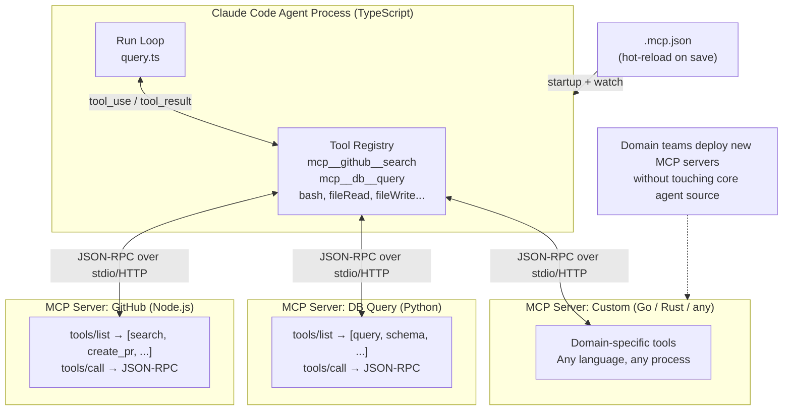

### MCP vs Built-in Tools: Decision Guide

| Dimension | Built-in Tool | MCP Tool |
|:---|:---|:---|
| Registration | Compiled into agent | Discovered at runtime |
| Schema format | Zod (TypeScript-native) | JSON Schema (language-agnostic) |
| Execution model | In-process function call | Cross-process JSON-RPC |
| Language requirement | TypeScript | Any (Python, Go, Rust, etc.) |
| Latency | Microseconds | Milliseconds (IPC overhead) |
| Fault isolation | Failure crashes the agent | Failure is isolated to the MCP process |
| When to use | Core, security-critical capabilities | Domain-specific extensions, third-party integrations |

For capabilities that touch the filesystem or execute shell commands, built-in tools are appropriate because they need access to the agent's permission system. For capabilities like querying a database, calling a third-party API, or running domain-specific analysis, MCP tools are appropriate — they can be authored by domain teams and deployed independently.

---

## Multi-Agent Architecture: Sub-Agents as Tools

The elegance of the multi-agent design is that **a sub-agent is just another tool** from the parent's perspective. Calling `AgentTool` is structurally identical to calling `BashTool` — it takes inputs, returns a `tool_result` string.

```typescript
// When the LLM calls AgentTool:
async function runSubAgent(task: string, context: ToolUseContext): Promise<string> {
  const childContext: ToolUseContext = {
    ...context,
    abortController: new AbortController(),          // Independent abort
    readFileState: cloneFileStateCache(context),      // Isolated cache
    setAppState: () => {},                            // No-op — can't mutate parent
    messages: [],                                     // Fresh history
    agentId: generateAgentId(),
  }

  const childEngine = new QueryEngine(childContext)
  const result = await childEngine.ask(task)          // Full agent loop

  // Parent only sees the final answer — not the child's internal turns
  return result.finalAnswer
}
```

### Budget Isolation

Without budget controls, a parent agent that spawns five sub-agents could exhaust the session token budget on the first sub-agent's work. Claude Code implements proportional budget splitting:

```
Parent remaining budget: $1.00
  → Child A allocation: $0.30
  → Child B allocation: $0.30
  → Parent reserve: $0.40  (for synthesis and recovery)
```

Each child's budget is capped, and the parent retains a reserve for its own synthesis work. When a child exhausts its budget, it exits cleanly — the parent receives a budget-exceeded result string and can decide whether to retry, summarise what's available, or escalate.

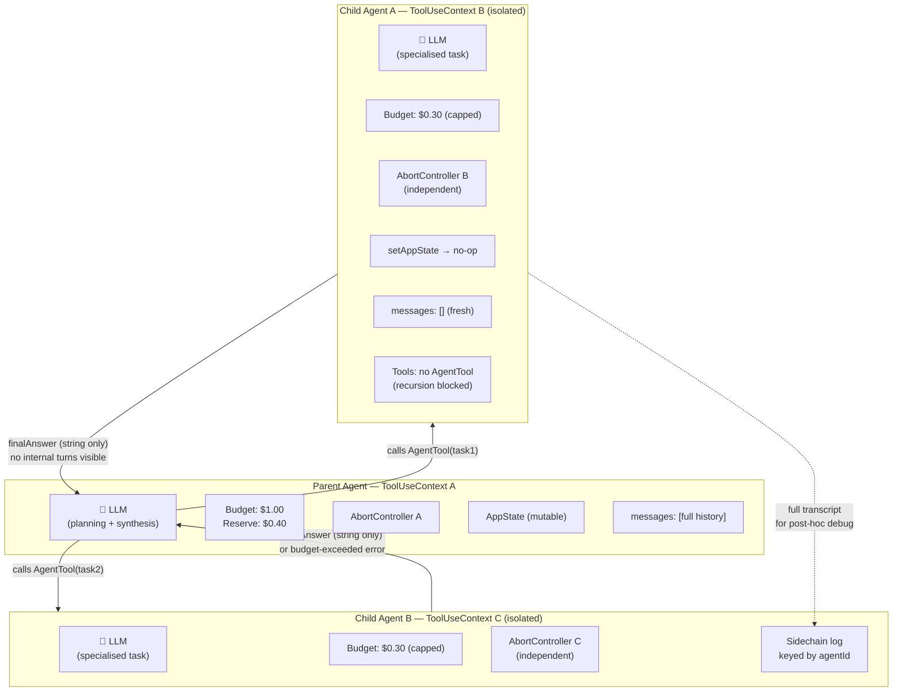

### The Information Boundary

The parent never sees a child's internal message history — only the final answer string. This is an intentional design choice with two consequences:

1. **Context efficiency**: The parent's context window isn't polluted by the child's deliberation, exploration, and dead-ends
2. **Debugging opacity**: When a child produces a wrong answer, you can't directly inspect its reasoning from the parent's message log

Full transcripts of child turns are persisted to a sidechain log (keyed by `agentId`) for post-hoc debugging. If you're building multi-agent systems, implement equivalent logging early — the internal turns of a child agent are often where failures originate, and you'll need them for debugging.

### Depth Limits and Recursion Prevention

By default, sub-agents cannot spawn their own sub-agents. The tool filter applied when building a child's `ToolUseContext` excludes `AgentTool` from the available tools set. This prevents unbounded recursion without requiring a global depth counter.

If your architecture genuinely requires recursive delegation (e.g., a planning agent that spawns specialised sub-agents, which in turn spawn workers), implement explicit depth tracking in `ToolUseContext` and enforce a hard limit at tool registration time.

---

## Synthesis: Design Principles for Production Agentic Systems

Reading this source code as a corpus, seven design principles emerge that are difficult to discover without examining a production system.

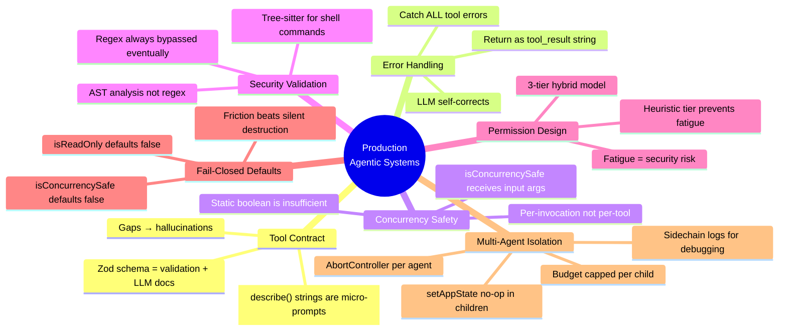

**1. The tool contract is your API surface — treat it as such.**
Zod schemas serve as runtime validation and LLM documentation simultaneously. Every `.describe()` string is a prompt. Gaps in description become hallucination opportunities. Invest the same care in tool schema design that you'd invest in a public REST API.

**2. Error handling must preserve agent self-correction.**
Exceptions that propagate out of tool execution terminate the agent's ability to recover. Every tool error must be caught and returned as a structured string the LLM can reason about. Design your error messages to be informative to the LLM, not just to human developers.

**3. Concurrency safety is per-invocation, not per-tool.**
`isConcurrencySafe(input)` receives actual arguments. A tool that is safe to parallelise with one set of inputs may be unsafe with another. Design your tool interface to support this — a static boolean field on the tool definition is insufficient.

**4. Security validation must operate on the AST, not on strings.**
For any tool that executes code or shell commands, regex-based validation is a false sense of security. Tree-sitter or equivalent AST parsing is the correct model. The complexity cost is real; so is the alternative.

**5. Permission systems need a heuristic tier to remain usable.**
Pure allow/deny lists produce permission fatigue. Users who are prompted on every unfamiliar command begin approving requests without reading them. A heuristic classifier that handles common-but-not-whitelisted cases is not a nice-to-have — it's a safety feature.

**6. Fail-closed defaults are architectural.**
`isReadOnly` defaults to `false`. `isConcurrencySafe` defaults to `false`. Newly registered tools are treated conservatively until proven safe. The friction of an unnecessary permission prompt is always preferable to a silent destructive action. Build this asymmetry into your default values, not into your documentation.

**7. Multi-agent isolation must be explicit at every layer.**
Abort controllers, state mutation paths, file caches, token budgets, and message history — each must be isolated per agent instance, not just at the process boundary. "Isolated" means: a child agent's failure cannot corrupt the parent's state, and the parent's abort cannot prematurely kill an independent child.

---

## Applying This to Your Architecture

If you're evaluating agent frameworks or designing agentic systems for your organisation, these are the questions to ask at the implementation level:

- **Tool contract**: Does the framework colocate runtime validation with LLM documentation, or are these separate artifacts that can drift?
- **Error handling**: Does the framework return errors to the LLM as tool results, or do they propagate as exceptions that kill the loop?
- **Concurrency model**: Can the framework determine concurrency safety at invocation time, or only at tool registration time?
- **Security model**: For code/command execution, does the framework use AST analysis or string matching?
- **Permission UX**: Does the framework implement any heuristic tier between explicit allow-lists and constant user prompting?
- **Child agent isolation**: What exactly is isolated per child agent? What can a child's failure affect in the parent?
- **Budget controls**: Does the framework have hard limits on turns, tokens, and recursive depth? Are these configurable?

The answers will tell you whether a framework is designed for experimentation or for production.

---

## Further Reading

- [Model Context Protocol Documentation](https://modelcontextprotocol.io) — MCP specification, server SDK, and reference implementations
- [Claude Code Source](https://github.com/anthropics/claude-code) — The production codebase this post analyses
- [Anthropic Research: Building Effective Agents](https://www.anthropic.com/research/building-effective-agents) — Anthropic's own patterns for agentic system design
- [Tree-sitter](https://tree-sitter.github.io/tree-sitter/) — The parser library used for AST-level shell command analysis
- [Zod Documentation](https://zod.dev) — Schema validation library used throughout Claude Code's tool system

---

*This post is based on a practitioner's deep-dive into Claude Code's source code, covering the tool contract, run loop, concurrency model, permission system, MCP integration, and multi-agent architecture. Code samples are illustrative reconstructions based on the source patterns — not verbatim extracts.*
