# Multi-Agent Architectures: The Diagrams the Numbers Are Hiding

LangChain's [Choosing the Right Multi-Agent Architecture](https://www.langchain.com/blog/choosing-the-right-multi-agent-architecture) lays out four patterns — **Subagents**, **Skills**, **Handoffs**, and **Router** — and benchmarks them across three scenarios with tables of model-call counts and token totals. It's a genuinely useful framework. But there's a gap: in every one of the three benchmark scenarios, only *one* pattern gets a sequence diagram (almost always Subagents). The other three patterns get a number in a table and nothing to show how that number was produced.

That's a problem, because the numbers aren't self-explanatory. A "5 calls, ~9K tokens" total looks like five equal, independent slices — but it isn't. Some calls in these flows are cheap routing decisions; others have to absorb everything every other agent just produced. Flattening that into one average-looking row hides exactly the tradeoff the post is trying to teach.

This post fills in the missing diagrams and reconstructs the call-by-call math behind each pattern's numbers, scenario by scenario. The token figures below are illustrative reconstructions consistent with the architectures and totals described in the original post — not official numbers published by LangChain, since they didn't break down the per-call math either.

## The four patterns, in plain terms

- **Subagents** — A main agent calls other agents like tools. Subagents are stateless and isolated; the main agent decides everything and stitches results together. Good for distinct domains (calendar, email, CRM) that never talk to the user directly.
- **Skills** — One agent, with specialized instructions it loads on demand, like pulling a manual off a shelf. Good for one agent covering many specialties without hard walls between them.
- **Handoffs** — Control passes between agents as the conversation progresses, and stays put until the next transfer. Good for staged flows (support, onboarding) where later steps unlock only after earlier ones finish.
- **Router** — A classifier dispatches the request to one or more specialized agents (often in parallel) and merges what comes back. Stateless by design. Good for separate knowledge domains queried at once.

With those in mind, here's the mental model that explains why each pattern produces the call counts and token totals it does.

## The mental model that explains every number in the original tables

Two simple rules account for almost every call-count and token figure in the source post:

1. **A tool call costs two model turns, not one.** The model has to (a) decide to call the tool and (b) read the tool's result and respond. Any pattern that adds a routing, handoff, or relay step on top of that adds more turns on top of those two.
2. **Isolation vs. accumulation determines token growth, not call count.** Patterns that isolate each subtask in its own context (Subagents, Router) keep individual calls small but pay a relay tax. Patterns that keep everything in one growing conversation (Skills, Handoffs) avoid the relay tax but every later call re-pays for everything that came before it.

Keep these two rules in mind — they're the thread connecting every diagram below.

---

## Scenario 1: One-shot request ("buy coffee")

| Pattern | Model calls | Why |
| :--- | :--- | :--- |
| Subagents | 4 | Main agent routes (1) → subagent calls the tool (2) → subagent reads the result and reports back (3) → main agent relays that to the user (4) |
| Skills | 3 | Route/select skill (1) → call tool (2) → read result, respond directly (3) |
| Handoffs | 3 | Hand off to the right agent (1) → call tool (2) → read result, respond directly (3) |
| Router | 3 | Classify and dispatch (1) → call tool (2) → read result, respond directly (3) |

The difference is entirely the extra relay hop. Subagents' fourth call doesn't add new *work* — it adds a second narrator.

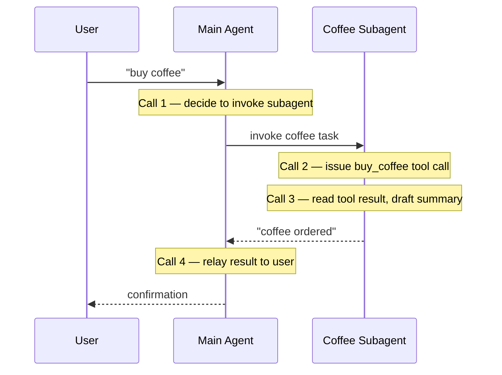

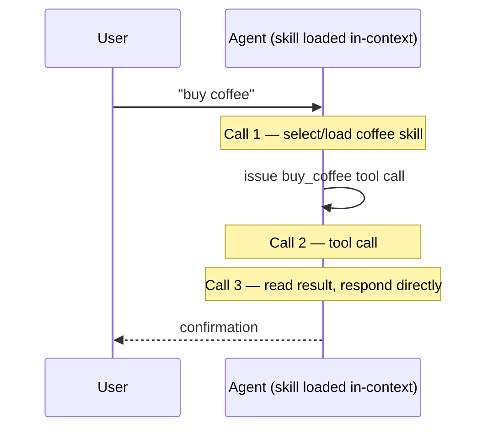

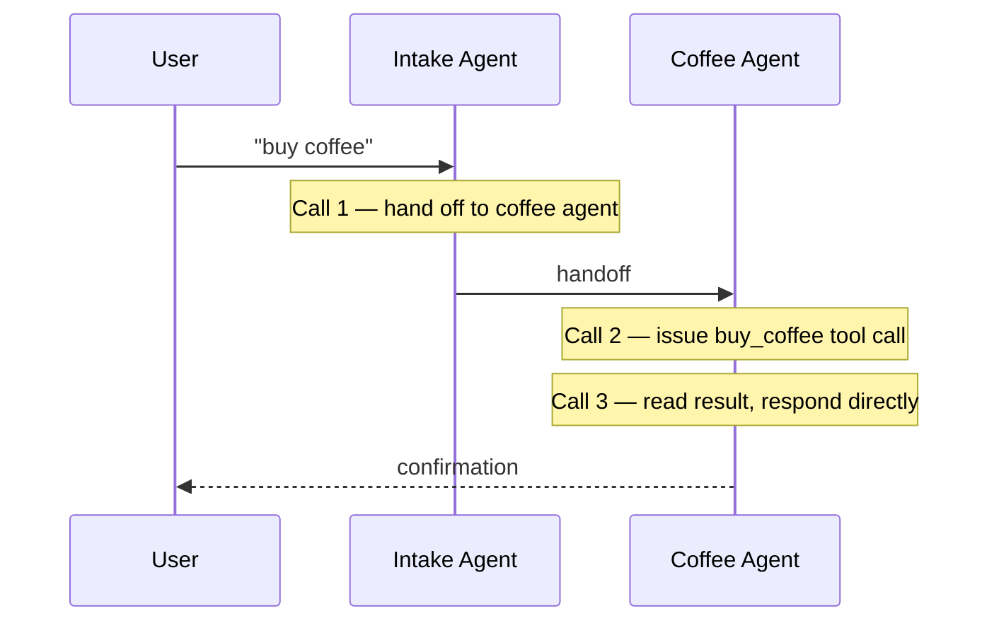

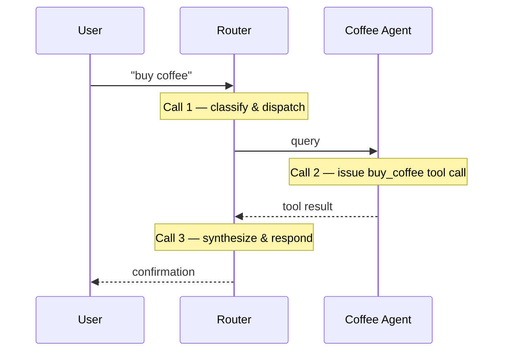

Same task, same tool, same number of *useful* steps across all three — they just route the decision through different participants. Skills keeps it inside one agent's own context; Handoffs hands control over to the coffee agent permanently, so it answers the user itself; Router always reads the result and synthesizes the final response itself, even when — like here — there's only one branch to synthesize from.

---

## Scenario 2: Repeat request ("buy coffee" → "buy coffee again")

This is where statefulness pays off — or doesn't.

| Pattern | Turn 2 calls | Total | Why |
|:--- | :--- | :--- |:---|
| Subagents | 4 | 8 | Stateless subagent — every call repeats turn 1's full sequence |
| Skills | 2 | 5 | Skill is already loaded; skip the routing call, go straight to tool call → response |
| Handoffs | 2 | 5 | Already handed off to the coffee agent; skip the handoff call |
| Router | 3 | 6 | Router re-classifies on every request by design, even repeats |

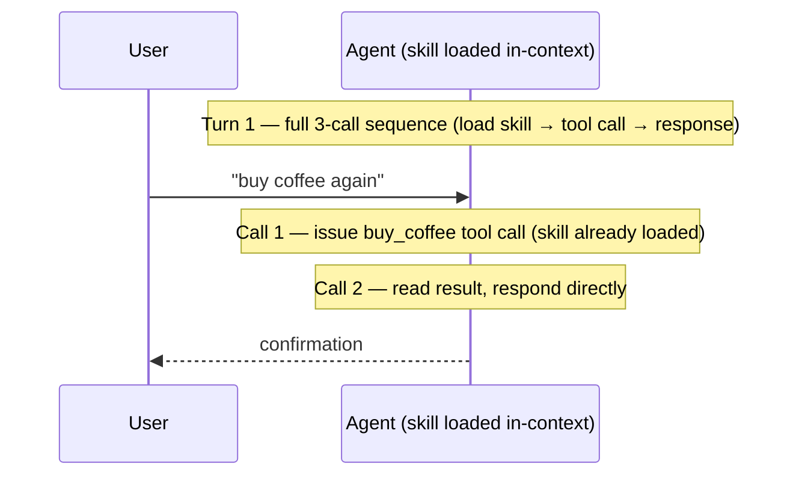

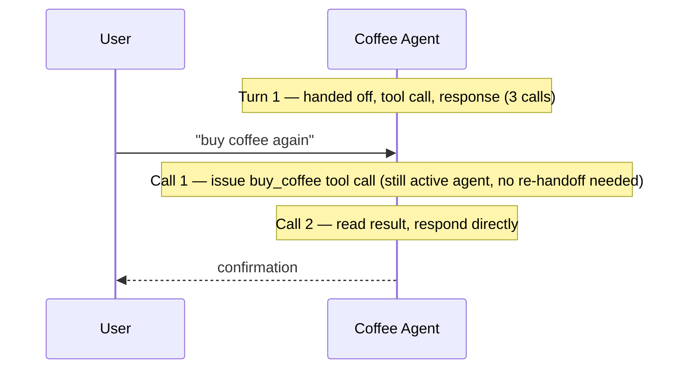

This is the architectural distinction that separates Handoffs from Router: a handoff is *permanent* until the active agent explicitly transfers control again. Once the Intake Agent hands control to the Coffee Agent, the Coffee Agent stays in the conversation loop for all subsequent user turns. The Intake Agent is not consulted again — there's no re-classification step on each turn, no re-routing through a central dispatcher. The user is now effectively talking directly to the Coffee Agent. In a Router pattern, by contrast, the next diagram shows that every single request must pass through the classifier again.

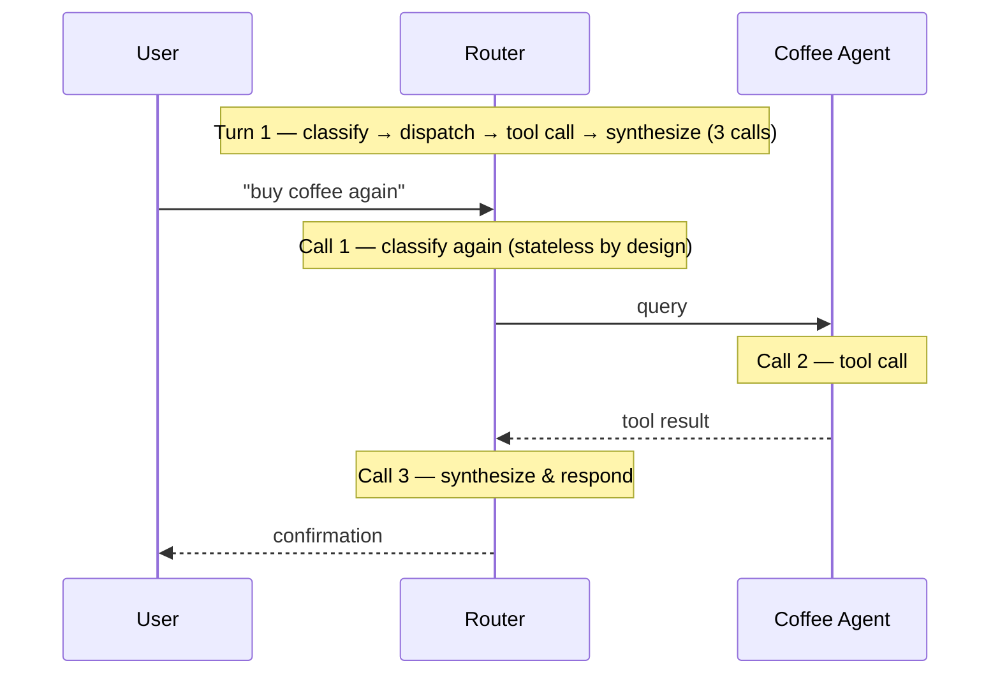

Subagents pays the same 4-call price every single time — that consistency is the whole point of the pattern's context isolation, but it means repeat requests never get cheaper. Router sits in between: it doesn't remember the *decision* to use the tool the way Skills/Handoffs do, but each of its calls stays small and parallel-friendly. Skills and Handoffs are the only patterns that genuinely benefit from "we've been here before."

---

## Scenario 3: Multi-domain query ("Compare Python, JS, and Rust")

This is the scenario in the diagram you uploaded, and where the numbers get interesting. Each language agent carries roughly 2,000 tokens of internal documentation.

| Pattern | Model calls | Published total | *Recalculated total* | Mechanism |
|:---|:---|:---|:---|:---|
| Subagents | 5 | ~9K | ~11.4K | Parallel fan-out; subagent contexts are isolated from each other, but the main agent accumulates all returned results, making the synthesis call 2-3x heavier than any individual subagent call |
| Router | 5 | ~9K | ~11.4K | Same shape as Subagents — parallel fan-out, but the router maintains its own running context across all dispatches, so the synthesis call absorbs all returned analyses |
| Skills | 3 | ~15K | ~17K | Fewer calls, but one growing conversation re-pays for itself every turn |
| Handoffs | 7+ | ~14K+ | ~18.8K | Sequential, no parallelism; each hop carries the full running history forward, and every handoff is a tool call costing two turns |

\* Recalculated by holding the ~2,000-token per-domain doc size constant across all four patterns (the figure the original post itself states) and explicitly pricing in the synthesis call's real input size — see the per-call breakdowns below.

### Subagents — what the uploaded diagram actually shows

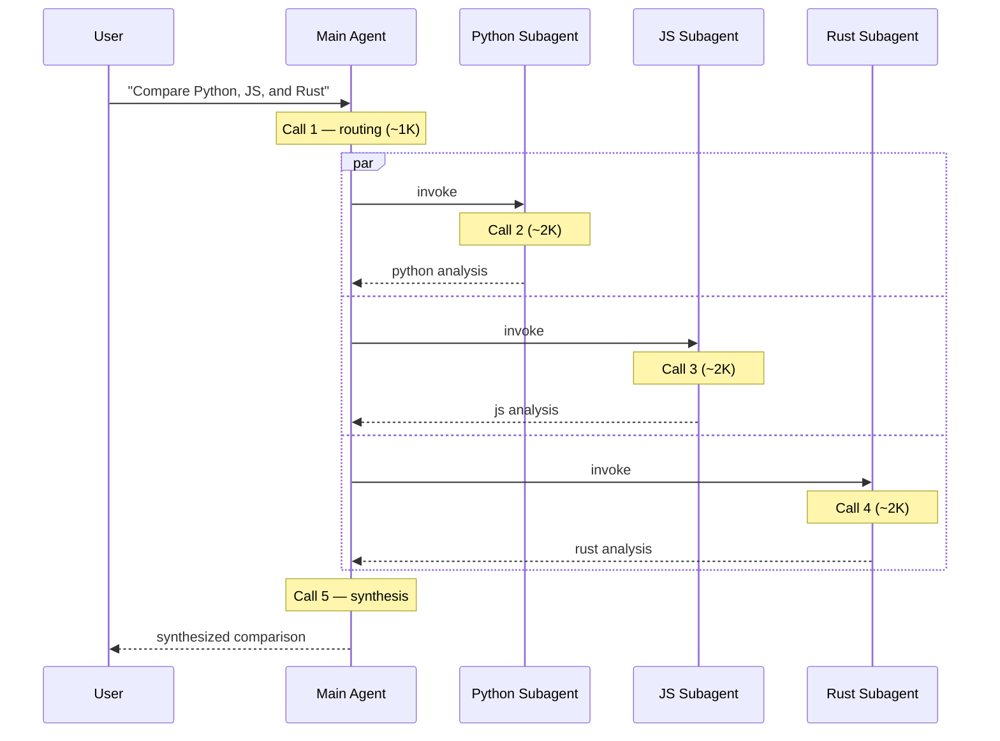

Here's the catch, and the reason this diagram is worth scrutinizing rather than just reading off the totals: **Call 5 cannot really be the same size as Calls 2–4.** It has to receive all three returned analyses *plus* the original task before it can write anything. And for the per-subagent calls to land anywhere near a "2K" box, each subagent has to compress its ~2K of internal documentation down to a short returned analysis — it can't return the documentation itself, only a verdict drawn from it. Holding the per-domain doc size at the ~2,000 tokens the original post states, and assuming each subagent returns a condensed ~300-token analysis (not its full internal context), the real shape looks like:

| Call | Input | Output | Total |
|:---|:---|:---|:---|
| 1 — routing | ~500 | ~500 (tool call with task specs) | ~1K |
| 2 — Python subagent | ~2.2K (2K docs + ~200 task) | ~300 (condensed analysis) | ~2.5K |
| 3 — JS subagent | same shape | ~300 | ~2.5K |
| 4 — Rust subagent | same shape | ~300 | ~2.5K |
| 5 — synthesis | ~1.9K (500 original + 500 routing from Call 1 + 900 from 3 returned analyses) | ~1K | **~2.9K** |
| **Total** | | | **~11.4K** |

That puts the realistic total around **~11.4K**, not the published ~9K — still meaningfully better than Skills, but the gap is smaller than the flat per-call boxes suggest, and the *last* call is consistently the most expensive one in the whole sequence, not an equal slice. This is the general shape of the "centralized orchestration" tradeoff: isolation keeps the fan-out calls cheap, but the synthesis step inherits the sum of everything that came back — and it only stays at ~2.5K per subagent call if each subagent is disciplined about returning a verdict, not a dump of its source material.

### Router — structurally identical to Subagents here

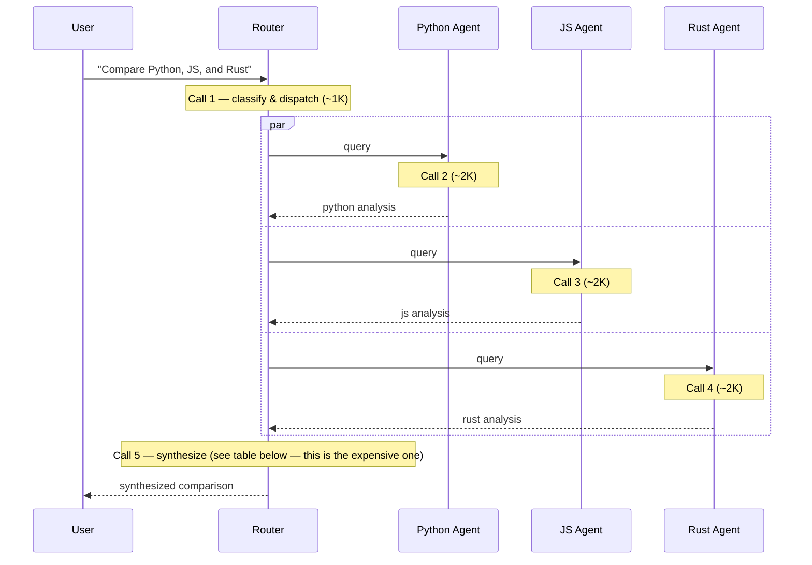

Router and Subagents land on the same total shape in this scenario because they're solving the fan-out the same way — parallel calls to isolated agents, plus one synthesis step by the router itself. But calling it "isolated" only tells half the story: each domain agent has its own fresh context (isolated from the other agents and from the router's running conversation), but the router's own context accumulates every returned analysis. That accumulation is what makes Call 5 the heaviest call in the sequence, not an equal slice like Calls 2-4. The numbers bear this out:

| Call | Input | Output | Total |
|:---|:---|:---|:---|
| 1 — classify & dispatch | ~500 | ~500 | ~1K |
| 2 — Python agent | ~2.2K (2K docs + ~200 task) | ~300 (condensed analysis) | ~2.5K |
| 3 — JS agent | same shape | ~300 | ~2.5K |
| 4 — Rust agent | same shape | ~300 | ~2.5K |
| 5 — synthesis | ~1.9K (500 original + 500 routing from Call 1 + 900 from 3 returned analyses) | ~1K | **~2.9K** |
| **Total** | | | **~11.4K** |

Identical to the corrected Subagents math, for the same reason: a router that genuinely "synthesizes results into a coherent response" — which is the part of the definition that distinguishes it from just forwarding one agent's answer — has to read all three returned analyses before it can write anything. The architectural difference between Router and Subagents isn't in this scenario's numbers at all; it's in Scenario 2's repeat-request test, where Router re-classifies every time and Subagents stays flat regardless. Same shape now, different behavior over a conversation.

### Skills — no isolation, so every call re-pays for the last one

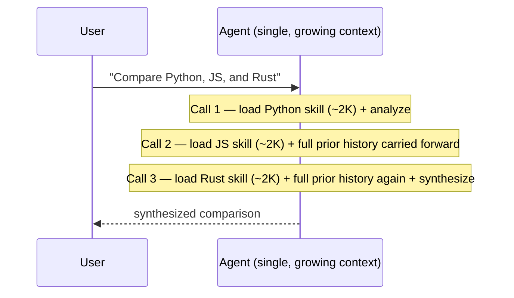

| Call | Input (running history + new skill) | Output | Call total |
|:---|:---|:---|:---|
| 1 | 500 + 2K (Python skill) = 2.5K | 400 | 2.9K |
| 2 | 2.9K (running) + 2K (JS skill) = 4.9K | 500 | 5.4K |
| 3 | 5.4K (running) + 2K (Rust skill) = 7.4K | 1.2K (synthesis) | 8.6K |
| **Total** | | | **~17K** |

Only 3 calls — fewer than every other pattern — but each one is carrying the full weight of everything before it, *plus* a fresh 2K skill load. Note that holding the doc size at the same ~2,000 tokens used for Subagents and Handoffs (rather than shrinking it to make the total land closer to the published figure) actually pushes the realistic total to **~17K**, a bit above the original post's reported ~15K. The published number likely assumes either a smaller doc size or some compression on reload — either way, the direction of the result doesn't change: this is "context accumulation" made concrete. The call count looks efficient right up until you look at what's actually inside each call.

### Handoffs — no parallelism, and the relay tax shows up at every hop

Handoffs can't fan out in parallel, because only one agent is "active" at a time — Python, JS, and Rust have to be visited one after another, and each transfer is its own tool call (which, per the two-turns rule, costs an extra turn beyond just the analysis itself). That's how this pattern ends up needing more calls than any other for the exact same task.

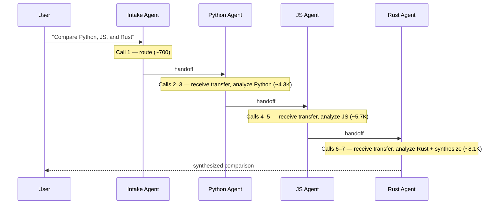

| Call | Agent | Action | Context in | New content | Output | Call total |
|:---|:---|:---|:---|:---|:---|:---|
| 1 | Intake | Route to Python | 500 (user) | — | 200 | 700 |
| 2 | Python | Receive handoff | 700 (from intake) | — | 200 | 900 |
| 3 | Python | Analyze with docs | 900 (from call 2) | 2K (docs) | 500 | 3.4K |
| 4 | JS | Receive handoff | ~1.4K (running) | — | 200 | ~1.6K |
| 5 | JS | Analyze with docs | ~1.6K (from call 4) | 2K (docs) | 500 | ~4.1K |
| 6 | Rust | Receive handoff | ~2.1K (running) | — | 200 | ~2.3K |
| 7 | Rust | Analyze + synthesize | ~2.3K (from call 6) | 2K (docs) | 1.5K | **~5.8K** |
| | **Total (7 calls)** | | | | | **~18.8K** |

Every handoff — the transfer of control from one agent to the next — happens as a tool call, and per the two-turns rule, each tool call adds its own round. The receiving agent's first call is always "absorb the transferred context" before it can do any real work. Over three hops, that's three extra turns that do nothing but pass the baton. The cumulative effect: Handoffs uses more calls than any other pattern AND has the highest token total, because each successive handoff call carries the full running history forward. Sequential execution is the structural reason this pattern can't compete with Subagents or Router on a fan-out task like this one, no matter how the token budget is tuned.

---

## Field notes for architects and staff engineers

The diagrams above settle the "what's actually happening" question. The following is what I'd want a team to weigh before any of this becomes a design doc.

**1. Don't compare patterns on tokens alone — multiply by your real traffic first.**
A token delta of a few thousand per request is noise at low volume and a board-level line item at high volume. Before treating any number above as a verdict, run it through your own shape: `extra_cost_per_month ≈ token_delta_per_request × requests_per_month × your_provider's_current_per-token_rate`. Pull the rate from your provider's pricing page rather than trusting any blog post's figure — rates change, and they differ for input vs. output tokens, which matters a lot for patterns like Skills where most of the growth is on the input side.

**2. Prompt caching changes this calculus more than the architecture choice does.**
Every table above assumes full-price tokens on every call. Most providers now offer prompt caching, which bills a repeated, unchanged prefix at a steep discount on subsequent calls. This helps Skills and Handoffs disproportionately, because their defining trait — one conversation that grows but rarely changes its earlier content — is exactly the shape caching rewards. Subagents and Router benefit less, because each subagent's context is freshly assembled per call; only the static system-prompt portion is reliably cacheable, not the task-specific content. In other words: the "expensive" pattern on paper can be the cheaper one in production once caching is wired up correctly, and the "cheap" one can lose most of its advantage if its calls never share a stable prefix. Model your real cost with caching in the loop, not the raw token count.

**3. Tokens and latency are different axes — a cheaper pattern can be the slower one.**
Skills wins on raw token count in some shapes, but its calls are strictly sequential — each one depends on the previous call's output before it can start. Subagents and Router can run their fan-out calls concurrently, so even when they cost more tokens in aggregate, they often finish in less wall-clock time because three calls run at once instead of three calls running back-to-back. If your product has a human waiting on the other end, profile latency separately from cost — optimizing one can quietly make the other worse.

**4. The patterns fail differently — pick based on your blast radius, not just your budget.**
- *Subagents / Router*: a single subagent erroring or timing out only affects its own branch. You can drop it, retry it, or note it's missing, and still answer with the other two-thirds of the result.
- *Skills / Handoffs*: a bad step poisons everything downstream in the same context — a malformed tool call during the JS step can corrupt the Rust step and the synthesis that follows, because they all share one growing transcript.
- *Handoffs specifically*: a mis-routed or dropped transfer strands the user mid-conversation with the wrong specialist, with no clean fallback to "just ask someone else in parallel," since nothing else is running concurrently to fall back on.

This is the kind of thing that doesn't show up in a token table and does show up in your on-call rotation. Decide it at design time, not after the first incident.

**5. In practice, almost no mature system runs one pure pattern.**
Treat these four as primitives you compose, not mutually exclusive architectures. A common, pragmatic shape in production: a Router or Subagents layer handles the coarse "which domain is this" decision and runs the parallelizable work, while each domain-specific agent underneath uses Skills for its own on-demand specialization. The original post's mention of combining subagents and skills in a single framework isn't an aside — it's the realistic default once a system has more than two or three domains and more than one team touching it.

**6. A short checklist before any of this gets built.**
- Do you actually need more than one agent? Most tasks don't. A single well-tooled agent is the right default, and every pattern above adds at least one coordination layer of cost and failure surface on top of it.
- Is the work genuinely parallelizable across independent domains? → lean Subagents or Router.
- Is it one evolving conversation with stages that should only unlock in order? → lean Handoffs.
- Is it one agent that occasionally needs deep, swappable expertise without hard isolation between specialties? → lean Skills.
- Will the same request repeat within a session? → favor the stateful patterns (Skills, Handoffs); the stateless ones (Subagents, Router) pay full price every time, by design.
- Is cost or latency your actual binding constraint? → profile both, separately, against your real traffic and your real cache hit rate, before the architecture decision — not after.

---

## Key takeaways

- **Call counts and token totals measure different things.** Subagents/Router minimize total tokens by isolating context; Skills minimizes call count by never isolating anything. Neither number alone tells you which is "cheaper" — you need both, and you need to know which calls are small and which are absorbing everyone else's output.
- **The synthesis/relay call is never the same size as the calls feeding it.** Any diagram that draws the final call the same width as the fan-out calls before it is simplifying away the actual cost driver of centralized-orchestration patterns.
- **Sequential patterns (Handoffs) pay a structural tax that no token optimization fixes.** If a task is genuinely parallelizable across domains, only Subagents and Router can use that parallelism — Handoffs is locked into one-at-a-time by design.
- **Statelessness is a tradeoff, not a flaw.** Subagents and Router cost more on repeat requests (Scenario 2) precisely because they don't remember anything — the same property that makes them safe to use anywhere is what stops them from getting cheaper over a conversation.

For the original framework, scoring tables, and the four-pattern decision guide this post builds on, see [LangChain's original post](https://www.langchain.com/blog/choosing-the-right-multi-agent-architecture).