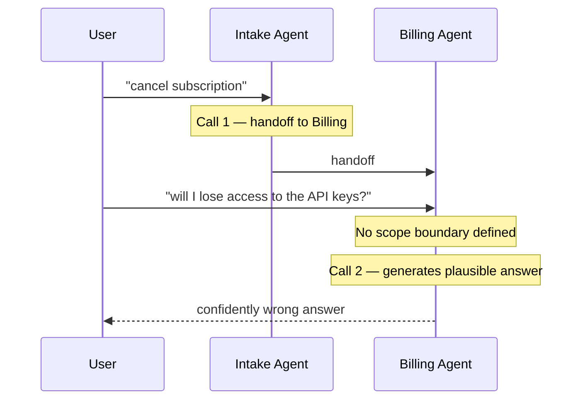
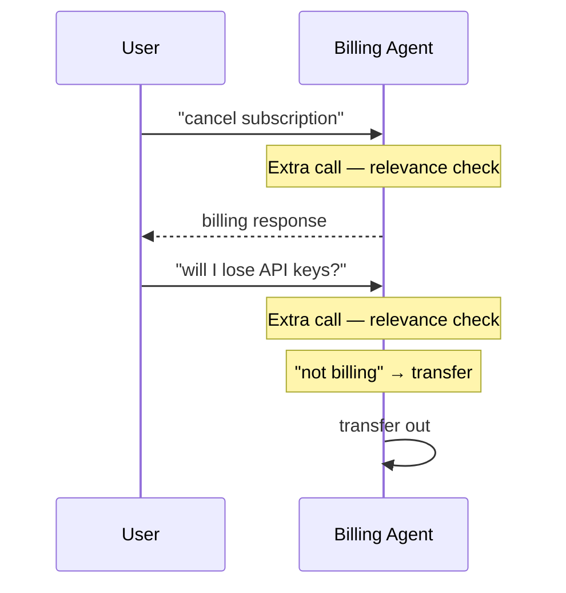
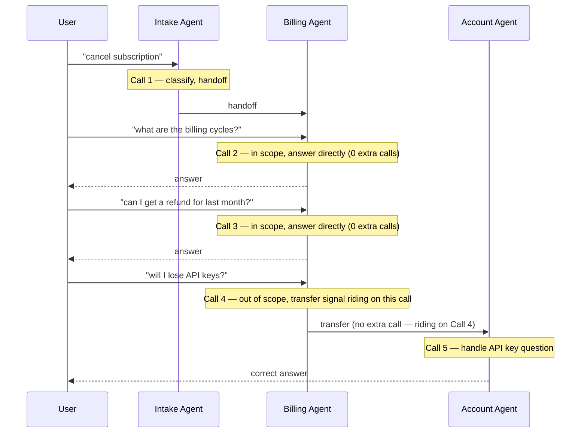

# The Self-Declaration Principle: Why Handoffs Only Works When Agents Know Their Own Edges

After reading the LangChain taxonomy post and writing [my own breakdown of the call-by-call numbers](https://akjamie.github.io/post/2026-06-23-multi-agent-architecture-token-breakdown/), I still had a nagging feeling I didn't fully understand Handoffs. Not the mechanics — the handoff tool is simple enough. What I didn't understand was *why* Handoffs produces the call-count advantages it claims, and *under what conditions* it actually behaves like the pattern the diagrams promise.

I brought that confusion to Claude. The conversation that followed clarified something that every framework tutorial and architecture diagram I had read quietly skipped over.

This post is my attempt to write it down before I forget it — and to review it through the lens of how Anthropic's own agent engineering guidance frames these design choices.

---

## What I was confused about

The [LangChain post](https://www.langchain.com/blog/choosing-the-right-multi-agent-architecture) and my own numbers breakdown both note that Handoffs achieves "0 extra calls" for topic-change detection. The explanation is always: the active agent handles this. It's already making an LLM call. No extra classification needed.

That sounded right. But I kept hitting a gap: if the active agent doesn't *know* when it's out of scope, it doesn't detect the topic change — it just answers wrongly. And if it does detect topic changes, either it has to check relevance on every turn (which is exactly what Router does) or... something else has to happen.

What is that *something else*? That's what I couldn't find in any of the tutorials.

---

## What Claude clarified

The thing that most framework docs quietly skip, Claude explained, is this:

> **Self-declaration is not an optional enhancement to Handoffs — it's what makes Handoffs a coherent pattern in the first place.**

Without it, you have two broken halves:

- **Pointer without self-declaration** → fast but silently misroutes on topic changes
- **Relevance check on every turn** → correct but structurally identical to Router

Self-declaration is what unifies them. The active agent is already making an LLM call to handle the request — the only additional cost is a few lines in its system prompt instructing it to signal when it's out of scope. That signal is essentially free, riding on a call you were paying for anyway.

Once I heard it framed this way, the whole pattern snapped into place.

---

## Why this clarifies the full four-pattern table

The original LangChain post includes a column for model-call counts but never explains *who* detects topic changes in each pattern or what that detection costs. Here's the full picture:

| Pattern | Who detects topic change? | Cost of detection |
|:---|:---|:---|
| Router | Central classifier, every turn | Always 1 extra call |
| Handoffs | Active agent, on demand | 0 extra calls |
| Subagents | Main agent implicitly, via tool selection | 0 extra calls |
| Skills | Same agent throughout, no handoff needed | 0 extra calls |

Handoffs is the **only pattern** where the currently executing agent is also responsible for its own boundary detection. That's a meaningful architectural commitment — not a footnote.

It means each agent must be designed with **domain awareness baked into its system prompt**, not just task capability. An agent that only knows how to do its job but doesn't know the *edges* of its job is incomplete in a Handoffs system.

---

## The two broken halves, visualized

Most implementations fall into one of two traps. Understanding why each one fails makes the self-declaration principle obvious.

### Broken half 1: Pointer only

The simplest implementation: A hands control to B. B's system prompt says *"You are a billing specialist. Answer billing questions."*



The handoff *worked*. The conversation *failed*. The Billing Agent has no mechanism to detect out-of-scope questions. It generates a plausible-sounding answer that happens to be wrong — and the user has no way to know.

This is the "mechanism without protocol" failure. The pointer routes correctly; the receiving agent has no contract.

### Broken half 2: Relevance check on every turn

The second trap tries to fix the first by adding a relevance gate before every response:

```python
def handle_request(query, domain):
    is_relevant = llm.call(f"Is this query about {domain}? Query: {query}")
    if not is_relevant:
        return transfer_to_intake()
    return llm.call(f"Answer this {domain} question: {query}")
```

This works correctly — the agent never misroutes. The problem is structural:



You're paying for a classification call on every single turn. Compare this to Router:

| | Router | Handoffs with relevance check |
|:---|:---|:---|
| Who classifies? | Central classifier | Active agent |
| Cost per turn | 1 extra call | 1 extra call |
| Where control lives | Always returns to router | Bounces back to intake |

They're structurally identical. You've built a Router with extra indirection.

---

## What self-declaration actually is

Self-declaration means each agent's system prompt must explicitly define two things — and the system design must define a third:

```
[Agent prompt]
1. What requests belong to me       → handle directly, zero extra call
2. What requests don't belong to me → transfer on demand, also zero extra call

```

Item 1 is where the architectural advantage lives. The active agent stays active for the entire in-scope dialogue — every turn it handles directly costs zero extra calls. Item 2 fires only when the topic genuinely leaves the domain. 

Here's the Billing Agent, rewritten with all three:

```python
BILLING_PROMPT = """
You are a billing specialist.

YOUR SCOPE:
- Payment methods, invoices, refunds, billing plan details
- Subscription billing details, payment failures, retry logic
- Billing history and receipts

NOT YOUR SCOPE (transfer to Account Agent):
- API key management and access
- Team/workspace settings and member management
- Plan tier changes (upgrade/downgrade)

NOT YOUR SCOPE (transfer to Tech Support):
- Bug reports, error messages, configuration issues
- Integration or performance problems

"""
```

Now the same conversation that failed earlier works correctly — and more importantly, notice what the *normal* multi-turn case looks like:



Calls 2 and 3 are the whole point. The Billing Agent stays active and handles every in-scope turn with zero extra overhead. The transfer on Call 4 isn't a routine step — it only fires because the topic genuinely left billing's domain. Self-declaration is what makes this distinction possible: without it, the agent can't tell the difference between a turn it should handle and one it should hand off.

---

## Reviewing the pattern through an agent design lens

Looking at self-declaration through the lens of principled agent design surfaces four properties that go beyond the mechanics.

### 1. Clarity of instruction is not optional for trust

Agents in a pipeline form a **trust chain**. For that trust chain to work reliably, each agent must operate within **clearly defined boundaries** — not inferred ones. An agent that hasn't been told the edges of its domain cannot be trusted to stay within them, because LLMs naturally generate plausible continuations even for out-of-scope requests.

Self-declaration is the mechanism that makes boundary enforcement explicit rather than inferred.

### 2. The cost of ambiguity is a safety property, not just a quality one

When an agent misroutes because it wasn't told it was out of scope, the failure mode isn't just wrong output — it's an agent that confidently produces wrong output with no signal that it has done so. A confident wrong answer is worse than a refusal.

This is the case for **minimal footprint** and **explicit task scope**: an agent that doesn't know when to stop is an agent that keeps going, often in the wrong direction.

### 3. Handoff design is a human–agent contract, not just an agent–agent one

The three-line checklist (scope, transfer target, termination signal) is not just a technical protocol between agents. It's also the contract the *builder* makes with the system:

- If you can't write the scope for an agent, you don't yet understand the domain well enough to build the agent.
- If you can't write the transfer target, you have an incomplete system topology.
- If you can't write the termination signal, your conversation pointer has no way to reset safely.

These aren't implementation details — they're the design artifacts that make a system auditable and debuggable by humans later.

### 4. The failure modes are asymmetric

The three self-declaration items fail in different directions:

| Skipped item | Failure direction | Visibility |
|:---|:---|:---|
| Scope (what's mine) | Silent wrong answer | Low — failure invisible until QA or user complaint |
| Transfer target (what's not mine) | Dropped conversation | Medium — user notices, restarts |
| Termination signal (when done) | Pointer leak | Low — manifests as wrong-agent routing for next topic |

>**Transfer target missing → Dropped conversation.** The agent recognizes an out-of-scope question, doesn't guess, but has nowhere to send it. The user gets *"I'm sorry, I can't help with that"* and has to start a new conversation and re-explain from scratch. This is the only failure that's immediately visible — the user knows something went wrong. That's why it lands in the "Medium" row: painful, but at least it doesn't silently give wrong information.

>**Pointer reset missing at orchestration layer → Pointer leak.** The LLM can't reliably detect when a user is "done" — users follow up, return after a pause, or pivot mid-conversation. Pointer reset must be handled by the orchestration layer: a new session, a timeout, or an explicit user action resets the active agent back to Intake. If the orchestration layer has no reset logic, the pointer stays pinned to the last active agent indefinitely. The next unrelated topic — *"What's my API quota?"* — goes straight to the Billing Agent. Low-visibility because the system doesn't crash; it just quietly routes the wrong topic to the wrong specialist.

>**Scope missing → Silent wrong answer.** The worst failure: the agent has no mechanism to recognize it's out of its depth, so it generates a plausible-sounding answer that happens to be wrong. The user follows the instructions, the system reports success, and nobody finds out until QA or a user complaint surfaces it.

The damage ranking — scope worst, termination signal sneaky, transfer target at least visible — is what makes termination signal the most commonly skipped item. The team doesn't feel the pain immediately, only when a follow-up conversation starts routing through the wrong agent.

---

## Implementation checklist: making this concrete

For every agent you build in a Handoffs system, verify all three items exist in the system prompt **before** any code is written:

```
Agent: [name]

✅ Scope defined:
   - What requests belong to this agent (with examples if edge cases exist)

✅ Transfer targets defined:
   - What requests don't belong here
   - Explicit transfer target for each out-of-scope category

✅ Termination signal defined:
   - The condition under which this agent signals completion
   - The signal token or phrase (e.g., HANDOFF_COMPLETE, transfer_to_intake)
```

If any item is missing, the agent is not ready to be built.

---

## When to use Router instead of Handoffs

Self-declaration puts a meaningful design burden on every agent in the system. If that burden isn't feasible — because domain boundaries are fuzzy, because agents are built by different teams with different standards, or because the system needs to be auditable by a central classifier — Router is the correct choice.

**Use Router instead of Handoffs when:**
- Domain boundaries can't be written precisely enough for each agent to self-declare accurately
- You need a central, inspectable record of every routing decision
- You can tolerate the extra classification call per turn in exchange for more predictable control flow
- The agents are third-party or externally maintained, so you can't guarantee their system prompts include self-declaration

**Use Handoffs when:**
- Each agent's domain can be precisely specified
- Topic changes within a session are relatively infrequent (so "0 cost on in-scope turns" is a real advantage)
- The conversation has a natural sequential flow (triage → specialist → resolution)
- You're willing to invest in per-agent prompt design as a first-class engineering artifact

---

## The architectural summary

The design principle that ties all of this together:

> **In the Handoffs pattern, each agent must be designed with domain awareness baked into its system prompt — not just task capability.**

This is what makes Handoffs architecturally distinct from Router. Router externalizes boundary detection to a central classifier that doesn't trust agents to know their own limits. Handoffs internalizes it — each agent carries its own scope definition and transfers when it recognizes something outside it.

Router's approach is more robust at the cost of an extra call per turn.  
Handoffs' approach has zero cost when the query is in scope — but **only when self-declaration is implemented correctly**.

Without self-declaration, you don't have a Handoffs system. You have a collection of agents with no coherent transfer protocol between them.

---

*This post is a follow-up to [the call-by-call numbers breakdown of multi-agent architectures](https://akjamie.github.io/post/2026-06-23-multi-agent-architecture-token-breakdown/). That post explains the price of each pattern. This one explains the protocol that makes Handoffs coherent — the design principle every framework tutorial quietly skips.*
